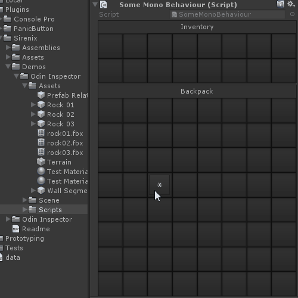
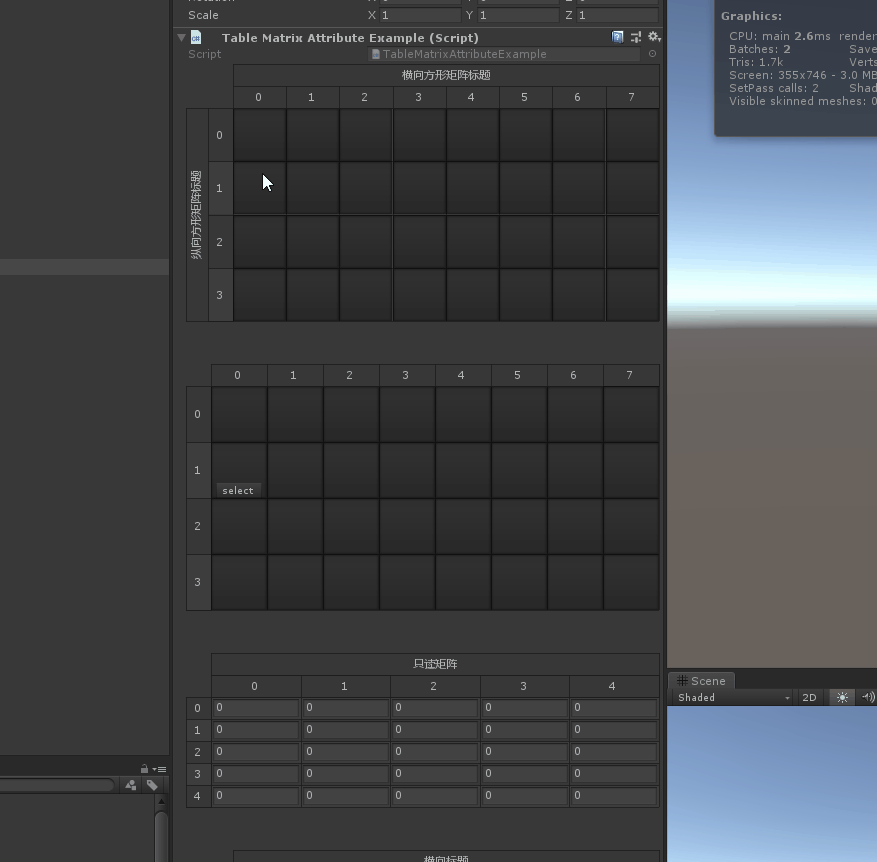
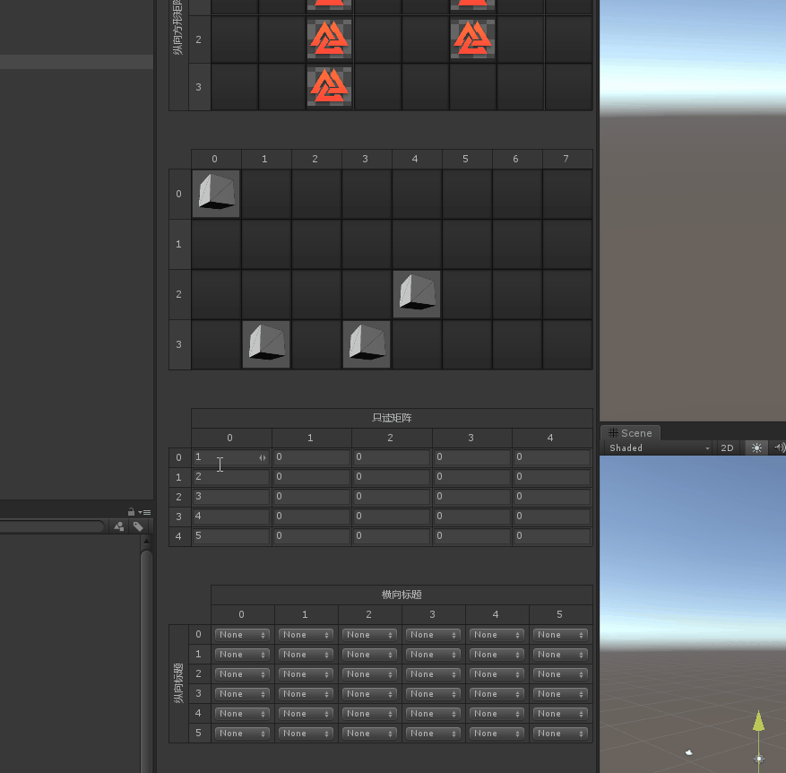
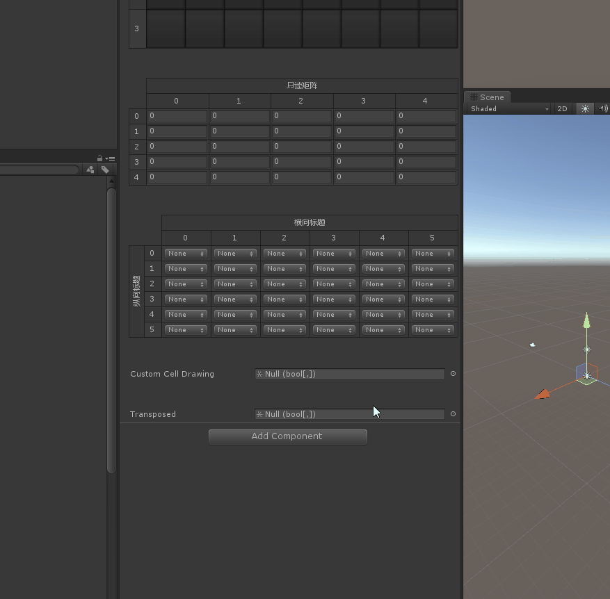
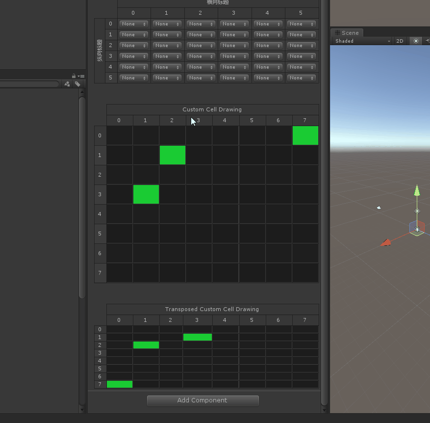

# Table Matrix

> *用于进一步指定Odin应如何绘制二维数组。*
> *这也是提高满满逼格的特性*

##### 官方示例展示




------


##### 工程示例



##### 【TableMatrix】HorizontalTitle：提供一个横向的标题 VerticalTitle ：提供一个纵向的标题 SquareCells：为True，则其他的cell的宽高将于第一个cell的宽度相等

```cs
    [ShowInInspector]
    [TableMatrix(HorizontalTitle = "横向方形矩阵标题",VerticalTitle = "纵向方形矩阵标题", SquareCells = true)] //SquareCells 为True，则其他的cell的宽高将于第一个cell的宽度相等
    public Texture2D[,] SquareCelledMatrix = new Texture2D[8, 4]
    {
    { null, null, null, null },
    { null, null, null, null },
    { null, null, null, null },
    { null, null, null, null },
    { null, null, null, null },
    { null, null, null, null },
    { null, null, null, null },
    { null, null, null,null },
    };

    [PropertySpace(40)]
    [ShowInInspector]
    [TableMatrix(SquareCells = true)]
    public Mesh[,] PrefabMatrix = new Mesh[8, 4]
    {
    { null, null, null, null },
    { null, null, null, null },
    { null, null, null, null },
    { null, null, null, null },
    { null, null, null, null },
    { null, null, null, null },
    { null, null, null, null },
    { null, null, null, null },
    };
```

##### 【IsReadOnly 】为true，则不能调整矩阵的顺序



```cs
    [PropertySpace(40)]
    [ShowInInspector]
    [TableMatrix(HorizontalTitle = "只读矩阵", IsReadOnly = true)]//IsReadOnly 不可更改矩阵的顺序
    public int[,] ReadOnlyMatrix = new int[5, 5];
```

##### 【Transpose】作用起到一个顺序调到的效果



```cs
    [PropertySpace(40)]
    [ShowInInspector, DoNotDrawAsReference]
    [TableMatrix(HorizontalTitle = "Transposed Custom Cell Drawing", DrawElementMethod = "DrawColoredEnumElement", ResizableColumns = true, RowHeight = 16, Transpose = true)]//Transpose顺序颠倒
    public bool[,] Transposed { get { return CustomCellDrawing; } set { CustomCellDrawing = value; } }

    private static bool DrawColoredEnumElement(Rect rect, bool value)
    {
        if (Event.current.type == EventType.MouseDown && rect.Contains(Event.current.mousePosition))
        {
            value = !value;
            GUI.changed = true;
            Event.current.Use();
        }

        UnityEditor.EditorGUI.DrawRect(rect.Padding(1), value ? new Color(0.1f, 0.8f, 0.2f) : new Color(0, 0, 0, 0.5f));

        return value;
    }
```

##### 其他辅助效果 ResizableColumns：是否可以通过鼠标调整列的宽度 RowHeight：固定行高度



##### 完整示例代码

```cs
using Sirenix.OdinInspector;
using Sirenix.Utilities;
using UnityEngine;

public class TableMatrixAttributeExample : MonoBehaviour
{
    [ShowInInspector]
    [TableMatrix(HorizontalTitle = "横向方形矩阵标题",VerticalTitle = "纵向方形矩阵标题", SquareCells = true)] //SquareCells 为True，则其他的cell的宽高将于第一个cell的宽度相等
    public Texture2D[,] SquareCelledMatrix = new Texture2D[8, 4]
    {
    { null, null, null, null },
    { null, null, null, null },
    { null, null, null, null },
    { null, null, null, null },
    { null, null, null, null },
    { null, null, null, null },
    { null, null, null, null },
    { null, null, null,null },
    };

    [PropertySpace(40)]
    [ShowInInspector]
    [TableMatrix(SquareCells = true)]
    public Mesh[,] PrefabMatrix = new Mesh[8, 4]
    {
    { null, null, null, null },
    { null, null, null, null },
    { null, null, null, null },
    { null, null, null, null },
    { null, null, null, null },
    { null, null, null, null },
    { null, null, null, null },
    { null, null, null, null },
    };

    [PropertySpace(40)]
    [ShowInInspector]
    [TableMatrix(HorizontalTitle = "只读矩阵", IsReadOnly = true)]//IsReadOnly 不可更改矩阵的顺序
    public int[,] ReadOnlyMatrix = new int[5, 5];

    [PropertySpace(40)]
    [ShowInInspector]
    [TableMatrix(HorizontalTitle = "横向标题", VerticalTitle = "纵向标题")]
    public InfoMessageType[,] LabledMatrix = new InfoMessageType[6, 6];

    [PropertySpace(40)]
    [ShowInInspector]
    [TableMatrix(HorizontalTitle = "Custom Cell Drawing", DrawElementMethod = "DrawColoredEnumElement", ResizableColumns = false, RowHeight = 40)]
    public bool[,] CustomCellDrawing;

    [PropertySpace(40)]
    [ShowInInspector, DoNotDrawAsReference]
    [TableMatrix(HorizontalTitle = "Transposed Custom Cell Drawing", DrawElementMethod = "DrawColoredEnumElement", ResizableColumns = true, RowHeight = 16, Transpose = true)]//Transpose顺序颠倒
    public bool[,] Transposed { get { return CustomCellDrawing; } set { CustomCellDrawing = value; } }

    private static bool DrawColoredEnumElement(Rect rect, bool value)
    {
        if (Event.current.type == EventType.MouseDown && rect.Contains(Event.current.mousePosition))
        {
            value = !value;
            GUI.changed = true;
            Event.current.Use();
        }

        UnityEditor.EditorGUI.DrawRect(rect.Padding(1), value ? new Color(0.1f, 0.8f, 0.2f) : new Color(0, 0, 0, 0.5f));

        return value;
    }
}
```

