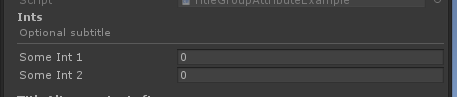
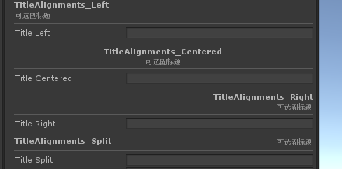
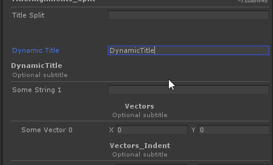
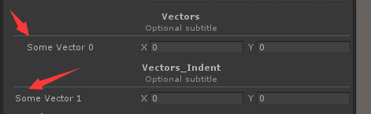
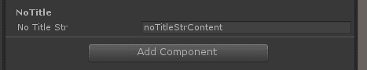

# Title Group

> Title Group Attribute特性：用于提供一个标题Group，将对应的成员划分

【TitleGroup】提供一个主标题，或者可以额外提供一个副标题



```csharp
    [TitleGroup("Ints")]
    public int SomeInt1;
    [TitleGroup("Ints", "Optional subtitle")]
    public int SomeInt2;
```

##### 【Alignment】可选择对应标题的对齐方式



```csharp
    [TitleGroup("TitleAlignments_Left", "可选副标题", alignment: TitleAlignments.Left)]
    public string titleLeft = "";
    [TitleGroup("TitleAlignments_Centered", "可选副标题", alignment: TitleAlignments.Centered)]
    public string titleCentered = "";
    [TitleGroup("TitleAlignments_Right", "可选副标题", alignment: TitleAlignments.Right)]
    public string titleRight = "";
    [TitleGroup("TitleAlignments_Split", "可选副标题", alignment: TitleAlignments.Split)]
    public string titleSplit = "";
```

##### 可是使用$特殊指定一个字段的值作为标题



```csharp
    public string DynamicTitle = "DynamicTitle";
    [TitleGroup("$DynamicTitle", "Optional subtitle")]
    public string SomeString1;
```

##### 【可设置是否缩进】



```csharp
    [TitleGroup("Vectors", "Optional subtitle", alignment: TitleAlignments.Centered, horizontalLine: true, boldTitle: true, indent: true)]
    public Vector2 SomeVector0;
    [TitleGroup("Vectors_Indent", "Optional subtitle", alignment: TitleAlignments.Centered, horizontalLine: true, boldTitle: true, indent: false)]
    public Vector2 SomeVector1;
```

##### 可以隐藏标题下面的横线



```csharp
    [TitleGroup("NoTitle", horizontalLine:false)]
    public string noTitleStr = "noTitleStrContent";
```


##### 完整示例代码

```csharp
using Sirenix.OdinInspector;
using UnityEngine;

public class TitleGroupAttributeExample : MonoBehaviour
{
    [TitleGroup("Ints")]
    public int SomeInt1;
    [TitleGroup("Ints", "Optional subtitle")]
    public int SomeInt2;

    [TitleGroup("TitleAlignments_Left", "可选副标题", alignment: TitleAlignments.Left)]
    public string titleLeft = "";
    [TitleGroup("TitleAlignments_Centered", "可选副标题", alignment: TitleAlignments.Centered)]
    public string titleCentered = "";
    [TitleGroup("TitleAlignments_Right", "可选副标题", alignment: TitleAlignments.Right)]
    public string titleRight = "";
    [TitleGroup("TitleAlignments_Split", "可选副标题", alignment: TitleAlignments.Split)]
    public string titleSplit = "";

    [PropertySpace(40)]
    public string DynamicTitle = "DynamicTitle";
    [TitleGroup("$DynamicTitle", "Optional subtitle")]
    public string SomeString1;

    [TitleGroup("Vectors", "Optional subtitle", alignment: TitleAlignments.Centered, horizontalLine: true, boldTitle: true, indent: true)]
    public Vector2 SomeVector0;
    [TitleGroup("Vectors_Indent", "Optional subtitle", alignment: TitleAlignments.Centered, horizontalLine: true, boldTitle: true, indent: false)]
    public Vector2 SomeVector1;

    [TitleGroup("NoTitle", horizontalLine:false)]
    public string noTitleStr = "noTitleStrContent";
}
```