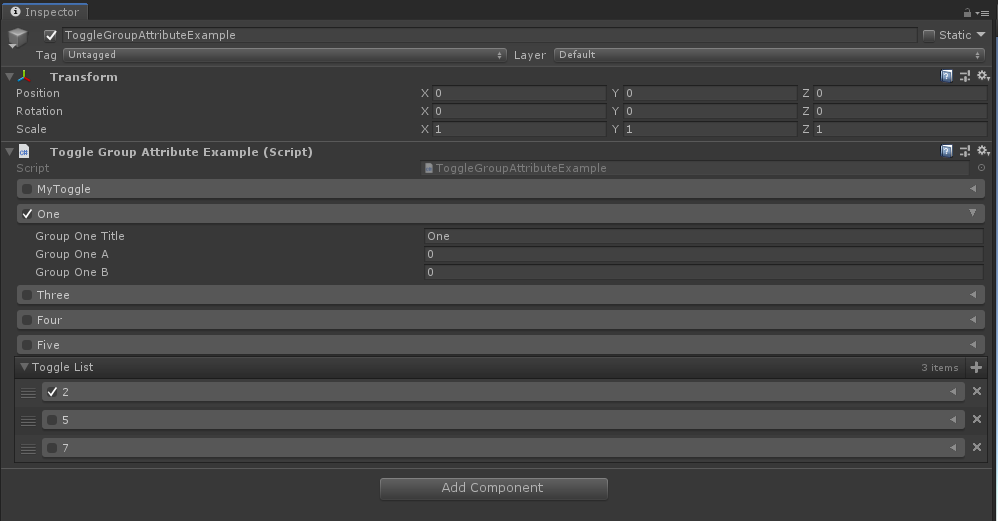
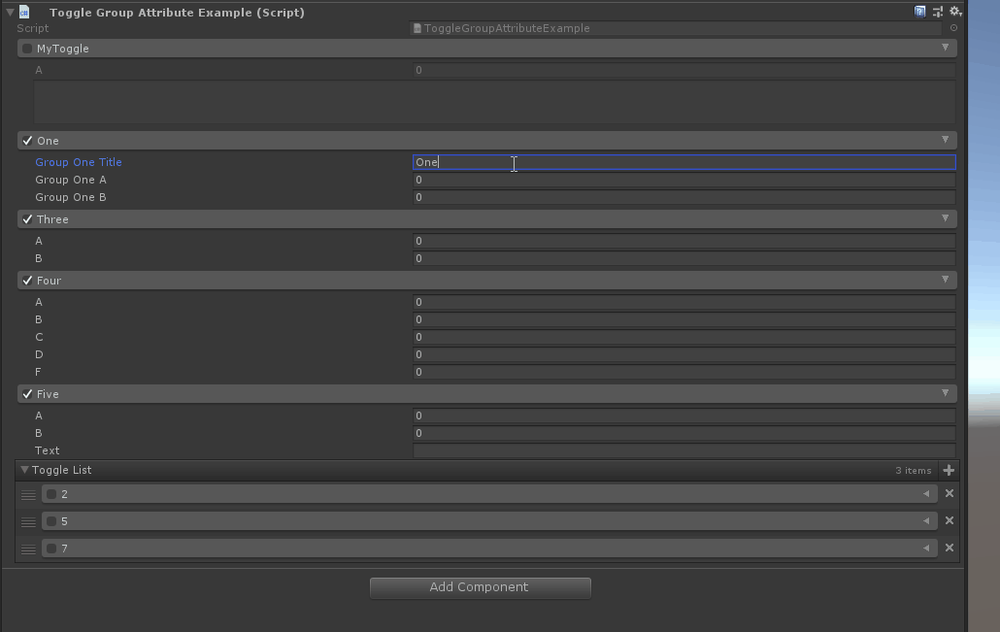
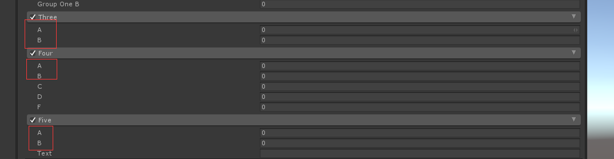

# Toggle Group Attribute

> *ToggleGroup用于任何字段，并创建一组可切换的选项。使用此选项可以创建可以启用或禁用的选项。*
>
> Group中必须存在一个和名字一样的bool值。



##### 【ToggleGroup】 通过制定一个返回bool值得成员名来控制toggle的开关 ，默认以成员的名称作为标题显示

> **注意：**此bool 成员不能为static


```cs
    [ToggleGroup("MyToggle")]
    public bool MyToggle;

    [ToggleGroup("MyToggle")]
    public float A;

    [ToggleGroup("MyToggle")]
    [HideLabel, Multiline]
    public string B;
```

##### 也可以以制定toggle group的标题，或者通过$特殊标识符引用一个成员的值作为标题



```cs
    [ToggleGroup("EnableGroupOne", "$GroupOneTitle")]
    public bool EnableGroupOne = true;

    [ToggleGroup("EnableGroupOne")]
    public string GroupOneTitle = "One";

    [ToggleGroup("EnableGroupOne")]
    public float GroupOneA;

    [ToggleGroup("EnableGroupOne")]
    public float GroupOneB;
```

##### 如果制定的toggle为class结构，需要添加Serializable特性，toggle标题默认为此类的名称，且继承关系的父类结构同样可以绘制在检查器面板上



```cs
    [Toggle("Enabled")]
    public MyToggleObject Three = new MyToggleObject();

    [Toggle("Enabled")]
    public MyToggleA Four = new MyToggleA();

    [Toggle("Enabled")]
    public MyToggleB Five = new MyToggleB();

    [Serializable]
    public class MyToggleObject
    {
        public  bool Enabled;

        [HideInInspector]
        public string Title;

        public int A;
        public int B;
    }

    [Serializable]
    public class MyToggleA : MyToggleObject
    {
        public float C;
        public float D;
        public float F;
    }

    [Serializable]
    public class MyToggleB : MyToggleObject
    {
        public string Text;
    }
```


##### 完整示例代码

```cs
using Sirenix.OdinInspector;
using System;
using UnityEngine;

public class ToggleGroupAttributeExample : MonoBehaviour
{
    [ToggleGroup("MyToggle")]
    public bool MyToggle;

    [ToggleGroup("MyToggle")]
    public float A;

    [ToggleGroup("MyToggle")]
    [HideLabel, Multiline]
    public string B;

    // Toggle for custom data.
    [ToggleGroup("EnableGroupOne", "$GroupOneTitle")]
    public bool EnableGroupOne = true;

    [ToggleGroup("EnableGroupOne")]
    public string GroupOneTitle = "One";

    [ToggleGroup("EnableGroupOne")]
    public float GroupOneA;

    [ToggleGroup("EnableGroupOne")]
    public float GroupOneB;

    // Toggle for individual objects.
    [Toggle("Enabled")]
    public MyToggleObject Three = new MyToggleObject();

    [Toggle("Enabled")]
    public MyToggleA Four = new MyToggleA();

    [Toggle("Enabled")]
    public MyToggleB Five = new MyToggleB();

    public MyToggleC[] ToggleList = new MyToggleC[]
    {
    new MyToggleC(){ Test = 2f, Enabled = true, },
    new MyToggleC(){ Test = 5f, },
    new MyToggleC(){ Test = 7f, },
    };

    [Serializable]
    public class MyToggleObject
    {
        public  bool Enabled;

        [HideInInspector]
        public string Title;

        public int A;
        public int B;
    }
    [Serializable]
    public class MyToggleA : MyToggleObject
    {
        public float C;
        public float D;
        public float F;
    }
    [Serializable]
    public class MyToggleB : MyToggleObject
    {
        public string Text;
    }

    [Serializable]
    public class MyToggleC
    {
        [ToggleGroup("Enabled", "$Label")]
        public bool Enabled;

        public string Label { get { return this.Test.ToString(); } }

        [ToggleGroup("Enabled")]
        public float Test;
    }
}
```