# ValueDropdownAttribute

> Value Dropdown Attribute特性用于任何属性，并使用可配置选项创建下拉列表。使用此选项可为用户提供一组特定的选项供您选择。
> 也就是创建一些特殊的下拉条
>
> 这个里面的属性就有点多了，达到了16个！！！
> 下面笔者逐个讲解

##### MemberName,也是唯一一个有参构造函数需要的属性，有两种形式的Drop下拉条，一种是直接数值的，另一种是Key-Value形式的


```cs
    /*【MemberName】*/
    [PropertySpace(40, 0)]
    [ValueDropdown("TextureSizes")]
    public int SomeSize1;
    private static int[] TextureSizes = new int[] { 32, 64, 128, 256, 512, 1024, 2048, 4096 };

    [ValueDropdown("FriendlyTextureSizes")]
    public int SomeSize2;
    private static IEnumerable FriendlyTextureSizes = new ValueDropdownList<int>()
    {
      { "Small", 256 },
      { "Medium", 512 },
      { "Large", 1024 },
    };
```

##### 【SortDropdownItems】默认为false 开启后为下拉列表为根据Key升序排序

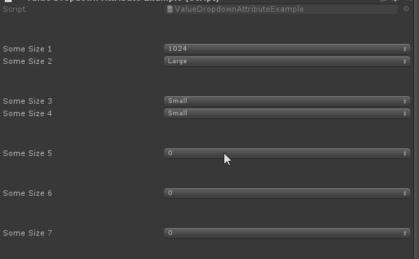

```cs
    /*【SortDropdownItems】默认为false 开启后为下拉列表为根据Key升序排序*/
    [PropertySpace(40, 0)]
    [ValueDropdown("SortList1")]
    public int SomeSize3;
    private IEnumerable SortList1 = new ValueDropdownList<int>()
    {
      { "Small", 256 },
      { "Medium", 512 },
      { "Large", 1024 },
      { "A", 128 },
    };
    [PropertySpace(0, 40)]
    [ValueDropdown("SortList2", SortDropdownItems = true)]
    public int SomeSize4;
    private List<ValueDropdownItem<int>> SortList2 = new ValueDropdownList<int>()
    {
      { "Small", 256 },
      { "Medium", 512 },
      { "Large", 1024 },
      { "A", 128 },
    };
```

##### 【DropdownTitle】给下来条提供一个标题


```cs
    [PropertySpace(0, 40)]
    [ValueDropdown("TextureSizes", DropdownTitle = "下拉条标题")]
    public int SomeSize5;
```

##### 【DropdownHeight】下拉条高度

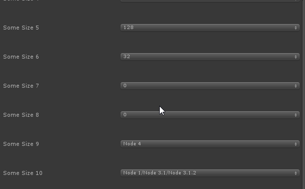

```cs
    /*【DropdownHeight】下拉条高度*/
    [PropertySpace(0, 40)]
    [ValueDropdown("TextureSizes", DropdownHeight = 80)]
    public int SomeSize6;
```

##### 【DropdownWidth】下拉条的宽度

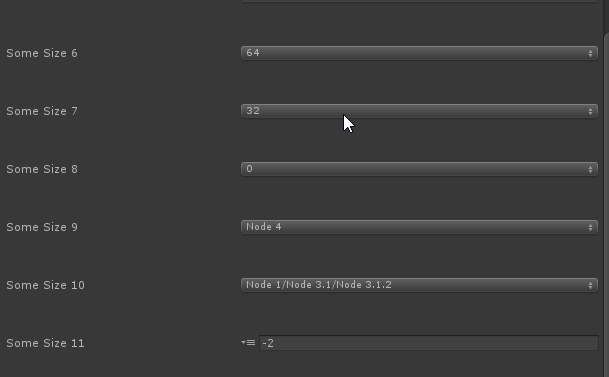

```cs
    /*【DropdownWidth】下拉条的宽度*/
    [PropertySpace(0, 40)]
    [ValueDropdown("TextureSizes", DropdownWidth = 100)]
    public int SomeSize7;
```

##### 【FlattenTreeView】是否使用平铺的树形视图

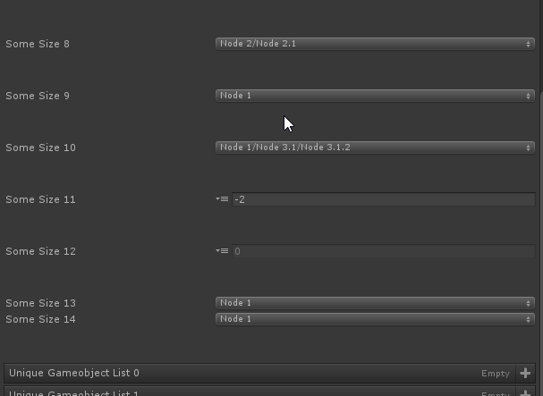

```cs
    /*【FlattenTreeView】是否使用平铺的树形视图*/
    [PropertySpace(0, 40)]
    [ValueDropdown("TreeViewOfInts", FlattenTreeView = true)]//默认为false，如果设置为true则禁用树形结构使用平铺模式
    public int SomeSize8;
```

##### 【DoubleClickToConfirm】需要双击才能确地选中的内容

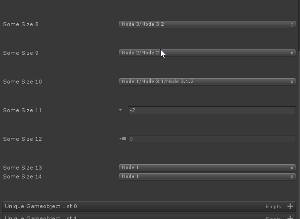

```cs
    /*【DoubleClickToConfirm】需要双击才能确地选中的内容*/
    [PropertySpace(0, 40)]
    [ValueDropdown("TreeViewOfInts", DoubleClickToConfirm = true)]//需要双击才能选中
    public int SomeSize9;
```

##### 【HideChildProperties】是否隐藏此类型所含有的属性信息

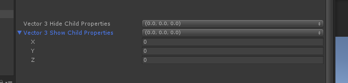

```cs
    /*【HideChildProperties】是否隐藏此类型所含有的属性信息*/
    [ValueDropdown("RangVector3", HideChildProperties = true)]//
    public Vector3 vector3HideChildProperties;
    [PropertySpace(0, 40)]
    [ValueDropdown("RangVector3", HideChildProperties = false)]//
    public Vector3 vector3ShowChildProperties;

    public IEnumerable<Vector3>  RangVector3()
    {
       return Enumerable.Range(0, 10).Select(i => new Vector3(i, i, i));
    }
```

##### 【AppendNextDrawer】下拉条变成一个小的选择器，代替原有的宽型下拉条

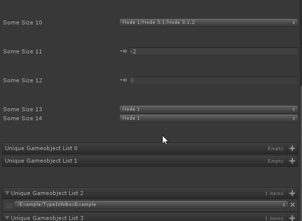

```cs
    /*【AppendNextDrawer】下拉条变成一个小的选择器，代替原有的宽型下拉条*/
    [PropertySpace(0, 40)]
    [ValueDropdown("TreeViewOfInts", AppendNextDrawer = true)]//
    public int SomeSize11;
```

##### 【DisableGUIInAppendedDrawer】配合AppendNextDrawer使用，显示的数值为灰度状态，达到不可更改数值的目的

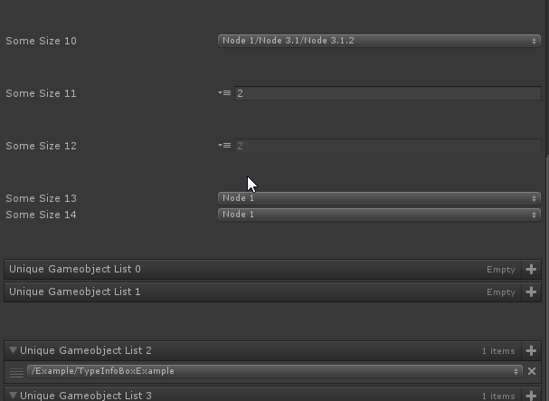

```cs
    /*【DisableGUIInAppendedDrawer】配合AppendNextDrawer使用，显示的数值为灰度状态，达到不可更改数值的目的*/
    [PropertySpace(0, 40)]
    [ValueDropdown("TreeViewOfInts", AppendNextDrawer = true, DisableGUIInAppendedDrawer = true)]//
    public int SomeSize12;
```

##### 【ExpandAllMenuItems】下拉条里面的条目是否全部展开

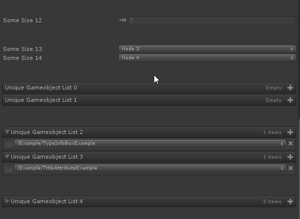

```cs
    /*【ExpandAllMenuItems】下拉条里面的条目是否全部展开*/
    [ValueDropdown("TreeViewOfInts" , ExpandAllMenuItems = false)]//
    public int SomeSize13;
    [PropertySpace(0, 40)]
    [ValueDropdown("TreeViewOfInts", ExpandAllMenuItems =true )]//
    public int SomeSize14;
```

##### 【IsUniqueList】在添加的列表Item前面添加勾选框，可以一次性勾选多个Item并添加

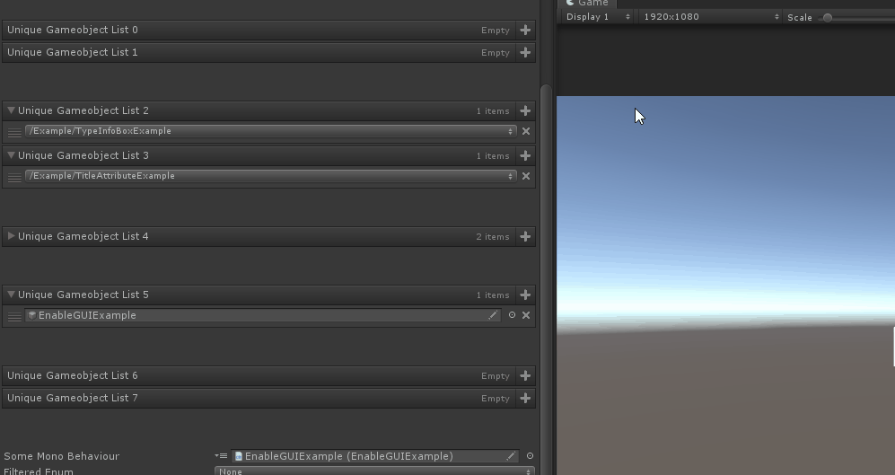

```cs
    /*【IsUniqueList】在添加的列表Item前面添加勾选框，可以一次性勾选多个Item并添加*/
    [ValueDropdown("GetAllSceneObjects", IsUniqueList = false)]
    public List<GameObject> UniqueGameobjectList0;
    [PropertySpace(0, 40)]
    [ValueDropdown("GetAllSceneObjects", IsUniqueList = true)]
    public List<GameObject> UniqueGameobjectList1;
```

##### 【ExcludeExistingValuesInList】添加列中不会显示已经选中的Item

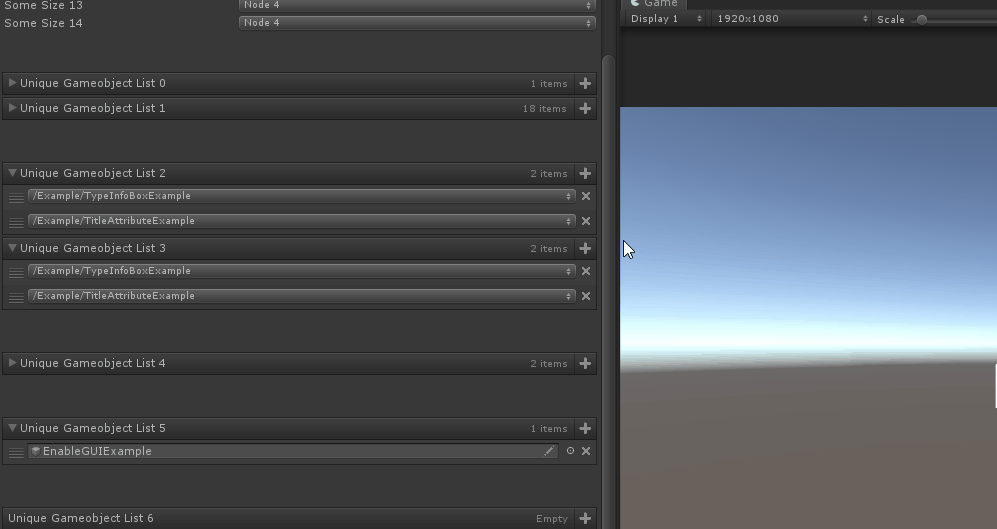

```cs
    /*【ExcludeExistingValuesInList】添加列中不会显示已经选中的Item*/
    [ValueDropdown("GetAllSceneObjects")]
    public List<GameObject> UniqueGameobjectList2;
    [PropertySpace(0, 40)]
    [ValueDropdown("GetAllSceneObjects", ExcludeExistingValuesInList = true)]
    public List<GameObject> UniqueGameobjectList3;
```

##### 【DisableListAddButtonBehaviour】禁用下拉列表，以弹窗的形式弹出

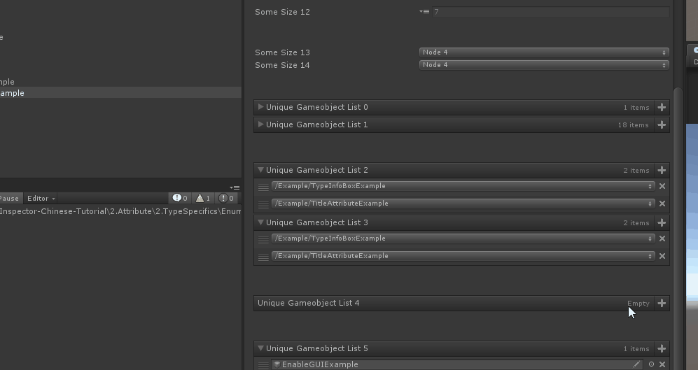

```cs
    /*【DisableListAddButtonBehaviour】禁用下拉列表，以弹窗的形式弹出*/
    [PropertySpace(0, 40)]
    [ValueDropdown("GetAllSceneObjects", DisableListAddButtonBehaviour = true, IsUniqueList = true)]
    public List<GameObject> UniqueGameobjectList4;
```

##### 【DrawDropdownForListElements】已经添加的Item不会再出现Item下拉表

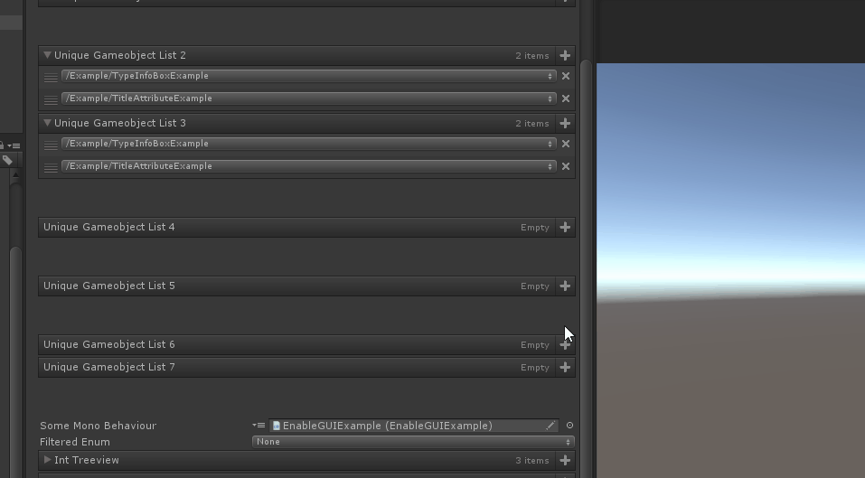

```cs
    /*【DrawDropdownForListElements】已经添加的Item不会再出现Item下拉表*/
    [PropertySpace(0, 40)]
    [ValueDropdown("GetAllSceneObjects", DrawDropdownForListElements = false)]
    public List<GameObject> UniqueGameobjectList5;
```

##### 【NumberOfItemsBeforeEnablingSearch】查过指定数量的Item则出现搜索框。默认是10。

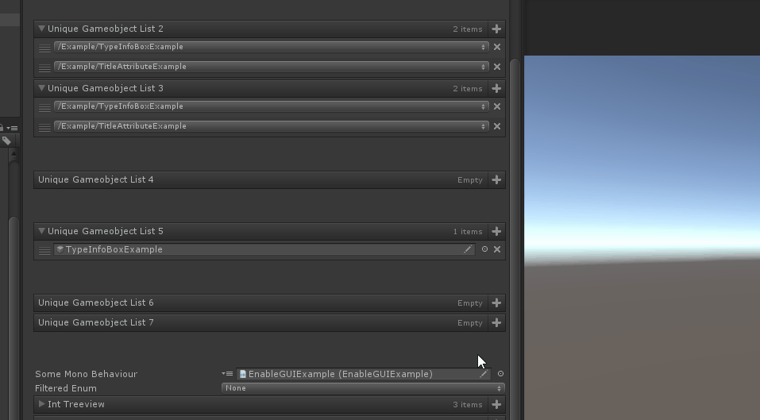

```cs
    /*【NumberOfItemsBeforeEnablingSearch】查过指定数量的Item则出现搜索框。默认是10。*/
    [ValueDropdown("GetAllSceneObjects", NumberOfItemsBeforeEnablingSearch =200)]
    public List<GameObject> UniqueGameobjectList6;
    [PropertySpace(0, 40)]
    [ValueDropdown("GetAllSceneObjects", NumberOfItemsBeforeEnablingSearch = 20)]
    public List<GameObject> UniqueGameobjectList7;
```

#### 示例完整代码（含有一些其他辅助性功能代码）

```cs
using Sirenix.OdinInspector;
using System;
using System.Collections;
using System.Collections.Generic;
using System.Linq;
using UnityEngine;

public class ValueDropdownAttributeExample : MonoBehaviour
{

    /*【MemberName】*/
    [PropertySpace(40, 0)]
    [ValueDropdown("TextureSizes")]
    public int SomeSize1;
    private static int[] TextureSizes = new int[] { 32, 64, 128, 256, 512, 1024, 2048, 4096 };

    [ValueDropdown("FriendlyTextureSizes")]
    public int SomeSize2;
    private static IEnumerable FriendlyTextureSizes = new ValueDropdownList<int>()
    {
      { "Small", 256 },
      { "Medium", 512 },
      { "Large", 1024 },
    };

    /*【SortDropdownItems】默认为false 开启后为下拉列表为根据Key升序排序*/
    [PropertySpace(40, 0)]
    [ValueDropdown("SortList1")]
    public int SomeSize3;
    private IEnumerable SortList1 = new ValueDropdownList<int>()
    {
      { "Small", 256 },
      { "Medium", 512 },
      { "Large", 1024 },
       { "A", 128 },
    };
    [PropertySpace(0, 40)]
    [ValueDropdown("SortList2", SortDropdownItems = true)]
    public int SomeSize4;
    private List<ValueDropdownItem<int>> SortList2 = new ValueDropdownList<int>()
    {
      { "Small", 256 },
      { "Medium", 512 },
      { "Large", 1024 },
      { "A", 128 },
    };

    /*【DropdownTitle】给下来条提供一个标题*/
    [PropertySpace(0, 40)]
    [ValueDropdown("TextureSizes", DropdownTitle = "下拉条标题")]
    public int SomeSize5;

    /*【DropdownHeight】下拉条高度*/
    [PropertySpace(0, 40)]
    [ValueDropdown("TextureSizes", DropdownHeight = 80)]
    public int SomeSize6;

    /*【DropdownWidth】下拉条的宽度*/
    [PropertySpace(0, 40)]
    [ValueDropdown("TextureSizes", DropdownWidth = 100)]
    public int SomeSize7;

    /*【FlattenTreeView】是否使用平铺的树形视图*/
    [PropertySpace(0, 40)]
    [ValueDropdown("TreeViewOfInts", FlattenTreeView = true)]//默认为false，如果设置为true则禁用树形结构使用平铺模式
    public int SomeSize8;

    /*【DoubleClickToConfirm】需要双击才能确地选中的内容*/
    [PropertySpace(0, 40)]
    [ValueDropdown("TreeViewOfInts", DoubleClickToConfirm = true)]//需要双击才能选中
    public int SomeSize9;

    /*【HideChildProperties】是否隐藏此类型所含有的属性信息*/
    [ValueDropdown("RangVector3", HideChildProperties = true)]//
    public Vector3 vector3HideChildProperties;
    [PropertySpace(0, 40)]
    [ValueDropdown("RangVector3", HideChildProperties = false)]//
    public Vector3 vector3ShowChildProperties;

    public IEnumerable<Vector3>  RangVector3()
    {
       return Enumerable.Range(0, 10).Select(i => new Vector3(i, i, i));
    }

    /*【AppendNextDrawer】下拉条变成一个小的选择器，代替原有的宽型下拉条*/
    [PropertySpace(0, 40)]
    [ValueDropdown("TreeViewOfInts", AppendNextDrawer = true)]//
    public int SomeSize11;

    /*【DisableGUIInAppendedDrawer】配合AppendNextDrawer使用，显示的数值为灰度状态，达到不可更改数值的目的*/
    [PropertySpace(0, 40)]
    [ValueDropdown("TreeViewOfInts", AppendNextDrawer = true, DisableGUIInAppendedDrawer = true)]//
    public int SomeSize12;

    /*【ExpandAllMenuItems】下拉条里面的条目是否全部展开*/
    [ValueDropdown("TreeViewOfInts" , ExpandAllMenuItems = false)]//
    public int SomeSize13;
    [PropertySpace(0, 40)]
    [ValueDropdown("TreeViewOfInts", ExpandAllMenuItems =true )]//
    public int SomeSize14;

    /*【IsUniqueList】在添加的列表Item前面添加勾选框，可以一次性勾选多个Item并添加*/
    [ValueDropdown("GetAllSceneObjects", IsUniqueList = false)]
    public List<GameObject> UniqueGameobjectList0;
    [PropertySpace(0, 40)]
    [ValueDropdown("GetAllSceneObjects", IsUniqueList = true)]
    public List<GameObject> UniqueGameobjectList1;

    /*【ExcludeExistingValuesInList】添加列中不会显示已经选中的Item*/
    [ValueDropdown("GetAllSceneObjects")]
    public List<GameObject> UniqueGameobjectList2;
    [PropertySpace(0, 40)]
    [ValueDropdown("GetAllSceneObjects", ExcludeExistingValuesInList = true)]
    public List<GameObject> UniqueGameobjectList3;

    /*【DisableListAddButtonBehaviour】禁用下拉列表，以弹窗的形式弹出*/
    [PropertySpace(0, 40)]
    [ValueDropdown("GetAllSceneObjects", DisableListAddButtonBehaviour = true, IsUniqueList = true)]
    public List<GameObject> UniqueGameobjectList4;

    /*【DrawDropdownForListElements】已经添加的Item不会再出现Item下拉表*/
    [PropertySpace(0, 40)]
    [ValueDropdown("GetAllSceneObjects", DrawDropdownForListElements = false)]
    public List<GameObject> UniqueGameobjectList5;

    /*【NumberOfItemsBeforeEnablingSearch】查过指定数量的Item则出现搜索框。默认是10。*/
    [ValueDropdown("GetAllSceneObjects", NumberOfItemsBeforeEnablingSearch =200)]
    public List<GameObject> UniqueGameobjectList6;
    [PropertySpace(0, 40)]
    [ValueDropdown("GetAllSceneObjects", NumberOfItemsBeforeEnablingSearch = 20)]
    public List<GameObject> UniqueGameobjectList7;

    [ValueDropdown("GetListOfMonoBehaviours", AppendNextDrawer = true, HideChildProperties = false)]
    public MonoBehaviour SomeMonoBehaviour;
    private IEnumerable<MonoBehaviour> GetListOfMonoBehaviours()
    {
        return GameObject.FindObjectsOfType<MonoBehaviour>();
    }

    [ValueDropdown("KeyCodes")]
    public KeyCode FilteredEnum;
    private static IEnumerable<KeyCode> KeyCodes = Enumerable.Range((int)KeyCode.Alpha0, 10).Cast<KeyCode>();

    [ValueDropdown("TreeViewOfInts", ExpandAllMenuItems = true)]
    public List<int> IntTreeview = new List<int>() { 1, 2, 7 };
    /// <summary>
    /// 以“/”符号作为类别分隔符
    /// </summary>
    private IEnumerable TreeViewOfInts = new ValueDropdownList<int>()
{
    { "Node 1/Node 1.1", 1 },
    { "Node 1/Node 1.2", 2 },
    { "Node 2/Node 2.1", 3 },
    { "Node 3/Node 3.1", 4 },
    { "Node 3/Node 3.2", 5 },
    { "Node 1/Node 3.1/Node 3.1.1", 6 },
    { "Node 1/Node 3.1/Node 3.1.2", 7 },
    { "Node 1", -1 },
    { "Node 2", -2 },
    { "Node 3", -3 },
    { "Node 4", -4 },
};

    /// <summary>
    /// IsUniqueList为true 每个Item上面有一个勾选框
    /// </summary>
    [ValueDropdown("GetAllSceneObjects", IsUniqueList = true, HideChildProperties = false)]
    public List<GameObject> UniqueGameobjectList;
    private static IEnumerable GetAllSceneObjects()
    {
        Func<Transform, string> getPath = null;
        getPath = x => (x ? getPath(x.parent) + "/" + x.gameObject.name : "");//三元运算符 其中X为Transform
        return GameObject.FindObjectsOfType<GameObject>().Select(x => new ValueDropdownItem(getPath(x.transform), x));
    }

    /// <summary>
    /// ExcludeExistingValuesInList 为 ture则选中的item不在出现在等待选择的列下拉表中
    /// DrawDropdownForListElements 为 true  每个item都有一个下拉列表
    /// </summary>
    [ValueDropdown("GetAllSceneObjects", IsUniqueList = false, DropdownTitle = "Select Scene Object", DrawDropdownForListElements = false, ExcludeExistingValuesInList = true)]
    public List<GameObject> UniqueGameobjectListMode2;

    private static IEnumerable GetAllScriptableObjects()
    {
        return UnityEditor.AssetDatabase.FindAssets("t:ScriptableObject")
            .Select(x => UnityEditor.AssetDatabase.GUIDToAssetPath(x))
            .Select(x => new ValueDropdownItem(x, UnityEditor.AssetDatabase.LoadAssetAtPath<ScriptableObject>(x)));
    }

    private static IEnumerable GetAllSirenixAssets()
    {
        var root = "Assets/Plugins/Sirenix/";

        return UnityEditor.AssetDatabase.GetAllAssetPaths()
            .Where(x => x.StartsWith(root))
            .Select(x => x.Substring(root.Length))
            .Select(x => new ValueDropdownItem(x, UnityEditor.AssetDatabase.LoadAssetAtPath<UnityEngine.Object>(root + x)));
    }
}
```
