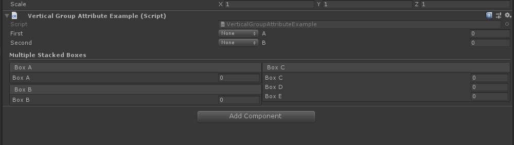

# Vertical Group Attribute

> Vertical Group:*用于在检查器的垂直组中一起收集属性。它本身并不能做很多事情，但是与其他组（例如 HorizontalGroupAttribute）组合使用可能会非常有用。*



```csharp
using Sirenix.OdinInspector;
using UnityEngine;

public class VerticalGroupAttributeExample : MonoBehaviour
{
    [HorizontalGroup("Split")]
    [VerticalGroup("Split/Left")]
    public InfoMessageType First;

    [VerticalGroup("Split/Left")]
    public InfoMessageType Second;

    [VerticalGroup("Split/Right")]
    public int A;

    [VerticalGroup("Split/Right")]
    public int B;

    [TitleGroup("Multiple Stacked Boxes")]
    [HorizontalGroup("Multiple Stacked Boxes/Split")]
    [VerticalGroup("Multiple Stacked Boxes/Split/Left")]
    [BoxGroup("Multiple Stacked Boxes/Split/Left/Box A")]
    public int BoxA;

    [BoxGroup("Multiple Stacked Boxes/Split/Left/Box B")]
    public int BoxB;

    [VerticalGroup("Multiple Stacked Boxes/Split/Right")]
    [BoxGroup("Multiple Stacked Boxes/Split/Right/Box C")]
    public int BoxC, BoxD, BoxE;
}
```