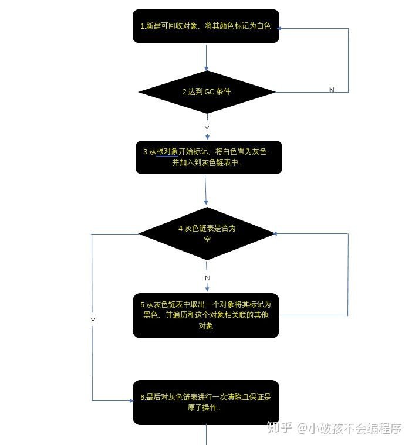
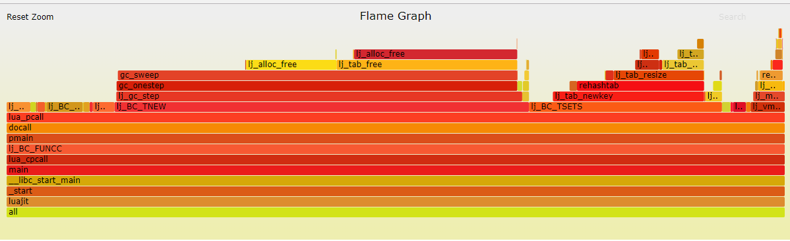
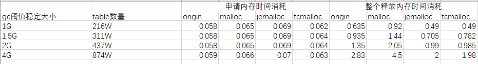
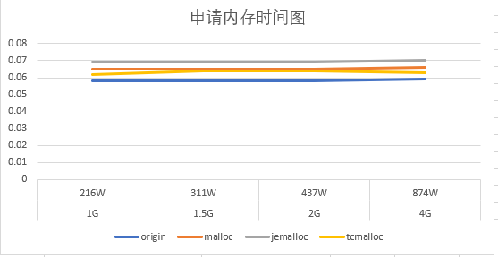
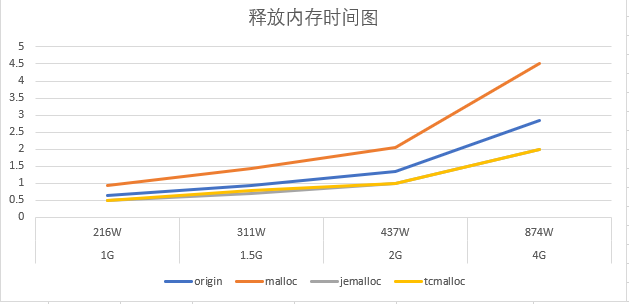
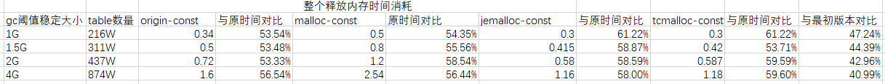
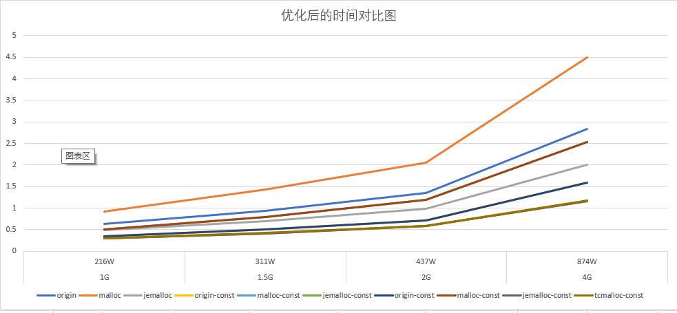
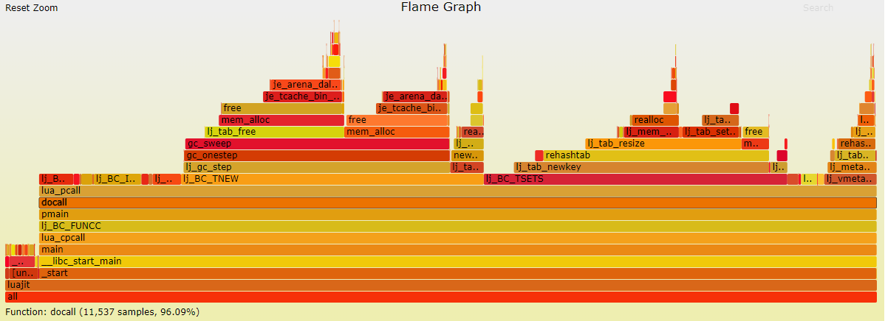

# Lua GC

[toc]

## Lua GC 算法

lua gc采取的是标记-清除算法，即一次gc分为两步：

1. 从根节点开始遍历gc对象，如果可达，则标记
2. 遍历所有的gc对象，清除没有被标记的对象

### 二色标记法


lua 5.1之前采用的算法，二色回收法是最简单的标记-清除算法，缺点是gc的时候不能被打断，所以会严重卡住主线程

### 三色标记法


所谓的颜色就是上文中“算法简述”提到过的标记，lua用白、灰、黑三色来标记一个对象的可回收状态。(白色又分为白1、白2)

**白色：**可回收状态。`详解：`如果该对象未被GC标记过，则此时白色代表当前对象为待访问状态。举例：新创建的对象初始状态就应该被设定为白色，因为该对象还没有被GC标记到，所以保持初始状态颜色不变，仍然为白色。如果该对象在GC标记阶段结束后，仍然为白色则此时白色代表当前对象为可回收状态。但其实本质上白色的设定就是为了标识可回收。

**灰色：**中间状态。`详解`：如果该对象未被GC标记过则此时白色代表当前对象为待访问状态。举例：当前对象已经被GC访问过，但是该对象引用的其他对象还没有被标记。

**黑色：**不可回收状态。`详解`:当前对象为以标记状态。举例当对象已经被GC访问过，并且对象引用的其他对象也被标记了。`备注`:白色分为百1和百2.原因：在GC标记阶段结束而清除阶段未开始时，如果新建一个对象，由于其未被发现引用关系，原则上应该被标记为白色，于是之后的清除阶段就会按照白色被清除的规则将新建的对象清除。这是不合理的。于是lua用两种白色进行标识，如果发生上述情况，lua依然会将新建对象标识为白色，不过是“当前白"（比如百1）。而lua在清扫”旧百“(比如百2),在清扫结束之后，则会更新“当前白”,即将白2作为当前白。下轮GC将会清扫作为“旧百”的白1标识对象。通过这样的技巧解决上述的问题。



1. Lua5.1开始使用一种三色回收的算法

   * 白色：在gc开始阶段，所有对象颜色都为白色，如果遍历一遍之后，对象还是白色的将被清除。(白色又分为白1为new、白2为free)
   * 灰色：灰色用在分布遍历阶段，如果一直有对象为灰色，则遍历将不会停止。
   * 黑色：确实被引用的对象，将不会被清除，gc完成之后会重置为白色。

2. luajit使用状态机来执行gc算法，共有6种状态：

   * GCSpause：gc开始阶段，初始化一些属性，将一些根节点（主线程对象，主线程环境对象，全局对象等）push到灰色链表中。
   * GCSpropagate：分布进行扫描，每次从灰色链表pop一个对象，遍历该对象的子对象，例如如果该对象为table，并且value没有设置为week，则会遍历table所有table可达的value，如果value为gc对象且为白色，则被push到灰色链表中，这一步将一直持续到灰色链表为空的时候。
   * GCSatomic：原子操作，因为GCSpropagate是分布的，所以分步过程中可能有新的对象创建，这时候将再进行一次补充遍历，这遍历是不能被打断的，但因为绝大部分工作被GCSpropagate做了，所以过程会很快。新创建的没有被引用的userdata，如果该userdata自定义了gc元方法，则会加入到全局的userdata链表中，该链表会在最后一个GCSfinalize处理。
   * GCSsweepstring：遍历全局字符串hash表，每次遍历一个hash节点，如果hash冲突严重，会在这里影响gc。如果字符串为白色并且没有被设置为固定不释放，则进行释放。
   * GCSsweep：遍历所有全局gc对象，每次遍历40个，如果gc对象为白色，将被释放。
   * GCSfinalize：遍历GCSatomic生成的userdata链表。如果该userdata还存在gc元方法，每次处理一个。

   ## 什么时候会gc？

   1. luajit中有两个判断是否需要gc的宏，如果需要gc，则会直接进行一次gc的step操作

      ```c
      /* GC check: drive collector forward if the GC threshold has been reached. */
      #define lj_gc_check(L) \
        { if (LJ_UNLIKELY(G(L)->gc.total >= G(L)->gc.threshold)) \
            lj_gc_step(L); }
      #define lj_gc_check_fixtop(L) \
        { if (LJ_UNLIKELY(G(L)->gc.total >= G(L)->gc.threshold)) \
            lj_gc_step_fixtop(L); }
      ```

      * gc.total: 代表当前已经申请的内存
      * gc.threshold：代表当前设置gc的阈值

   2. 这两个宏会在各个申请内存的地方进行调用，所以当前申请的内存如果已经达到设备设置的阈值，则会申请的所有对象都会有gc消耗。

   
   
   ## luajit gc速率控制
   
   ```c
   int LJ_FASTCALL lj_gc_step(lua_State *L)
   {
     global_State *g = G(L);
     GCSize lim;
     int32_t ostate = g->vmstate;
     setvmstate(g, GC);
     // 设置此次遍历的限制值，每次调用gc_onestep都会返回此次step的消耗，限制值消耗完毕之后此次step结束;
     lim = (GCSTEPSIZE/100) * g->gc.stepmul;
     if (lim == 0)
       lim = LJ_MAX_MEM;
     if (g->gc.total > g->gc.threshold)
       g->gc.debt += g->gc.total - g->gc.threshold;
     do {
       lim -= (GCSize)gc_onestep(L);
       if (g->gc.state == GCSpause) {
         g->gc.threshold = (g->gc.estimate/100) * g->gc.pause;
         g->vmstate = ostate;
         return 1;  /* Finished a GC cycle. */
       }
     } while (sizeof(lim) == 8 ? ((int64_t)lim > 0) : ((int32_t)lim > 0));
     if (g->gc.debt < GCSTEPSIZE) {
       g->gc.threshold = g->gc.total + GCSTEPSIZE;
       g->vmstate = ostate;
       return -1;
     } else {
       // 加快内存上涨速度;
       g->gc.debt -= GCSTEPSIZE;
       g->gc.threshold = g->gc.total;
       g->vmstate = ostate;
       return 0;
     }
   }
   ```
   
   - 可以看到最重要的变量为lim，该变量控制着一个lj_gc_step里的循环次数。每次调用gc_onestep都会返回此次的step消耗，例如如果处于GCSpropagate阶段，则返回值为该step遍历的内存大小，所以如果遍历了一个较大的table就会消耗更多的lim值
   - lim大小主要由gc.stepmul控制，所以设置该值的大小会影响每次step的调用时间

## 步骤源码详解

### 4.1新建对象阶段

**STEP1：新建可回收对象，将其颜色标记为白色** 解释：首先lua对数据类型进行了抽象，具体数据结构可见如下源码： `（lobject.h）`

```c
** Common type for all collectable objects
*/
typedef struct GCObject GCObject;

/*
** Common Header for all collectable objects (in macro form, to be
** included in other objects)
*/
#define CommonHeader  GCObject *next; lu_byte tt; lu_byte marked

/*
** Common type has only the common header
*/
struct GCObject {
  CommonHeader;
};


/*
** Tagged Values. This is the basic representation of values in Lua,
** an actual value plus a tag with its type.
*/
/*
** Union of all Lua values
*/
typedef union Value {
  GCObject *gc;    /* collectable objects */
  void *p;         /* light userdata */
  int b;           /* booleans */
  lua_CFunction f; /* light C functions */
  lua_Integer i;   /* integer numbers */
  lua_Number n;    /* float numbers */
} Value;

#define TValuefields  Value value_; int tt_

typedef struct lua_TValue {
  TValuefields;
} TValue;
```

由代码分析可知，Lua的实现中，数据类型可以分为需要被GC管理回收的对象、按值存储的对象。而**STEP1**中提及的“**可回收对象**”(GCObject)就是指那些需要被GC管理回收的对象,在lua5.3中，具体是指：TString、Udata、Cloure、Table、Proto、lua_State(可通过查看GCUnion)这些数据类型。这些数据类型都有一个共同的部分CommonHeader： `(lobject.h)`

```c
#define CommonHeader
GCObject *next; lu_byte tt; lu_byte marked
```

其中**next**链接下一个GCObject，**tt**表明数据类型，**marked**用于存储之前提到的颜色。 创建上述数据类型对象是通过lua虚拟机调用对应的数据类型创建函数完成的。**在创建过程中，总会调用(lgc.c)luaC_newobj这个函数，来完成GCObject的初始化。** 以Table为例，会依次调用： `（lvm.c）`[luaV_execute]->`(ltable.c)`[luaH_new]->`(lgc.c)`[luaC_newobj] 下面我们来看luaC_newobj: `（lgc.c）`

```c
/*
** create a new collectable object (with given type and size) and link
** it to 'allgc' list.
*/
GCObject *luaC_newobj (lua_State *L, int tt, size_t sz) {
  global_State *g = G(L);
  GCObject *o = cast(GCObject *, luaM_newobject(L, novariant(tt), sz));
  o->marked = luaC_white(g);
  o->tt = tt;
  o->next = g->allgc;
  g->allgc = o;
  return o;
}
```

该函数依次完成：

- 1.通过luaM_newobject进行内存分配，并更新GCdebt(内存使用相关的参数)
- 2.将GCObject置为“当前白”，设置数据类型，将GCObject挂载到alloc链表上

`注意`：alloc链表就是清除阶段，被GC依次遍历链表上的对象标志并根据标志进行清除的重要数据结构。 如此便从创建一个可回收对象开始了我们的GC之旅。

### 4.2触发条件

**STEP2：达到GC条件** Lua分为自动、手动两种GC方式。 手动式： `(lapi.h)`

```c
LUAI_FUNC void luaC_step (lua_State *L);
```

自动式： `(lgc.h)`

```c
#define luaC_condGC(L,pre,pos) \
  { if (G(L)->GCdebt > 0) { pre; luaC_step(L); pos;}; \
    condchangemem(L,pre,pos); }
/* more often than not, 'pre'/'pos' are empty */
#define luaC_checkGC(L)   luaC_condGC(L,(void)0,(void)0)
```

手动方式就是通过调用`collectgarbage ([opt [, arg]])`来启动GC。而自动方式则需要满足GC的条件。如果我们审查lapi.c/ldo.c/lvm.c ,会发现大部分会引起内存增长的API中，都调用了luaC_checkGC。从而实现GC可以随内存使用增加而自动进行。而这些触发条件是通过g-> GCdebt、g-> totalbytes等参数计算得来。由于参数的意义，参数的计算方式等问题需要进一步阐述，限于篇幅，我准备在之后的关于手动GC调参方面的文章中详细阐述。但目前可以**概括的说明luaGC的触发条件：当lua使用的内存达到阀值，便会触发GC**。当然这个阀值是动态设定的。

**collectgarbage** 来进行一些gc操作，其中opt参数可以为：

- “collect”：执行一个完整的垃圾回收周期，这是一个默认的选项

- “stop”：停止垃圾收集器（如果它在运行），实现方式其实就是将gc.threshold设置为一个巨大的值，不再触发gc step操作

- “restart”：将重新启动垃圾收集器（如果它已经停止）。

- “count”：返回当前使用的的程序内存量（单位是Kbytes），返回gc->total/1024

- “step”：执行垃圾回收的步骤，这个步骤的大小由参数arg（较大的数值意味着较多的步骤），如果这一步完成了一个回收周期则函数返回true。

- “setpause”：设置回收器的暂停参数，并返回原来的暂停数值。该值是一个百分比，影响gc.threshold的大小，即影响触发下一次gc的时间，设置代码如下：

  `g->gc.threshold = (g->gc.estimate/100) * g->gc.pause;`

  g->gc.estimate为当前实际使用的内存的大小，如果gc.pause为200，则该段代码表示，设置gc的阈值为当前实际使用内存的2倍

- “setstepmul”：设置回收器的步进乘数，并返回原值。该值代表每次自动step的步长倍率，影响每次gc step的速率，具体这么影响可以查看后面小节

### 4.3 GC函数状态机

## 4.3 GC函数状态机

当满足GC条件后，进入了真正的GC过程。 在开始这个过程之前，需要阐述一个问题。lua5.0之前的GC因为只采用了白、黑两种标识色，所以GC时需要stop the world，即GC过程需要一次性完成。而lua5.1之后采用了三标识色，**最大的的一个改进就是实现了分步。** **这个改进的意义在于提高了lua系统的实时性，**使GC过程可以分段执行。这个改进是由一系列变化引起的，比如：灰色的引入、barrier机制的引入、singlestep函数(GC过程中最重要的一个函数)的状态细分等。但是我认为真正从原理上可以实现分步，是在于灰色的引入。这是因为如果只有黑、白两色，每个对象的状态就仅是“二元的”，不能有中间态，所以GC操作时需要不可被打断。 接下来分析luaGC机制中最重要的一个函数singlestep。所有的GC流程，都是从singlestep函数开始的。 `(lgc.h)`

```c
static lu_mem singlestep (lua_State *L)
```

**singlestep实际上就是一个简单的状态机。**具体如下：


### 4.4标记阶段

**STEP3：从根对象开始标记，将白色置为灰色，并加入到灰色链表中** 该步骤实际对应状态：**GCSpause** `(lgc.c)[singlestep]`

```c
switch (g->gcstate) {
      case GCSpause: {
      g->GCmemtrav = g->strt.size * sizeof(GCObject*);
      restartcollection(g);
      g->gcstate = GCSpropagate;
      return g->GCmemtrav;
      }
```

主要工作由restartcollection函数完成: `(lgc.c)`

```c
/*
** mark root set and reset all gray lists, to start a new collection
*/
static void restartcollection (global_State *g) {
  g->gray = g->grayagain = NULL;
  g->weak = g->allweak = g->ephemeron = NULL;
  markobject(g, g->mainthread);
  markvalue(g, &g->l_registry);
  markmt(g);
  markbeingfnz(g);  /* mark any finalizing object left from previous cycle */
}
```

- 1.将用于辅助标记的各类型对象链表进行初始化清空，其中g->gray是灰色节点链；g->grayagain是需要原子操作标记的灰色节点链；g->weak、g->allweak、g->ephemeron是与弱表相关的链。
- 2.然后依次利用markobject、markvalue、markmt、markbeingfnz标记根(全局)对象:mainthread(主线程(协程), 注册表(registry), 全局元表(metatable), 上次GC循环中剩余的finalize中的对象，并将其加入对应的辅助标记链中。

**STEP4：灰色链表是否为空** **STEP5：从灰色链表中取出一个对象将其标记为黑色，并遍历和这个对象相关联的其他对象** 上述步骤对应状态：**GCSpropagate**，这是标记阶段的核心内容。 `(lgc.c)[singlestep]`

```c
case GCSpropagate: {
      g->GCmemtrav = 0;
      lua_assert(g->gray);
      propagatemark(g);
      if (g->gray == NULL)  /* no more gray objects? */
       g->gcstate = GCSatomic;  /* finish propagate phase */
      return g->GCmemtrav;  /* memory traversed in this step */
  }
```

主要工作由propagatemark函数完成： `(lgc.c)`

```c
/*
** traverse one gray object, turning it to black (except for threads,
** which are always gray).
*/
static void propagatemark (global_State *g) {
  lu_mem size;
  GCObject *o = g->gray;
  lua_assert(isgray(o));
  gray2black(o);
  switch (o->tt) {
    case LUA_TTABLE: {
      Table *h = gco2t(o);
      g->gray = h->gclist;  /* remove from 'gray' list */
      size = traversetable(g, h);
      break;
     …
    default: lua_assert(0); return;
  }
  g->GCmemtrav += size;
}
```

步骤四中循环判断灰色链表，其实并不是通过循环实现的。而是如果灰色表不为空，状态将不会发生改变。进而每次进入状态机时，**由于状态未发生改变，而反复执行这个状态对应的处理函数。直到状态发生改变后，进入下一个状态。** 设计的原因可以结合propagetemark这个函数一同理解，在propagatemark中，每次只会从灰色链表中取一个灰色节点，将其置为黑(与lua5.1的GC有区别)，从灰色链表中出去，遍历与此节点相关的其他节点，并将有关节点加入到灰色链中，至此就完成了一次GCSpropagate状态处理。不难发现，**这个过程只是处理了一个原先灰色链表中的灰色节点。这是因为标记与对应节点有关的节点实际上是通过遍历完成的，这个过程的开销会很大，所以lua只希望每次GCSpropagate时，处理一个这样的节点。** **这样的好处就是将开销大的步骤通过多次调用，减少每次阻塞的时间。而同时带来了一个新的问题，如果lua创建分配对象的速度远大于GCSpropagate处理的速度，那么lua的GC过程将会阻塞在GCSpropagate这个状态。`解决方法就留给读者思考了`。** 在propagetemark方法中，会针对不同的数据类型进行分类操作，但是最终都会落脚到reallymarkobject这个方法上： `(lgc.c)`

```c
static void reallymarkobject (global_State *g, GCObject *o) {
 reentry:
  white2gray(o);
  switch (o->tt) {
    case LUA_TSHRSTR: {
      gray2black(o);
      g->GCmemtrav += sizelstring(gco2ts(o)->shrlen);
      break;
    }
     …
    case LUA_TTABLE: {
      linkgclist(gco2t(o), g->gray);
      break;
    }
    …
    default: lua_assert(0); break;
  }
}
```

如果是字符串类型，因为其特殊性，可以直接判定为黑。其他类型加入灰色链或其他的辅助标记链。 **STEP6:最后对灰色链表进行一次清除且保证是原子操作。** 该步骤实际对应状态：**GCSatomic** `(lgc.c)[singlestep]`

```c
case GCSatomic: {
      lu_mem work;
      propagateall(g);  /* make sure gray list is empty */
      work = atomic(L);  /* work is what was traversed by 'atomic' */
      entersweep(L);
      g->GCestimate = gettotalbytes(g);  /* first estimate */;
      return work;
    }
```

**1.Propagateall** `(lgc.c)`

```c
static void propagateall (global_State *g) {
      while (g->gray) propagatemark(g);}
```

先检测g->gray,因为luaC_barrier函数(用于处理新建对象的一种机制)的存在,它调用reallymarkobject时有可能会操作变量g->gray. **2.atomic完成需要`原子操作`的步骤，主要如下：**

- 1重新遍历(跟踪)根对象。
- 2遍历之前的grayagain(grayagain上会有弱表的存在), 并清理弱表的空间。
- 3调用separatetobefnz函数将带__gc函数的需要回收的(白色)对象放到global_State.tobefnz表中,留待以后清理。
- 4.使global_State.tobefnz上的所有对象全部可达。
- 5.将当前白色值切换到新一轮的白色值。

以上内容只是对atomic简述，有很多具体的细节会牵扯过多的内容，限于篇幅就不具体展开了。

### 4.5清除阶段

**STEP7：据不同类型的对象，进行分步回收。回收中遍历不同类型对象的存储链表** **STEP8：该对象存储链表是否到达链尾** **STEP9：逐个判断对象颜色是否为白** **STEP10：释放对象所占用的空间** **STEP11：将对象颜色置为白** 上述步骤实际对应状态：`GCSswpallgc`、`GCSswpfinobj`、`GCSswptobefnz`、`GCSswpend` `(lgc.c)[singlestep]`

```c
case GCSswpallgc: {  /* sweep "regular" objects */
      return sweepstep(L, g, GCSswpfinobj, &g->finobj);
    }
  case GCSswpfinobj: {  /* sweep objects with finalizers */
      return sweepstep(L, g, GCSswptobefnz, &g->tobefnz);
    }
  case GCSswptobefnz: {  /* sweep objects to be finalized */
      return sweepstep(L, g, GCSswpend, NULL);
    }
  case GCSswpend: {  /* finish sweeps */
      makewhite(g, g->mainthread);  /* sweep main thread */
      checkSizes(L, g);
      g->gcstate = GCScallfin;
      return 0;
}
```

这个过程可以理解成对**垃圾分类回收**： GCSswpallgc将通过sweepstep将g->allgc上的所有死对象释放（`GCSatomic`状态以前的白色值的对象)，并将活对象重新标记为当前白色值。 GCSswpfinobj和GCSswptobefnz两个状态也调用了sweepstep函数。但是g->finobj和g->tobefnz链表上是不可能有死对象的（**`原因留给读者思考`**），因此它们的作用仅仅是将这些对象重新设置为新一轮的白色。 GCSswpend用来释放mainthread上的一些空间，如：字符串表，连接缓冲区等。 这些状态的切换是通过判定当前类型的对象链表是否到达尾部实现的。 上述的状态真正清扫操作是通过sweepstep来调用sweeplist完成的。 `(lgc.c)`

```c
static GCObject **sweeplist (lua_State *L, GCObject **p, lu_mem count) {
  global_State *g = G(L);
  int ow = otherwhite(g);
  int white = luaC_white(g);  /* current white */
  while (*p != NULL && count-- > 0) {
    GCObject *curr = *p;
    int marked = curr->marked;
    if (isdeadm(ow, marked)) {  /* is 'curr' dead? */
      *p = curr->next;  /* remove 'curr' from list */
      freeobj(L, curr);  /* erase 'curr' */
    }
    else {  /* change mark to 'white' */
      curr->marked = cast_byte((marked & maskcolors) | white);
      p = &curr->next;  /* go to next element */
    }
  }
  return (*p == NULL) ? NULL : p;
}
```

上文中提到的各种可回收数据类型对象链表都是很长的，所以清除也是分段完成的，比如可以通过sweeplist中的count参数来控制每次清理的数量。(这个值的设定以及动态变换的过程，我希望在下一篇关于GC参数调节的文章中阐述)。**从上述的清除过程中，可以明白lua的GC过程是非搬迁式的，即没有对数据进行迁移，不做内存整理。** 最后一个GC状态：**GCScallfin** `(lgc.c)`

```c
case GCScallfin: {  /* call remaining finalizers */
      if (g->tobefnz && g->gckind != KGC_EMERGENCY) {
        int n = runafewfinalizers(L);
        return (n * GCFINALIZECOST);
      }
      else {  /* emergency mode or no more finalizers */
        g->gcstate = GCSpause;  /* finish collection */
        return 0;
      }
}
```

在这个状态会逐个取出g->tobefnz链表上的对象，然后调用其__gc函数，并将其放入g->allgc链表中，准备在下个GC循环回正式回收此对象。

## 大table对GC影响

从luajit gc原理上看，以为每次gc的遍历都会遍历所有的gc对象，所以大的table是会影响gc性能。

**测试代码**

```lua
-- 关闭jit
if jit then
    jit.off()
end

local data = {} -- 一个大的table，用来模拟常驻内存的table，测试的时候使用的是drop_data.lua里面的数据，该data有8655个table元素（在gc的时候产生消耗），60810个元素（包括table元素，会在遍历的时候产生消耗）

function deepCopyTable(t)
    local ret = {}
    for k, v in pairs(t) do
        if type(v) == "table" then
            ret[k] = deepCopyTable(v)
        else
            ret[k] = v
        end
    end
    return ret
end

datas = {}

-- 循环产生更多的常驻内存的table，可以看到总共会有865W+的table元素和总共6000W+的元素
for i = 1, 1000 do
	datas[#datas+1] = deepCopyTable(data)
end

print("begin")
local time = os.clock()
for i = 1, 2000000 do
    -- 模拟产生临时变量
	local temp = deepCopyTable(data)

    -- 每10次计算一次时间和内存
	if i % 10 == 0 then
		local time_temp = os.clock()
		print(collectgarbage("count"), time_temp-time)
		time = time_temp
	end
end
```

**测试结果（第一个列为当前内存，第二列为当前内存阈值，第三列为当前gc状态，第四列为循环10次的时间）**

```
-- gc没有介入阶段，平均时间大概在0.059s，这时候代表着内存的分配速度
3345733.2617188	4136590.0390625	0	0.058304
3366347.6367188	4136590.0390625	0	0.058013000000003
3386962.0117188	4136590.0390625	0	0.058147999999996
3407576.3867188	4136590.0390625	0	0.059978000000001
3428190.7617188	4136590.0390625	0	0.059843999999998
3448805.1367188	4136590.0390625	0	0.058331000000003
3469419.5117188	4136590.0390625	0	0.058205000000001
3490033.8867188	4136590.0390625	0	0.058352999999997
3510648.2617188	4136590.0390625	0	0.058503000000002
3531262.6367188	4136590.0390625	0	0.058151000000002
3551877.0117188	4136590.0390625	0	0.058059999999998

-- gc进入sweep阶段，删除内存，峰值时间在0.78s左右，后面时间变少应该是因为那一块都是常驻内存的gc对象，很少会去调用free函数
5056726.3867188	5056726.3242188	1	0.076171000000002
5077340.7617188	5077340.9492188	1	0.076453999999998
4955367.8554688	4955368.0429688	4	0.140509
3994134.0820313	3994134.0195313	4	0.679567
3032849.7617188	3032850.1992188	4	0.786561
2133608.0117188	2133608.7617188	4	0.788004
2154222.3867188	2154222.3242188	4	0.255904
2174836.7617188	2174837.1992188	4	0.254212
full sweep time: 2.850359
2195451.1367188	4137406.4453125	0	0.066203999999999
```

- 火焰图分析（gc处于sweep状态）：
  [](https://blog-1251569602.cos.ap-shanghai.myqcloud.com/blog/12/12.png)
  主要时间消耗在gc_sweep(51.34%)：该步骤会遍历所有的gc对象，如果可回收，就进行free操作，所以gc_sweep里面最耗时的就是free函数(34%左右)

## gc优化

从火焰图上看到，gc_sweep函数耗时严重，其主要工作是遍历所有gc对象，如果为白色，则free它，所以优化方案有两点：

1. 内存分配算法优化
2. 减少gc遍历的对象，即减少那些明确常驻内存的gc对象遍历

### 内存分配算法优化

luajit默认使用的是自己的内存分配算法，现在尝试分别使用glibc自带的内存分配和第三方高性能jemalloc（选择的版本是jemalloc-stable-4），tcmalloc（选择的是gperftools-2.7）的分配算法进行分析。

1. #### 测试结果

   

   

   

#### 结果分析

- 申请内存的速率跟常驻内存的table大小关系不大，luajit自带的分配算法最快，但是总体相差不大
- 随着常驻内存的table大小变大，会影响gc释放速度，这将会卡主主线程
- 释放内存速率jemalloc最好，并且随着常驻内存的table大小变大，效率体现的越明显

### table缓存优化

自己写一个table缓冲池，缓冲一定数量、一定大小的table在c++内存，避免每次反复申请内存及rehash，reszie table操作
TODO: 需要具体修改luajit源码进行测试。

### 减少gc遍历的对象

#### 思路

对于那些常驻内存的table，可以主动加一个标记，在gc时候遍历到这个table，将对其以及所有子gc对象从全局gc链表删除，并加入到一个全局const gc对象链表中。
源代码可以查看[github](https://github.com/Drecik/luajit-table-const)

#### 测试结果

[](https://blog-1251569602.cos.ap-shanghai.myqcloud.com/blog/12/18.png)

#### 对比结果

[](https://blog-1251569602.cos.ap-shanghai.myqcloud.com/blog/12/19.png)

#### 火焰图（jemalloc-4G内存）

[](https://blog-1251569602.cos.ap-shanghai.myqcloud.com/blog/12/11.png)

- - gc_sweep在总的采样占比上已经变得很少，这点从打log上面就能看出

  - free占比gc_sweep的时间比重增加，说明减少了遍历的时间消耗

    #### 注意点

  - 从给table设置constant之后完整的一次gc之前，不能主动调用full gc否则会导致table子元素没有被标记，这样就会被误删除，导致访问的时候出现内存问题

  - table不能设置weak

  - table元素只能是table、string、number，不能有function，线程

    #### 结论

    可以看到优化在常驻内存table大的时候很明显，主要提升了两个方面的速度：

  - 在GCSpropagate阶段减少不必要的遍历，加快遍历速度，同时减少了新临时变量的生成

  - 在GCSweep阶段，减少不必要的遍历，同时因为加快遍历速度，需要free的临时变量变少，所以减少了GCSweep的时间

## 5.总结

至此，其实lua的GC算法已经讲述完毕了。但是为了在解释完源码之后，重新呼应文章开头的算法简述的内容，也方便读者能够有一个宏观的理解。所以我想最后用一句话来完成对这个算法的描述：(当然表述只是针对了主干情况) **Lua通过借助grey链表，依次利用reallymarkobject对对象进行了颜色的标记，之后通过遍历alloc链表，依次利用sweeplist清除需要回收的对象。** 本篇文章是我这个后学晚辈仓促成文，实在是诚惶诚恐的。希望文中错误之处，大家能够多多批评指正，我一定认真及时纠正相关的错误。感谢大家的阅读。

