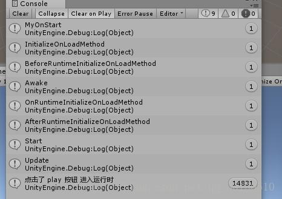

## INITIALIZEONLOAD、INITIALIZEONLOADMETHOD、RUNTIMEINITIALIZEONLOADMETHOD特性的使用

第一个脚本

```c#
using UnityEngine;
using UnityEditor;
 
[InitializeOnLoad]
public class LoadOrderTest
{
    static LoadOrderTest()
    {
        MyOnStart();
 
 
        EditorApplication.update = MyUpdate;
 
    }
 
    static void MyOnStart()
    {
        Debug.Log("MyOnStart");  
    }
    
    static void MyUpdate()
    {
        //if(Application.isFocused)
        //{
        //    Debug.Log("鼠标点击进入了Game窗口");
        //}
        //else
        //{
        //    Debug.Log("鼠标移除Game窗口，并点击了别的地方");
        //}
        
        if (Application.isPlaying)
        {
            Debug.Log("点击了 play 按钮 进入运行时");
        }
        else
        {
            Debug.Log("点击 play 按钮 进入 editor模式");
        }
    }
 
    [InitializeOnLoadMethod]
    static void InitializeOnLoadMethod()
    {
        Debug.Log("InitializeOnLoadMethod");
    }
}
```

这个脚本放在，Editor文件夹下，添加了**InitializeOnLoad特性后，其构造方法会自动执行**，测试结果是，每次修改这个类的内容，就会重新执行一变构造方法。可以在构造方法中执行一些操作，来控制Editor模式下的代码执行。

我这里是，定义了一个OnStart，和EditorApplication.update赋值，效果类似Mono的Start、Update方法。

**InitializeOnLoadMethod特性定义的方法，也会在构造方法之后执行一遍。**

如果存在多个被InitializeOnLoad特性修饰的类，则所有的构造方法都会执行一遍，如果都在其中给EditorApplication.update赋值的话，只有最后一个进行赋值的会起作用，这个是很好理解的。

---

第二个脚本：

```c#
using UnityEngine;
 
public class LoadOrderTestTwo : MonoBehaviour {
 
    [RuntimeInitializeOnLoadMethod(RuntimeInitializeLoadType.BeforeSceneLoad)]
    static void BeforeRuntimeInitializeOnLoadMethod()
    {
        Debug.Log("BeforeRuntimeInitializeOnLoadMethod");
    }
 
 
    [RuntimeInitializeOnLoadMethod]
    static void OnRuntimeInitializeOnLoadMethod()
    {
        Debug.Log("OnRuntimeInitializeOnLoadMethod");
    }
 
    [RuntimeInitializeOnLoadMethod(RuntimeInitializeLoadType.AfterSceneLoad)]
    static void AfterRuntimeInitializeOnLoadMethod()
    {
        Debug.Log("AfterRuntimeInitializeOnLoadMethod");
    }
 
    private void Awake()
    {
        Debug.Log("Awake");
    }
 
    private void Start()
    {
        Debug.Log("Start");
 
    }
 
    bool isUpdate = true;
    private void Update()
    {
        if(isUpdate)
        {
            Debug.Log("Update");
            isUpdate = false;
        }
 
    }
}
```

我这里这个脚本继承自Mono，所以是需要挂载在一个场景中的物体上才能运行的，其实被**RuntimeInitializeOnLoadMethod修饰的方法可以是随便的一个类，并且不需要进行new，而且这个类可以放在Editor下，也可以放在Editor外，其对应的方法都能很好的执行。RuntimeInitializeOnLoadMethod可以通过后面的参数，来调节当前方法的执行顺序，可以控制其在Awake之前执行。**

把脚本2挂载在一个场景中的物体上，进入editor，几秒后点击play按钮，运行结果如下：



可以看出执行顺序是：脚本一构造方法、脚本一的update方法、InitalizeOnLoadMethod修饰的方法（和上一个先后不一定）、脚本二中的BeforeRuntime、Awake、OnRuntime、AfterRuntime、Start、Update。

