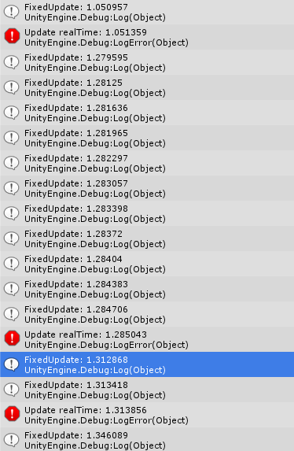
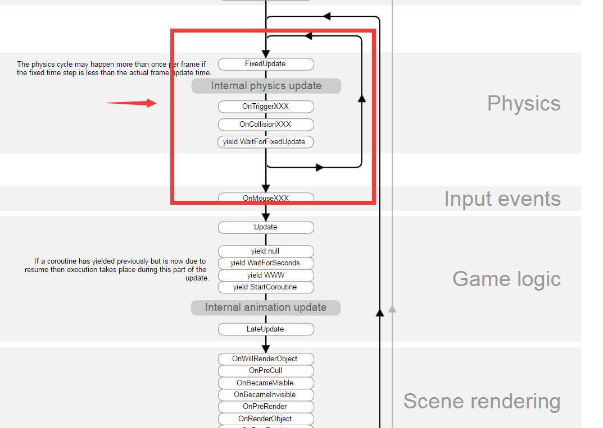

# cUpdate 和 FixedUpdate

默认情况下FixedUpdate的更新频率是50FPS（0.02s），如果当游戏的更新频率较大时——例如60FPS——那么FixedUpdate有固定的更新频率还稍微可以理解，但是如果游戏本身的更新频率就很低——例如30FPS——那么是怎么保证FixUpdate的更新频率呢？

而Unity的主要逻辑是单线程的，所以也不存在有不同的逻辑循环可能，换句话说Update和FixedUpdate是在同一个线程上调用的。

如果我们来重复一下各位测试FixedUpdate时经常采用的方式：打印两次调用之间的时间间隔，或者是计算每次调用的累积时间，但区别在于我直接使用了真实的时间：

```c#
void FixedUpdate()
{
	Debug.Log("FixedUpdate realTime: " + Time.realtimeSinceStartup);
}

void Update()
{
	Debug.LogError("Update realTime: " + Time.realtimeSinceStartup);
}
```

为了以示区别，正常的Log是FixedUpdate，LogError是Update，并且设定整个游戏的更新频率为30FPS。



通过上图可以发现，FixedUpdate并不是间隔0.02s才调用一次，相反，它有可能在Update之前**调用多次**。

例如刚启动时，在某次Update之前连续调用了11次FixedUpdate，而之后每次Update调用之前都会调用1~2次FixedUpdate方法，这也很好理解，因为FixedUpdate的频率是50FPS，而我们设定的更新频率为30FPS，FixedUpdate的调用次数势必要多于Update。

所以，FixedUpdate除了用来处理物理逻辑之外并不适合处理其他模块的逻辑，尤其是当大家的潜意识里都笃定它的更新频率是固定的时候。因为这很危险，比如一个需要状态同步的游戏要求按照固定的频率向目标同步状态，如果贸然采用FixedUpdate方法，就会出现上图那样可能在短时间内多次调用的问题。**所以最好只在物理逻辑的处理中使用FixedUpdate，而不要滥用**。而由于FixedUpdate主要是用于物理逻辑的，因此下文的讨论也主要围绕物理逻辑。

## 可变增量时间

ok，那我们来看看游戏引擎的定时器是如何来实现的吧。假设我们手头没有一个现成的游戏引擎，一切都需要自己来实现，那么一个最简单的游戏循环大概就是下面这个样子的。

```c#
double lastTime = Timer.GetTime();
...

while (!quit()){

  double currentTime = Timer.GetTime();
  double frameTime = currentTime - lastTime ;

  UpdateWorld(frameTime);
  RenderWorld();

  lastTime = currentTime;
}
```

这种实现方式使得增量时间和具体的机器设备相关，并且它每一次的**时间增量都不一定相同**。

当机器十分快时，引擎可能通过线程休眠来保证固定的FPS。

```c#
while(timeout > 0.001 && deltaTime<timeout)
{
    //...休眠后计算新的增量时间
}
```

所以看上去整个游戏保证一个大致的更新频率似乎不难。但是现在问题的关键在于每次更新时的**时间增量无法保证相同**。而在物理模拟中，保证一个固定的增量时间是十分重要的。这是因为在游戏引擎进行物理模拟时要使用数值积分，而作为最简单的数值积分方法——欧拉法在游戏引擎中大量使用。


上面就是一个欧拉法的简单例子。可以看到增量时间是很重要的。而在游戏引擎的物理模拟中，一个不稳定的增量时间可能导致很多和预期相悖的结果。

由于此时计算的是真实的时间，而真实的增量时间无法保证固定，那换一个思路，我们把参与物理模拟的增量时间当做一个常量可以吗？换句话说，不论游戏的更新频率如何，参与物理模拟的增量时间是一个常数。

## 固定增量时间

一个最简单的固定增量时间的实现，显然就是将固定的增量时间作为一个**常量参数**传递给物理模拟模块，这样我们就能够保证物理模拟的增量时间固定，同时还能将物理模拟的更新频率和游戏引擎的更新频率进行解耦——物理的模拟不受引擎的更新频率影响，无论游戏的更新频率是多少，传递给物理模拟的增量时间都是一个常量。

这里还拿Unity引擎来举例子，默认情况下项目的Fixed Timestep的值为0.02s。也就是说物理模拟的频率是50FPS，假设我们的游戏的更新频率是25FPS，那么会发生什么呢？没错，游戏每1次Update时，物理模拟都要推进2次，也就是之前我们看到的在Update之前多次调用了FixedUpdate。那么如果我们的游戏更新频率是100FPS呢？这次就变成了每2次Update调用1次FixedUpdate。

这也就解释了为何有的朋友在做相关的小测试的时候，在每次FixedUpdate内打印Time.deltaTime时输出的都是0.02了，因为Time.deltaTime并非两次调用FixedUpdate之间真实的时间间隔，而是来自我们在项目的Time设置内设置的值——它是一个与真实时间无关的常量。

> When called from inside MonoBehaviour's FixedUpdate, returns the fixed framerate delta time.

那么这种固定增量时间的逻辑如何用代码表示呢？很简单，只需要在主循环的内部，再来一个二级循环。

```c#
double  simulationTime = 0;
double  fixedTime = 20;

while (!quit()){

  double  realTime = Timer.GetTime();

  while (simulationTime < realTime){
         simulationTime += fixedTime; 
         UpdateWorld(fixedTime);
  }

  RenderWorld();
}
```

而Unity的实现显然也是类似的，这个在Unity手册中关于执行顺序的相关章节内可以看到。

上图标明了FixedUpdate是属于物理模拟模块的，同时在主循环的内部，物理模拟的部分还有一个二级循环。

## Update、FixedUpdate以及LateUpdate

```c++
void FixedUpdate(){}
void Update(){}
void LateUpdate(){}
```

```c++
#include <iostream>
 
void FixedUpdate(){}
void Update(){}
void LateUpdate(){}
 
int main(){
    while(true){
        FixedUpdate();
        Update();
        LateUpdate();
    }
}
```

1. while每循环一次，对应游戏里一帧 
2. Unity里的三个Update调用的次序是按照上面代码所示的次序 
3. Update和LateUpdate每帧调用一次，FixedUpdate和FixedTime相关联

下面代码说明FixedTime和FixedUpdate是如何关联的：

```c++
#include <iostream>
#include <ctime>
#include <chrono>
#include <thread>
 
static const long kMilliSecondsPerFrame = 1000;
static const float kFixedTime = 0.2f;
 
void FixedUpdate(){
    std::cout<< "FixedUpdate\n";
}
 
void Update(){
    std::cout<< "Update\n";
}
 
void LateUpdate(){
    std::cout<< "LateUpdate\n";
}
 
int main(){
    clock_t t = clock();
    while(true){
        float detTime = (clock() - t)/(float)CLOCKS_PER_SEC + kMilliSecondsPerFrame/1000;
        t = clock();
        int count = detTime/kFixedTime;
        for(int i = 0; i < count; ++i){
            FixedUpdate();
        }
        Update();
        LateUpdate();
        std::this_thread::sleep_for(std::chrono::milliseconds(kMilliSecondsPerFrame));
    }
}
```

上面代码用到了C++11的sleep_for和chrono类，其实主要就是实现程序休眠一段时间，主要理解FixedUpdate的逻辑即可，FixedUpdate根据每帧需要的时间来和自己的FixedTime去比较，所以FixedUpdate每一帧调用几次取决于程序一帧执行的时间以及FixedTime。


-----

为啥要有三个Update？ 

Update：

> 每帧需要更新的逻辑在Update函数里调用

LateUpdate:

> 是当Update调用结束，并且LateUpdate调用完，才会调用渲染逻辑，所以当Update结束后，需要更新的逻辑可以放到LateUpdate中。

FixedUpdate:

> 精确计时需要用到FixedUpdate，因为FixedTime是定值，无论每一帧调用花费多少时间，到FixedUpdate调用时都会按照FixedTime来决定调用次数。因为程序每一帧渲染的时间是不能确定的。

这次我们项目中需要做战斗录像，为了保证逻辑都是按照精确时间调用，所有和时间相关的实例需要总的FixedUpdate调用过来。

当然如果是和物理相关，或者做类似保证按照对应的次数和时间调用，FixedUpdate是最合适不过的。