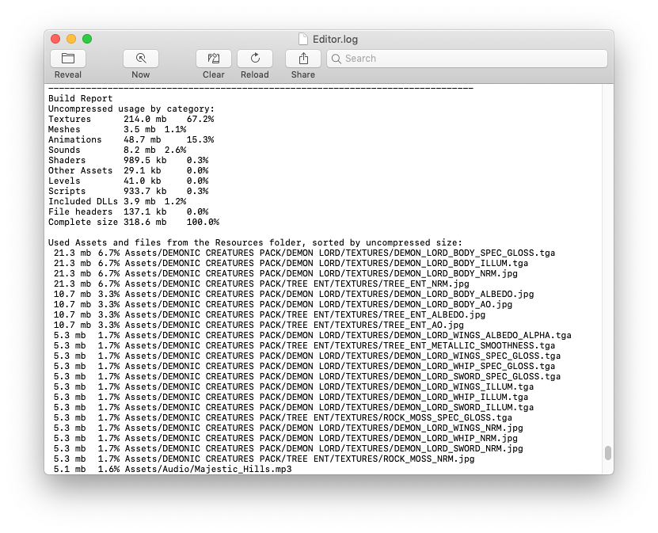

# 减小构建文件的大小

将构建的应用程序的文件大小保持在最低限度非常重要，尤其是对于移动设备或施加了大小限制的应用商店而言。减小大小的第一步是确定哪些资源对最终大小的影响最大，因为这些资源最有可能是需要优化的目标。执行构建后，可在 Editor 日志中找到此信息。选择 Console 窗口（菜单：__Window__ > **General** > **Console），单击右上角的小下拉选单面板，然后选择** Open Editor Log。


执行构建后打开的 Editor 日志

Editor 日志提供按类型细分的资源摘要，然后按大小比例顺序列出所有各个资源。通常，纹理 (Textures)、声音 (Sounds) 和动画 (Animations) 等内容占用的空间最多，而脚本 (Scripts)、关卡 (Levels) 和着色器 (Shaders) 一般影响最小。列表中显示的__文件标头 (File headers)__ 不是资源，实际上是添加到“原始”资源文件的额外数据，用于存储引用和设置。这些标头通常与资源大小差别很小，但如果在 Resources 文件夹中有许多大型资源，则该值可能会很大。

Editor 日志有助于识别可能要删除或优化的资源，但在开始之前应考虑以下事项：

- Unity 将导入的资源重新编码为其自己的内部格式，因此源资源类型的选择不是相关因素。例如，如果项目中有一个多层 Photoshop 纹理，在构建之前将其展平并压缩。将纹理导出为 .png 文件对构建大小没有任何影响，因此应该坚持使用在开发过程中最方便的格式。
- Unity 在构建期间会剥离大多数未使用的资源，因此无法通过从项目中手动删除资源来获得任何优化效果。唯一不会删除的资源是脚本（但无论如何，这些脚本通常都非常小）和 Resources 文件夹中的资源（因为 Unity 无法确定哪些是需要的，而哪些不是）。考虑到这一点，应确保 Resources 文件夹中的所有资源都是游戏所必需的资源。也许可以使用 [AssetBundle](https://docs.unity.cn/cn/2018.4/Manual/AssetBundlesIntro.html) 替换 Resources 文件夹中的资源；这样一来，Unity 就会动态加载资源，从而减小播放器大小。

## 关于减小构建大小的建议

### 纹理

纹理通常在构建中占据最多空间。第一个解决方案是使用压缩的纹理格式。请参阅有关[特定于平台的纹理压缩](https://docs.unity.cn/cn/2018.4/Manual/class-TextureImporterOverride.html)的文档以了解更多信息。

如果这样做不足以减小文件大小，请尝试减小纹理图像的物理大小（以像素为单位）。若要在不修改实际源内容的情况下执行此操作，请在 Project 视图中选择该纹理，然后在 Inspector 窗口中减小 **Max Size**。要查看纹理在游戏中的外观，请放大使用该纹理的游戏对象，然后调整 __Max Size__，直至该纹理在 Scene 视图中的外观开始变差。更改最大纹理大小不会影响纹理资源，只会影响纹理在游戏中的分辨率。

更改最大纹理大小不会影响纹理资源，只会影响纹理在游戏中的分辨率

默认情况下，Unity 在导入时会压缩所有纹理。要在 Editor 中加快工作流程，请选择 **Unity** < **Preferences** 并取消选中 **Compress Assets on Import** 的复选框。无论此设置如何，所有纹理都会在构建中进行压缩。

### 网格和动画

可以压缩[网格](https://docs.unity.cn/cn/2018.4/Manual/class-Mesh.html)和导入的动画剪辑，使它们在游戏文件中占用较少的空间。要启用网格压缩，请选择网格，然后在 Inspector 窗口中将 **Mesh Compression** 设置为 **Low**、**Medium** 或 **High**。网格和动画压缩使用量化技术，这意味着占用更少的空间，但压缩可能会带来一定程度的不准确性。请针对具体模型尝试找到可接受的压缩程度。

请注意，网格压缩只是生成较小的数据文件，在运行时不会减少使用的内存。减少动画关键帧会生成较小的数据文件，并会在运行时减少使用的内存；通常应始终启用该功能。请参阅有关[动画剪辑](https://docs.unity.cn/cn/2018.4/Manual/class-AnimationClip.html)的文档以了解与此相关的更多信息。

### 减小 .NET 库大小

Unity 支持两个 .NET API 兼容性级别：.NET 4.x 和 .NET Standard 2.0。.NET Standard 2.0 会将您限制在较小的 .NET API 子集中，这有助于减小大小。

# JSON 序列化

JSON 序列化功能将对象转换为 [JSON](http://www.json.org/) 格式或从 JSON 格式转换对象。此功能在与 Web 服务交互时很有用，也可直接用于轻松地将数据打包和解压为基于文本的格式。

有关 JsonUtility 类的信息，请参阅 Unity ScriptRef [JsonUtility](https://docs.unity.cn/cn/2018.4/ScriptReference/JsonUtility.html) 页面。

## 简单用法

JSON 序列化功能围绕“结构化”JSON 的概念而构建，因此可通过创建类或结构来描述将在 JSON 数据中存储的变量。例如：

```
[Serializable]
public class MyClass
{
    public int level;
    public float timeElapsed;
    public string playerName;
}
```

此代码段定义了一个包含三个变量（__level**、**timeElapsed__ 和 __playerName__）的普通 C# 类，并将该类标记为 Serializable，这是使用 JSON 序列化程序所必需的。然后，可按如下方式创建该类的实例：

```
MyClass myObject = new MyClass();
myObject.level = 1;
myObject.timeElapsed = 47.5f;
myObject.playerName = "Dr Charles Francis";
```

并使用 `JsonUtility.ToJson` 将其序列化为 JSON 格式：

```
string json = JsonUtility.ToJson(myObject);
```

因此将产生包含字符串的 `json` 变量：

```
{"level":1,"timeElapsed":47.5,"playerName":"Dr Charles Francis"}
```

要将 JSON 转换回对象，请使用 `JsonUtility.FromJson`：

```
myObject = JsonUtility.FromJson<MyClass>(json);
```

这将创建一个新的 `MyClass` 实例，并使用 JSON 数据设置该实例的值。如果 JSON 数据包含的值未映射到 `MyClass` 中的字段，则将忽略这些值，而如果 JSON 数据缺少 `MyClass` 字段的值，则这些字段将保留返回对象中的构造值。

JSON 序列化程序当前不支持使用“非结构化”JSON（即，以键/值对的任意树形式导航和编辑 JSON）。如果需要这样做，应采用功能更全面的 JSON 库。

## 用 JSON 覆盖对象

也可以获取 JSON 数据并在已经创建的对象“之上”反序列化该数据，从而覆盖已存在的数据：

```
JsonUtility.FromJsonOverwrite(json, myObject);
```

在 JSON 中不包含值的对象上的任何字段都将保持不变。此方法允许通过重用先前创建的对象将分配保持在最低限度，并允许故意用仅包含一小部分字段的 JSON 来覆盖对象以便“修补”对象。

请注意，JSON 序列化程序 API 支持 `MonoBehaviour` 和 `ScriptableObject` 子类以及普通结构/类。但是，将 JSON 反序列化为 `MonoBehaviour` 或 `ScriptableObject` 的子类时，_必须_使用 FromJsonOverwrite；FromJson 不受支持并将抛出异常。

## 支持的类型

该 API 支持任何 `MonoBehaviour` 子类、`ScriptableObject` 子类或者带有 `[Serializable]` 属性的普通类/结构。传入的对象将被送入标准 Unity 序列化程序进行处理，因此需要遵循与在 Inspector 中相同的规则和限制；只序列化字段，不支持类似 `Dictionary<>` 的类型。

目前不支持将其他类型直接传递给 API，例如原始类型或数组。现在需要将这些类型包裹在某种 `class` 或 `struct` 中。

在 Editor 中且仅在 Editor 中有一个并行 API：`EditorJsonUtility`，允许将 `UnityEngine.Object` 派生的任何类型与 JSON 进行互相序列化。这样生成的 JSON 将包含与对象的 YAML 表示相同的数据。

## 性能

基准测试表明，`JsonUtility` 要比流行的 .NET JSON 解决方案快得多（尽管功能比其中一些解决方案更少）。

GC 内存使用量为最低量：

- `ToJson()` 仅为返回的字符串分配 GC 内存。
- `FromJson()` 仅为返回的对象以及所需的所有子对象分配 GC 内存（例如，如果对包含数组的对象进行反序列化，则将为该数组分配 GC 内存）。
- `FromJsonOverwrite()` 仅根据需要为写入的字段（例如字符串和数组）分配 GC 内存。如果 JSON 覆盖的所有字段都是值类型，则不应分配任何 GC 内存。

**允许**使用后台线程中的 JsonUtility API。与任何多线程代码一样，在一个线程上序列化/反序列化对象时，应注意不要在另一个线程上访问或更改该对象。

## 控制 ToJson() 的输出

`ToJson` 支持完美打印 JSON 输出。此功能默认为关闭状态，但可通过传递 `true` 作为第二个参数来打开此功能。

可使用 `[NonSerialized]` 属性从输出中省略字段。

## 未提前知道类型的情况下使用 FromJson()

将 JSON 反序列化为包含“公共”字段的类或结构，然后使用这些字段的值来计算出您想要的实际类型。然后第二次反序列化为该类型。

# 流媒体资源 (Streaming Assets)

Unity 中的大多数资源在构建时都会合并到项目中。但是，将文件放入目标计算机上的普通文件系统以使其可通过路径名访问有时会很有用。这方面的一个例子是在 iOS 设备上部署电影文件；原始电影文件必须位于文件系统中的某个位置以便由 `PlayMovie` 函数进行播放。

放置在 Unity 项目中名为 **StreamingAssets__（区分大小写）的文件夹中的所有文件都将逐字复制到目标计算机上的特定文件夹。可使用 [Application.streamingAssetsPath](https://docs.unity.cn/cn/2018.4/ScriptReference/Application-streamingAssetsPath.html) 属性来检索此文件夹。在任何情况下，最好使用 `Application.streamingAssetsPath` 来获取** StreamingAssets__ 文件夹的位置，因为它总是指向运行应用程序的平台上的正确位置。

此文件夹的位置因平台而异。请注意，以下名称区分大小写：

- 在桌面计算机（Mac OS 或 Windows）上，可使用以下代码获取文件的位置：

  ```
   path = Application.dataPath + "/StreamingAssets";
  ```

- 在 iOS 上，使用：

  ```
   path = Application.dataPath + "/Raw";
  ```

- 在 Android 上，使用：

  ```
   path = "jar:file://" + Application.dataPath + "!/assets/";
  ```

在 Android 上，这些文件包含在压缩的 .jar 文件（其格式与标准的 zip 压缩文件基本相同）中。这意味着，如果不使用 Unity 的 WWW 类来检索文件，则需要使用其他软件查看 .jar 存档内部并获取文件。

**注意**：位于 **StreamingAssets** 文件夹中的 .dll 文件不参与编译。

# ScriptableObject

## ScriptableObject 是什么？

ScriptableObject 是一个可独立于类实例来保存大量数据的数据容器。ScriptableObjects 的一个主要用例是通过避免重复值来减少项目的内存使用量。如果项目有一个[预制件](https://docs.unity.cn/cn/2018.4/Manual/Prefabs.html)在附加的 MonoBehaviour 脚本中存储不变的数据，这将非常有用。每次实例化预制件时，都会产生单独的数据副本。这种情况下可以不使用该方法并且不存储重复数据，而是使用 ScriptableObject 来存储数据，然后通过所有预制件的引用访问数据。这意味着内存中只有一个数据副本。

与 MonoBehaviours 类似，ScriptableObjects 派生自 Unity 基对象，但不同于 MonoBehaviours 之处在于，不能将 ScriptableObject 附加到 [GameObject](https://docs.unity.cn/cn/2018.4/Manual/class-GameObject.html)。而是应该将它们保存为项目中的资源。

如果使用 Editor，可以在编辑时和运行时将数据保存到 ScriptableObjects，因为 ScriptableObjects 使用 Editor 命名空间和 Editor 脚本。但是，在已部署的构建中，不能使用 ScriptableObjects 来保存数据，但可以使用在开发期间设置的 ScriptableObject 资源中保存的数据。 从 Editor 工具作为资源保存到 ScriptableObjects 的数据将写入磁盘，因此将在会话之间一直保留。

## 使用 ScriptableObject

ScriptableObjects 的主要用例为：

- 在 Editor 会话期间保存和存储数据
- 将数据保存为项目中的资源，以便在运行时使用

要使用 ScriptableObject，必须在 **Assets** 文件夹中创建一个脚本，并使其继承自 `ScriptableObject` 类。您可以使用 [CreateAssetMenu](https://docs.unity.cn/cn/2018.4/ScriptReference/CreateAssetMenuAttribute.html) 属性，从而使用您的类轻松创建自定义资源。例如：

```c#
using UnityEngine;

[CreateAssetMenu(fileName = "Data", menuName = "ScriptableObjects/SpawnManagerScriptableObject", order = 1)]
public class SpawnManagerScriptableObject : ScriptableObject
{
    public string prefabName;

    public int numberOfPrefabsToCreate;
    public Vector3[] spawnPoints;
}
```

使用上述在 **Assets** 文件夹中创建的脚本，您可以通过导航到 **Assets > Create > ScriptableObjects > SpawnManagerScriptableObject** 来创建 ScriptableObject 的实例。为新的 ScriptableObject 实例提供有意义的名称并更改值。要使用这些值，必须创建一个引用 ScriptableObject（在本例中为 `SpawnManagerScriptableObject`）的新脚本。例如：

```c#
using UnityEngine;

public class Spawner : MonoBehaviour
{
    // 要实例化的游戏对象。
    public GameObject entityToSpawn;

    //上面定义的 ScriptableObject 的一个实例。
    public SpawnManagerScriptableObject spawnManagerValues;

    //这将附加到创建的实体的名称，并在创建每个实体时递增。
    int instanceNumber = 1;

    void Start()
    {
        SpawnEntities();
    }

    void SpawnEntities()
    {
        int currentSpawnPointIndex = 0;

        for (int i = 0; i < spawnManagerValues.numberOfPrefabsToCreate; i++)
        {
            //在当前生成点处创建预制件的实例。
            GameObject currentEntity = Instantiate(entityToSpawn, spawnManagerValues.spawnPoints[currentSpawnPointIndex], Quaternion.identity);

            //将实例化实体的名称设置为 ScriptableObject 中定义的字符串，然后为其附加一个唯一编号。
            currentEntity.name = spawnManagerValues.prefabName + instanceNumber;

            // 移动到下一个生成点索引。如果超出范围，则回到起始点。
            currentSpawnPointIndex = (currentSpawnPointIndex + 1) % spawnManagerValues.spawnPoints.Length;

            instanceNumber++;
        }
    }
}
```

将上述脚本附加到[场景](https://docs.unity.cn/cn/2018.4/Manual/CreatingScenes.html)中的游戏对象。然后，在 Inspector 中，将 **Spawn Manager Values** 字段设置为新设置的 `SpawnManagerScriptableObject`。将 **Entity To Spawn** 字段设置为 Assets 文件夹中的任何预制件，然后在 Editor 中单击 **Play**。您将在使用 `SpawnManagerScriptableObject` 设置实例化的 `Spawner` 中看到引用的预制件。 定义了 ScriptableObject 派生类后，可以使用 [CreateAssetMenu](https://docs.unity.cn/cn/2018.4/ScriptReference/CreateAssetMenuAttribute.html) 属性，从而轻松地使用该类创建自定义资源。

提示：在 Inspector 中使用 ScriptableObject 引用时，可以双击引用字段来打开 ScriptableObject 的 Inspector。还可以创建自定义编辑器来定义该类型的 Inspector 外观，从而帮助管理它所代表的数据。

