# 高级开发

# 性能分析器概述

Unity Profiler 窗口可帮助优化游戏。此窗口会报告游戏的各个方面所用的时间。例如，可报告渲染、动画化或游戏逻辑所用的时间百分比。

可以分析 GPU、CPU、内存、渲染和音频的性能。

要查看性能分析数据，可在 Editor 中启用性能分析的情况下玩游戏，这样就会记录性能数据。然后，Profiler 窗口会在时间轴中显示数据，因此可以看到处于峰值（占用更多时间）的帧或区域。通过单击时间轴中的任意位置，Profiler 窗口的底部将显示所选帧的详细信息。

请注意，性能分析必须设置您的代码（即添加一些指令以便于检查）。虽然这对游戏性能有少许影响，但开销足够很小，不会影响游戏帧率。

## 关于使用该工具的提示

使用性能分析工具时，应关注消耗最多时间的游戏部分。比较代码更改前后的性能分析结果，由此衡量改进情况。有时为提高性能而进行的更改可能会对帧率产生负面影响；代码优化可能会产生意外后果。

## 性能分析器控件


性能分析器控件位于窗口顶部的工具栏中。使用这些控件可打开和关闭性能分析以及并浏览分析的帧。转移控件位于工具栏的最右端。请注意，当游戏正在运行且性能分析器正在收集数据时，单击任何这些转移控件会暂停游戏。这些控件可分别转到第一个记录的帧、后退一个帧、前进一个帧以及转到最后一帧。

性能分析器不会保留所有记录的帧，因此_第一_帧的概念应该是仍然保留在内存中的最早的帧。“当前”转移按钮使性能分析统计窗口显示实时收集的数据。Active Profiler 弹出菜单用于选择是在 Editor 中还是在单独的播放器中进行性能分析（例如，在连接的 iOS 设备上运行的游戏）。使用 Save 按钮可以将记录的帧写入文件。相应地，Load 按钮读取先前保存的数据。还可以加载由播放器写出的二进制性能分析数据（生成日志时，设置 [Profiler.enableBinaryLog](https://docs.unity.cn/cn/2018.4/ScriptReference/Profiling.Profiler-enableBinaryLog.html) 以启用二进制格式）。如果在按下 Shift 键的同时单击“Load”按钮，文件内容将附加到内存中的当前性能分析帧。

### 深度性能分析 (Deep Profiling)

打开 **Deep Profile** 后，将分析_所有_的脚本代码，也就是说会记录所有函数调用。这有助于了解游戏代码中的确切时间使用情况。

请注意，深度性能分析会产生**非常大的开销**并占用大量内存，因此在性能分析时游戏的运行速度会明显变慢。如果脚本代码很复杂，可能根本无法进行深度性能分析。对于使用简单脚本编写的小游戏，深度性能分析应该足够快。如果发现整个游戏的深度性能分析导致帧率下降太多以至于游戏几乎无法运行，应考虑不使用此方法，而是使用下面描述的方法。在设计游戏并决定如何以最佳方式实现关键功能时，可能适合使用深度性能分析。请注意，对于大型游戏，深度性能分析可能会导致 Unity 耗尽内存，因此可能无法进行深度性能分析。

手动分析脚本代码块的开销比使用深度性能分析要小。使用 [Profiler.BeginSample](https://docs.unity.cn/cn/2018.4/ScriptReference/Profiling.Profiler.BeginSample.html) 和 [Profiler.EndSample](https://docs.unity.cn/cn/2018.4/ScriptReference/Profiling.Profiler.EndSample.html) 脚本函数可启用和禁用关于代码段的性能分析。

## Profiler 时间轴

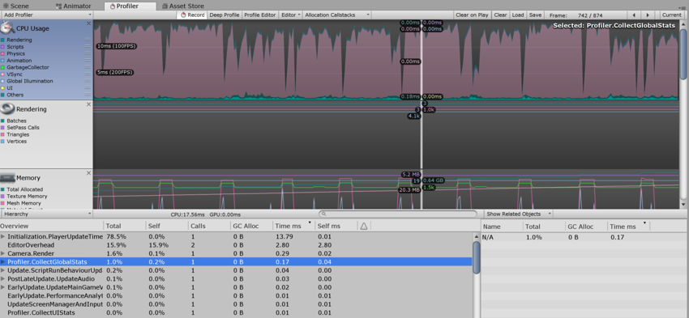

Profiler 窗口的上半部分显示随时间推移的性能数据。运行游戏时，每帧都会记录数据，并显示最近几百帧的历史记录。单击特定帧将在窗口的下半部分显示其详细信息。根据当前选择的时间轴区域会显示不同的详细信息。

时间轴的垂直刻度是自动管理的，并会尝试填充窗口的垂直空间。请注意，要显示更多详细信息，比如 CPU Usage 区域中的信息，可删除 Memory 和 Rendering 区域。此外，可选择时间轴和统计信息区域之间的分割线并向下拖动，从而增加用于时间轴图表的屏幕区域。

时间轴包含几个区域：CPU Usage、Rendering 和 Memory。单击面板中的关闭按钮可删除这些区域，而使用性能分析器控件栏中的 *Add Area* 下拉选单可重新添加这些区域。

请注意，标签区域中的彩色方块可以控制是否显示关联的时间轴。要从显示中删除样本，请单击颜色键。该键将变暗，且数据将从图表中删除。此功能很有用，例如，可用于找出 CPU 图中产生尖峰的原因。

## WebGL

与任何其他平台上一样，可在 WebGL 上使用 Unity Profiler。但有一个重要的区别，即无法附加到 WebGL 中运行的播放器，因为 WebGL 使用 WebSocket 进行通信，导致不允许浏览器端的传入连接。相反，需要使用 Build Settings 中的“Autoconnect Profiler”复选框。还要注意，目前无法为 WebGL 分析绘制调用。

## 远程性能分析

要分析在另一台设备上运行的游戏或在另一台计算机上运行的 Unity 播放器的性能，可将 Unity Editor 连接到该设备或计算机。**Active Profiler** 下拉选单会显示本地网络上运行的所有 Unity 播放器。这些播放器由玩家类型和运行播放器的主机名进行标识，如“iPhonePlayer (Toms iPhone)”。

为了能够连接到 Unity 播放器，必须将 Unity 播放器作为 **Development build__（菜单：__File** > **Build Settings…**）启动。

在对话框中选中 **Development Build** 选项。在此处还可选中 **Autoconnect Profiler** 以确保 Editor 和播放器在启动时自动连接。

### iOS

按照以下步骤在 iOS 设备上启用远程性能分析：

1.将 iOS 设备连接到 WiFi 网络。（性能分析器使用本地 WiFi 网络将性能分析数据从您的设备发送到 Unity Editor。） 1.在 Unity Editor 的 **Build Settings** 对话框（菜单：__File__ > **Build Settings…**）中，选中 **Autoconnect Profiler** 复选框。 1.通过线缆将设备连接到 Mac。在 Unity Editor 的 **Build Settings** 对话框（菜单：__File__ > **Build Settings…**）中，选中 **Autoconnect Profiler** 复选框，并选择 **Build & Run**。 1.在设备上启动应用程序时，在 Unity Editor 中打开 Profiler 窗口 (**Window** > **Analysis** > **Profiler**)。

如果使用了防火墙，需要确保防火墙出站规则中的端口 54998 至 55511 已打开；这些是 Unity 用于远程性能分析的端口。

**注意：**有时，Unity Editor 可能无法自动连接到设备。在这种情况下，可从 Profiler 窗口 **Active Profiler** 下拉菜单中选择适当的设备来启动性能分析器连接。

### Android

可使用两种方法以 Android 设备上启用远程性能分析：WiFi 或 [ADB](http://developer.android.com/guide/developing/tools/adb.html)。

要进行 WiFi 性能分析，请遵循以下步骤：

1.确保在 Android 设备上禁用移动数据 (Mobile Data)。 1.将 Android 设备连接到 WiFi 网络。（性能分析器使用本地 WiFi 网络将性能分析数据从您的设备发送到 Unity Editor。） 1.通过线缆将设备连接到 Mac 或 PC。在 Unity 的 Build Settings 对话框中选中 **Development Build** 和 **Autoconnect Profiler** 复选框，然后在 Unity Editor 中单击 **Build & Run**。 1.在设备上启动应用程序时，在 Unity Editor 中打开 Profiler 窗口（菜单：__Window__ > **Analysis** > **Profiler__）。 1.如果 Unity Editor 无法自动连接到设备，请从 Profiler 窗口** Active Profiler__ 下拉菜单中选择适当的设备。

**注意：**Android 设备和主机（运行 Unity Editor）必须位于同一[子网](http://en.wikipedia.org/wiki/Subnetwork)上才能正常进行设备检测。

要进行 ADB 性能分析，请遵循以下步骤：

- 通过线缆将设备连接到 Mac 或 PC，并确保 ADB 能识别该设备（即显示在 _adb 设备_列表中）。
- 在 Unity Editor 的 **Build Settings** 对话框（菜单：__File__ > **Build Settings__）中，选中** Development Build__ 复选框并选择 **Build & Run**。
- 在设备上启动应用程序时，在 Unity Editor 中打开 Profiler 窗口（菜单：__Window__ > **Analysis** > __Profiler__）。
- 从 Profiler 窗口 **Active Profiler** 下拉菜单中选择 *AndroidProfiler(ADB@127.0.0.1:34999)*。 **注意：**单击 **Build & Run** 时，Unity Editor 会自动为应用程序创建一个 adb 通道。 如果要分析其他应用程序或重新启动 adb 服务器，必须手动设置此通道。为此，请打开终端窗口/CMD 提示窗口，并输入：

```
adb forward tcp:34999 localabstract:Unity-{在此处插入 Bundle ID}
```

**注意：**仅当所选目标为 Android 时，才会显示下拉菜单中的条目。

# CPU 使用率性能分析器 (CPU Usage Profiler)

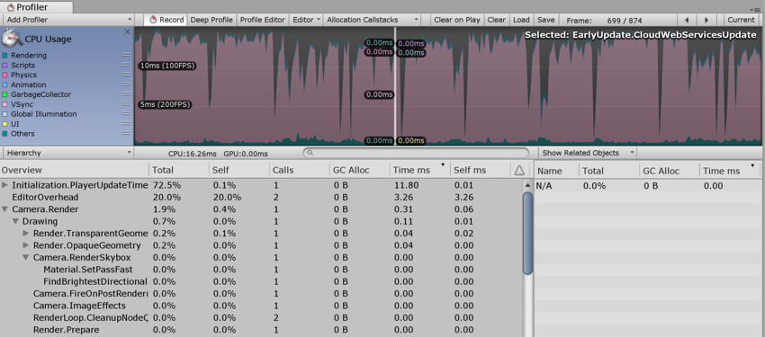

CPU Usage Profiler 显示游戏中的时间使用情况。选择此选项后，下方面板将显示所选帧的层级时间数据。请参阅有关 [Profiler 窗口](https://docs.unity.cn/cn/2018.4/Manual/ProfilerWindow.html)的文档以了解关于 Profiler 时间轴的更多信息。

- **Hierarchy mode：**显示层级时间数据。
- **Group Hierarchy mode：**将时间数据分成逻辑组（例如 Rendering、Physics、Scripts）。由于任何组的子项也可以位于不同的组中（例如，某些脚本也可能调用渲染函数），因此组时间的百分比通常总计超过 100%。

上下拖动图表标签可重新排列 CPU 图表的堆叠方式。

## 选择各项

在下方面板中选择某一项时，将突出显示其对 CPU 图表的贡献（其余部分将变暗）。再次单击某一项将取消选择该项。

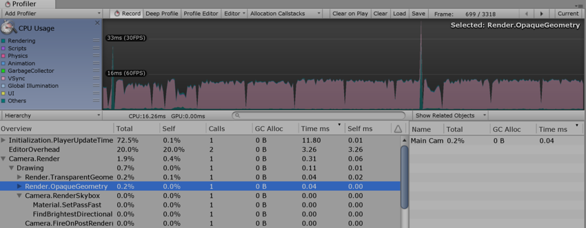已选择 Render.OpaqueGeometry 并在图表中突出显示其贡献

在层级时间数据中，__Self__ 列表示在特定函数中所用的时间量，不包括调用子函数所用的时间。在上面的截屏中，1.9% 的时间用在了 `Camera.Render` 函数上。此函数在此帧做了一些工作，并调用各种绘制和剔除函数。排除所有这些函数之后，只有 0.4% 的时间用在了 `Camera.Render` 函数本身上。

**Time ms** 和 **Self ms** 列显示相同的信息，但以毫秒为单位。`Camera.Render` 需要 0.06ms，但包括其调用的所有函数在内一共需要 0.31ms。**GC Alloc** 列显示当前帧中已分配并稍后由垃圾回收器收集的内存量。将此值保持为零可防止垃圾回收器造成帧率不稳。

CPU 性能分析器的 **Others** 部分记录不属于 Rendering、Scripts、Physics、Garbage Collection 或 VSync 的所有方面的总和。此部分包括 Animation、AI、Audio、Particles、Networking、Loading 和 PlayerLoop。

## 物理标记

下面的描述简要介绍了各种高级 Physics Profiler 标记的含义。

- **Physics.Simulate：**从 `FixedUpdate` 中调用。通过指示物理引擎 (PhysX) 运行其模拟来更新物理系统的当前状态。

- **Physics.Processing：**从 `FixedUpdate` 中调用。处理所有非布料物理作业。扩展此标记可显示物理引擎内部完成的工作的低级细节。

- **Physics.ProcessingCloth：**从 `FixedUpdate` 中调用。处理所有布料物理作业。扩展此标记将显示物理引擎内部完成的工作的低级细节。

- **Physics.FetchResults：**从 `FixedUpdate` 中调用。从物理引擎收集物理模拟结果。

- **Physics.UpdateBodies：**从 `FixedUpdate` 中调用。更新所有物理体的位置和旋转以及发送说明这些更新的消息。

- Physics.ProcessReports：从  `  FixedUpdate  ` 中调用。此阶段在物理` FixedUpdate` 结束后运行，负责处理响应模拟结果的所有不同阶段。更新接触、关节破坏和触发器并发送相关消息。包括四个不同的子阶段：

  - **Physics.TriggerEnterExits：**从 `FixedUpdate` 中调用。处理 `OnTriggerEnter` 和 `OnTriggerExit` 事件。
  - **Physics.TriggerStays：**从 `FixedUpdate` 中调用。处理 `OnTriggerStay` 事件。
  - **Physics.Contacts：**从 `FixedUpdate` 中调用。处理 `OnCollisionEnter`、`OnCollisionExit` 和 `OnCollisionStay` 事件。
  - **Physics.JointBreaks：**从 `FixedUpdate` 中调用。处理与被破坏的关节相关的更新和消息。
  
- **Physics.UpdateCloth：**从 `Update` 中调用。进行与布料及其蒙皮网格相关的更新。

- **Physics.Interpolation：**从 `Update` 中调用。此阶段处理所有物理对象的位置和旋转的插值。

## 性能警告

CPU 性能分析器能够检测并警告一些常见的性能问题。查看 **CPU Usage** 时，这些问题会显示在下方面板的 **Warning** 列中。

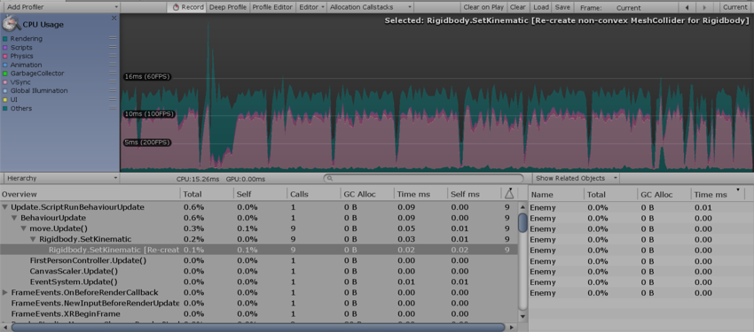性能分析器警告指示已移动静态碰撞体

性能分析器可检测的具体问题包括：

- **Rigidbody.SetKinematic** [为刚体重新创建非凸面体 MeshCollider]
- **Animation.DestroyAnimationClip** [触发 RebuildInternalState]
- **Animation.AddClip** [触发 RebuildInternalState]
- **Animation.RemoveClip** [触发 RebuildInternalState]
- **Animation.Clone** [触发 RebuildInternalState]
- **Animation.Deactivate** [触发 RebuildInternalState]

在上面的截屏中，性能分析器显示了 **Static Collider.Move** 警告。**Warning** 列显示此警告已在当前帧中触发 12 次。术语“延迟成本”意味着，虽然性能分析器中的条目可能显示低成本（在此情况下为 0.00ms），但该操作可能会在以后触发更多消耗系统资源的操作。

## CPU Profiler Timeline

### Mem Record：本机内存性能分析

本机内存性能分析允许在 Unity 的本机内存管理系统中分析活动，并评估对运行时性能的影响。在 Unity 的内存管理中搜索不必要的或资源密集的分配模式时，此分析功能非常有用。

要分析 Unity 的本机内存管理，必须记录内存情况。要访问本机内存记录模式（在 Unity 中称为 **Mem Record__），请选择** Window__ > **Analysis** > **Profiler** 以打开 Profiler 窗口。选择 **CPU Usage** Profiler（如果不可见，请单击 **Add Profiler** > **CPU__），然后在 Profiler 下面选择下拉菜单。接下来，单击** Timeline__，然后选择 **Mem Record**。

选择记录模式

| **选项**             | **功能**                                                     | **对性能的影响** |
| :------------------- | :----------------------------------------------------------- | :--------------- |
| **None**             | 禁用模式。这是默认选择。                                     | 无               |
| **Sample only**      | 记录内存分配、重新分配、取消分配、活动类型和系统。           | 低               |
| **Callstack (fast)** | 此选项具有与 **Sample only** 相同的功能，但还记录来自本机分配站点的快捷调用栈（调用栈从本机符号转换为脚本符号）。实际上，最多只能看到最深脚本符号的调用栈。 | 中               |
| **Callstack (full)** | 此选项具有与 **Sample only** 相同的功能，但还记录具有完整脚本到本机转换和本机到脚本转换的调用栈。 | 高               |

**注意：**当激活的性能分析器仅连接到独立平台播放器时，仅支持低影响力的 **Sample only** 模式。

记录的内存分配样本以亮红色显示在 Profiler 窗口中。


单击 **Mem Record** 旁边的 **High Detail** 按钮可启用 High Detail 模式。选择一个样本来显示分配类型和系统。如果为所选分配样本记录了调用栈，则还会解析并显示关联的调用栈符号：


#### 使用 Mem Record

在许多情况下，__Mem Record__ 功能很有用。例如：

- 了解系统何时进行大量小型分配而不仅仅是少量大型分配。
- 了解何时工作线程意外分配内存（例如，通过意外使用 MemLabel）。
- 查找锁争用（多个线程尝试同时访问本机内存系统时）。
- 查找内存碎片的来源（对于低内存设备尤为重要）。

## Timeline 的 High Detail 视图

CPU Usage Profiler Timeline 的 **High Detail** 视图为 Unity 的 CPU Usage Profiler 记录的每个样本提供至少一个宽度像素。

这样便可查看帧中所有活动的完整概况，包括线程同步或内存分配等短期活动。

要启用 **High Detail** 视图，请选择 **Window** > **Analysis** > **Profiler** 以打开 Profiler 窗口。选择 **CPU Usage** Profiler（如果不可见，请单击 **Add Profiler** > **CPU__），然后将在 Profiler 下面选择下拉菜单，并依次单击** Timeline__ 和 **High Detail**。


## 比较

以下两个图显示了 CPU Usage Profiler Timeline 的 **High Detail** 视图与普通视图之间的区别。

### High Detail 视图


### 普通视图


# 渲染性能分析器 (Rendering Profiler)


Rendering Profiler 显示渲染统计信息。时间轴显示渲染的批次 (Batches)、SetPass 调用 (SetPass Calls)、三角形 (Triangles) 和顶点 (Vertices) 的数量。下方面板将显示更多渲染统计信息，这些统计信息与 GameView [Rendering Statistics](https://docs.unity.cn/cn/2018.4/Manual/RenderingStatistics.html) 窗口中显示的统计信息非常接近。

# 内存性能分析器 (Memory Profiler)

Memory Profiler 中提供了两种模式来检查应用程序的内存使用情况。在下方面板左上角的下拉选单中可选择模式。

## Simple

**Simple** 视图提供每个帧在整个 Unity 中的实时内存使用量的简单概况。

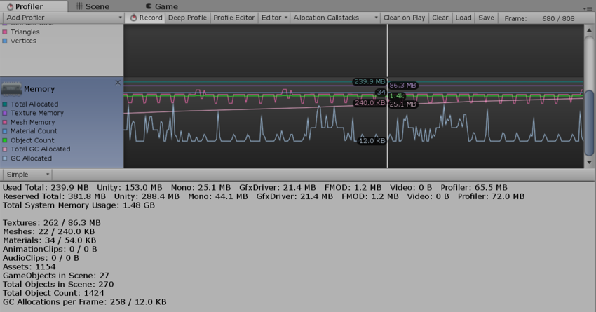

Unity 保留了可供分配的内存池，以免过于频繁向操作系统索取内存。此部分显示为保留量以及已用量。

此部分涵盖的方面包括：

- **Unity**：本机 Unity 代码中的分配所跟踪的内存量
- **Mono**：托管代码使用的总堆大小和已用堆大小。此内存量是垃圾收集量
- **GfxDriver**：驱动程序对纹理、渲染目标、着色器和网格数据使用的估计内存量。
- **FMOD**：音频驱动程序的估计内存使用量
- **Profiler**：用于性能分析器数据的内存

显示的数字与任务管理器或活动监视器不同，因为 Memory Profiler 未对某些用途进行跟踪。这些用途包括一些驱动程序使用的内存和用于可执行代码的内存。

此性能分析器会显示某些最常见的资源/对象类型的内存统计信息。这些统计信息包括计数和已用内存（主内存和视频内存）：

- **纹理 (Textures)**
- **网格 (Meshes)**
- **材质 (Materials)**
- **动画 (Animations)**
- **音频 (Audio)**
- **对象计数 (Object Count)**

**Object Count** 是创建的对象总数。如果此数字随着时间的推移而上升，表明游戏创建了一些永不销毁的对象。

## Detailed

**Detailed** 视图用于创建当前状态的快照。使用 **Take Sample** 按钮可捕获详细的内存使用情况。获取此数据需要一些时间，因此不要期望 Detailed 视图能提供实时详细信息。在采样之后，Profiler 窗口将更新为树视图，可在其中查看内存使用情况。

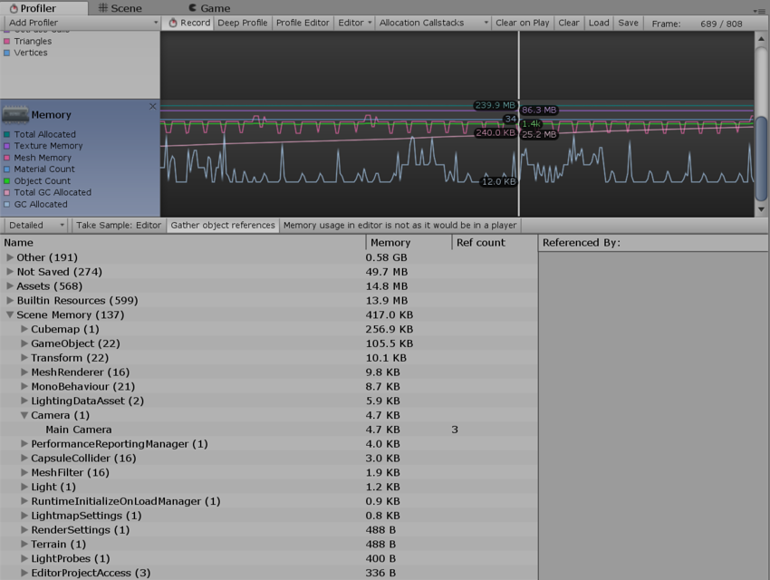

此视图将显示各个资源和游戏对象的内存使用情况。此外还显示游戏对象位于内存中的原因。常见原因包括：

- **Assets**：从用户或本机代码引用的资源
- **Built-in Resources**：Unity Editor 资源或 Unity 默认资源
- **Not Saved**：标记为 DontSave 的游戏对象
- **Scene Memory**：游戏对象和附加的组件
- **Other**：未在上述类别中标记的游戏对象

单击列表中的游戏对象可在 Project 或 Scene 视图中查看该游戏对象。

在 Editor 中进行性能分析时，Memory Profiler 显示的所有数字都表示 Editor 中的内存使用情况。这些数字通常比在播放器中运行时更大，因为运行 Unity Editor 会增加额外的内存。如需了解应用程序更精确的数字和内存使用情况，请使用性能分析器连接来连接到正在运行的播放器。这样将给出目标设备上的实际使用情况。

在 `System.ExecutableAndDlls` 下报告的内存是只读内存，因此操作系统可能会根据需要丢弃这些页面，然后从文件系统重新加载它们。这样可以降低内存使用量，而且通常不会直接导致操作系统决定终止应用程序。此外，其中一些页面也可能与使用相同框架的其他应用程序共享。

# 音频性能分析器 (Audio Profiler)

在 Profiler 窗口中，有一个名为 Audio 的面板。该面板将显示有关音频系统的重要性能指标，例如总负载和语音计数。突出显示该面板时，窗口的下半部分将变为详细视图，其中包含图表未涵盖的音频系统各个部分。

- **Playing Sources** 是特定帧在场景中的总播放源。监控此信息可了解音频是否过载。
- **Paused Sources** 是特定帧在场景中的暂停源。
- **Audio Voice** 是实际使用的音频（FMOD 通道）语音数。PlayOneShot 表示未显示在 Playing Sources 中的语音。
- **Audio Memory** 是音频引擎使用的总 RAM。

可在底部看到 CPU 使用率。监控此信息可了解单独的音频是否占用太多 CPU。

单击 **Channels**、**Groups** 或 **Channels and groups** 按钮可获取声音事件的每帧详细记录。在此处可以获取和浏览这些事件，就像渲染器和内存图一样。

帧日志中的行会显示诸如哪些音频源播放了哪些剪辑、播放的音量、与监听器的距离以及相对回放时间等信息。 单击其中一行将在 Project Browser 和 Hierarchy 窗口中突出显示关联的音频源和剪辑。

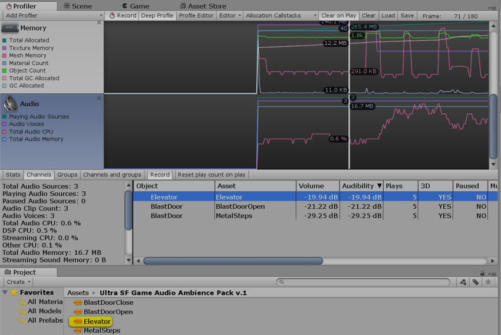 **Channel** 视图。单击一行时，首先突出显示音频剪辑资源，然后在层级视图中突出显示播放该资源的音频源。

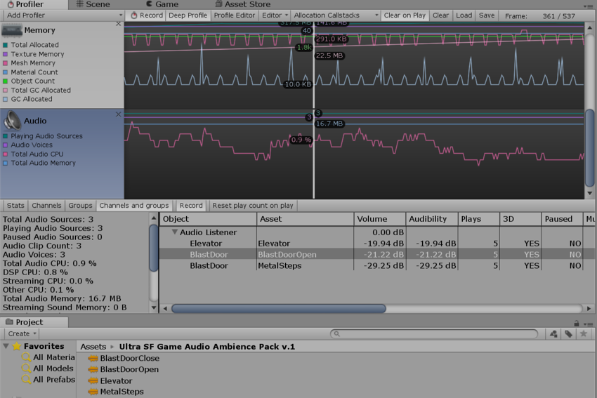 **Channels and groups** 视图。此处突出显示了在所选行中播放声音的音频源。


内存性能分析器 (Memory Profiler)

# 物理性能分析器 (Physics Profiler)

Physics Profiler 显示物理引擎在场景中已处理的物理统计信息。此信息有助于诊断和解决与场景中的物理相关的性能问题或意外差异。

另请参阅[物理调试可视化](https://docs.unity.cn/cn/2018.4/Manual/PhysicsDebugVisualization.html)。

Physics Profiler

## 属性

| **属性**               | **功能**                                                     |
| :--------------------- | :----------------------------------------------------------- |
| **Active Dynamic**     | 非睡眠的非运动刚体组件的数量。                               |
| **Active Kinematic**   | 非睡眠的运动刚体组件的数量。请注意，已附加关节的运动刚体组件可能每帧被处理多次，这会计入显示的数量中。在帧中调用 [MovePosition](https://docs.unity.cn/cn/2018.4/ScriptReference/Rigidbody.MovePosition.html) 或 [MoveRotation](https://docs.unity.cn/cn/2018.4/ScriptReference/Rigidbody.MoveRotation.html) 时，运动刚体处于活动状态，并在下一帧中保持活动状态。 |
| **Static Colliders**   | 未附加刚体组件或父游戏对象未附加刚体组件的游戏对象上的碰撞体组件数。如果此类游戏对象或其父游戏对象具有刚体组件，则碰撞体将不计为静态碰撞体。这些碰撞器称为复合碰撞体。这有助于以方便的方式排列多个碰撞体，而不是将所有碰撞体放在与刚体组件相同的游戏对象上。 |
| **Rigidbody**          | 物理引擎处理的刚体组件数量（与组件的睡眠状态无关）。         |
| **Trigger Overlaps**   | 重叠触发器的数量（成对计数）。                               |
| **Active Constraints** | 物理引擎处理的原始约束的数量。约束用作关节的构建块以及碰撞响应。例如，限制 [ConfigurableJoint](https://docs.unity.cn/cn/2018.4/ScriptReference/ConfigurableJoint.html) 的线性或旋转自由度涉及每个限制的基本约束。 |
| **Contacts**           | 场景中所有碰撞体之间的触点对总数，也包括触发器重叠对的数量。请注意，一旦每个碰撞体对之间的距离低于特定的用户可配置限制，该碰撞体对就会创建一个触点对，因此可能会看到针对尚未接触或重叠的刚体组件生成的触点。有关更多详细信息，请参阅 [Collider.contactOffset](https://docs.unity.cn/cn/2018.4/ScriptReference/Collider-contactOffset.html) 和 [ContactPoint.separation](https://docs.unity.cn/cn/2018.4/ScriptReference/ContactPoint-separation.html)。 |

**注意**：

- 这些数字可能与场景中具有物理组件的游戏对象的确切数量不对应。这是因为有些物理组件以不同的速率处理，具体取决于其他组件产生的影响（例如，附加的关节组件）。要计算附加了特定物理组件的游戏对象的确切数量，请使用 [FindObjectsOfType](https://docs.unity.cn/ScriptReference/Object.FindObjectsOfType.html) 函数编写自定义脚本。
- Physics Profiler 不显示睡眠刚体组件的数量。这些是与物理引擎无关的组件，因此不由 Physics Profiler 处理。有关睡眠刚体组件的更多信息，请参阅[刚体概述：睡眠](https://docs.unity.cn/cn/2018.4/Manual/RigidbodiesOverview.html)。

## 使用 Physics Profiler 了解性能问题

物理模拟在主逻辑更新循环的单独固定频率更新周期中运行，只能通过每次调用的 [Time.fixedDeltaTime](https://docs.unity.cn/cn/2018.4/ScriptReference/Time-fixedDeltaTime.html) 推进时间。这类似于 [Update](https://docs.unity.cn/cn/2018.4/ScriptReference/MonoBehaviour.Update.html) 和 [FixedUpdate](https://docs.unity.cn/cn/2018.4/ScriptReference/MonoBehaviour.FixedUpdate.html) 之间的区别（有关更多信息，请参阅关于 [Time](https://docs.unity.cn/cn/2018.4/Manual/class-TimeManager.html) 窗口的文档）。

当出现需要很长时间的复杂逻辑或图形帧时，Physics Profiler 必须每帧多次调用物理模拟。这意味着已经占用大量资源的帧会占用更多的时间和资源，这很容易导致物理模拟因为 **Maximum Allowed Timestep** 值（设置菜单：__Edit__ > **Project Settings__，然后选择** Time__ 类别）而暂时停止。

可在项目中检测到这一点，方法是选择 [CPU Usage Profiler](https://docs.unity.cn/cn/2018.4/Manual/ProfilerCPU.html) 并在 **Overview** 部分中检查 **Physics.Processing** 或 **Physics.Simulate** 的调用次数。

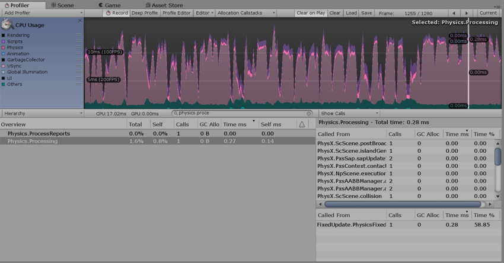**Calls** 列中的值为 1 的 Physics Profiler

在此示例图中，__Calls__ 列中的值 1 表示物理模拟在最后一个逻辑帧上被调用一次。

调用计数接近 10 可能表示存在问题。第一种解决方案是降低物理模拟的频率；如果问题仍然存在，请检查在 Physics Profiler 必须使用大量模拟调用以便追赶游戏时间之前可能是什么原因导致了大型帧。有时，大型的图形帧可能会导致稍后在场景中进行更多物理模拟调用。

如需了解场景中的物理模拟的更多详细信息，请单击三角形箭头以展开 __Physics.Processing__，如上面的截屏所示。此时可看到为更新场景而运行的物理引擎任务的实际名称。可能会看到的两个最常见的名称为：

- __Pxs__：“PhysX 解算器”(PhysX solver) 的缩写，是关节所需的以及用于解算重叠体触点的物理引擎任务。
- __ScScene__：更新场景、运行宽阶段和窄阶段以及整合刚体（由于力和冲量将它们移动到空间中）所需的任务。请参阅 [Steven M. LaValle 的“规划算法”(Planning Algorithms)](http://planning.cs.uiuc.edu/node214.html) 了解两阶段碰撞检测阶段的定义。

# GPU 性能分析器 (GPU Profiler)

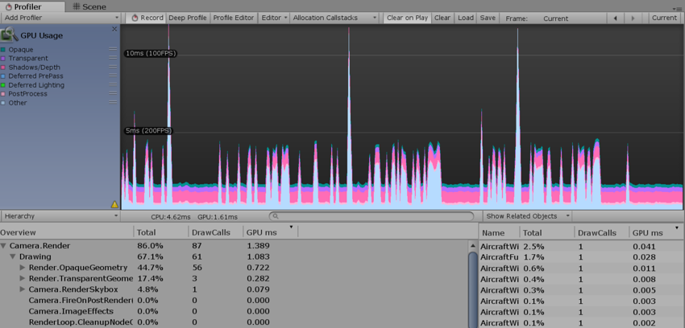GPU Usage Profiler

GPU Usage Profiler 显示游戏中的 GPU 时间使用情况。选择此性能分析器后，下方面板将显示所选帧的层级时间数据。从层级视图中选择一项即可在右侧面板中查看贡献的细分情况。请参阅有关 [Profiler 窗口](https://docs.unity.cn/Manual/ProfilerWindow.html)的文档以了解关于性能分析器的更多信息。

请注意，在 **Player** 设置中启用 **Graphics Jobs (Experimental)** 的情况下将禁用 GPU 性能分析。请参阅有关[独立平台播放器](https://docs.unity.cn/cn/2018.4/Manual/class-PlayerSettingsStandalone.html)设置的文档以了解更多信息。在 macOS 上，GPU 性能分析仅适用于 OSX 10.9 Mavericks 及更高版本。

## 远程性能分析支持

| 平台          | 图形 API                                                     | 状态                                          |
| :------------ | :----------------------------------------------------------- | :-------------------------------------------- |
| Windows       | D3D9、D3D11、D3D12、OpenGL Core、OpenGL ES 2.0、OpenGL ES 3.x、Vulkan | 受支持。                                      |
| Mac OS X      | OpenGL Core                                                  | 受支持。                                      |
|               | Metal                                                        | 不可用。改用 XCode 的 GPU 帧调试器 UI。       |
| Linux         | OpenGL Core、Vulkan                                          | 受支持。                                      |
| PlayStation 4 | libgnm                                                       | 受支持（另一种选择是 Razor）。                |
| Xbox One      | D3D11                                                        | 受支持（另一种选择是 PIX）。                  |
| WebGL         | WebGL 1.0 和 WebGL 2.0                                       | 不可用。                                      |
| Android       | OpenGL ES 2.0、OpenGL ES 3.x                                 | 仅在运行 NVIDIA 或 Intel GPU 的设备上受支持。 |
|               | Vulkan                                                       | 受支持                                        |
| iOS、tvOS     | Metal、OpenGL ES 2.0、OpenGL ES 3.0                          | 不可用。改用 XCode 的 GPU 帧调试器 UI。       |
| Tizen         | OpenGL ES 2.0                                                | 不可用。                                      |

## 在 Unity Editor 中进行性能分析

Editor 仅支持在装有 Direct3D 9 和 Direct3D 11 API 的 Windows 上进行性能分析。此做法有利有弊：便于快速分析，因为意味着不需要构建播放器；但是，性能分析器受运行 Unity Editor 的开销所影响，可能会使性能分析结果不够准确。

# 全局光照性能分析器 (Global Illumination Profiler)


Global Illumination Profiler 显示实时全局光照 (GI) 子系统的统计信息以及在所有工作线程中消耗的 CPU 时间。GI 由 Unity 中的一个名为 Enlighten 的中间件进行管理。请参阅有关[全局光照](https://docs.unity.cn/cn/2018.4/Manual/GlobalIllumination.html)的文档以了解更多信息。

| **Name**                         | **Description**                                              |
| -------------------------------- | ------------------------------------------------------------ |
| **Total CPU Time**               | Total Enlighten CPU time across all threads.                 |
| **Probe Update Time**            | Time spent updating Light Probes.                            |
| **Setup Time**                   | Time spent in the Setup stage.                               |
| **Environment Time**             | Time spent processing Environment lighting.                  |
| **Input Lighting Time**          | Time spent processing input lighting.                        |
| **Systems Time**                 | Time spent updating Systems.                                 |
| **Solve Tasks Time**             | Time spent running radiosity solver tasks.                   |
| **Dynamic Objects Time**         | Time spent updating Dynamic GameObjects.                     |
| **Time Between Updates**         | Time between Global Illumination updates.                    |
| **Other Commands Time**          | Time spent processing other commands.                        |
| **Blocked Command Write Time**   | Time spent in blocked state, waiting for command buffer.     |
| **Blocked Buffer Writes**        | Number of writes to the command buffer that were blocking.   |
| **Total Light Probes**           | Total number of Light Probes in the Scene.                   |
| **Solved Light Probes**          | Number of solved Light Probes since the last update.         |
| **Probe Sets**                   | Number of Light Probe sets in the Scene.                     |
| **Systems**                      | Number of Enlighten Systems in the Scene.                    |
| **Pending Material GPU Renders** | Number of Albedo/Emission renders queued for rendering on the GPU. |
| **Pending Material Updates**     | Number of Material updates waiting to get processed.         |

# UI 性能分析器 (UI Profiler)

UI Profiler 是专用于游戏内 UI 的性能分析器模块。

可通过 [Profiler 窗口](https://docs.unity.cn/cn/2018.4/Manual/ProfilerWindow.html)的菜单 **Add Profiler** > **UI and UI Details** 访问该模块。

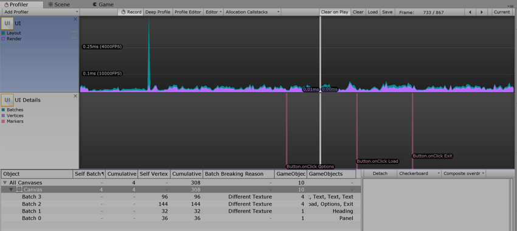UI 和 UI Details Profiler 窗口

使用此功能有助于了解 UI 批处理、对象的批处理原因和方式、UI 的哪一部分负责减速，还可在拖动时间轴时预览 UI 或其某个部分。

请注意，与其他性能分析器模块类似，此性能分析器非常耗费资源。

## 设置

UI Details 图表具有可切换的 **Markers** 组，类似于 CPU 图表提供的组。 在预览面板中，有一个 **Detach** 按钮和两个下拉菜单。

- Markers 开关在 UI Details 图表上显示或隐藏事件标记。
- Detach 在单独的窗口中弹出预览内容。
- 两个下拉菜单可用于选择预览背景（黑色、白色或棋盘）和预览类型（原始渲染、过度绘制或复合过度绘制）。

## 有用的注意事项

- 标记可能会让人眼花缭乱，具体取决于所分析的用例。在需要时隐藏或显示标记有助于提高图表的可读性。
- 为了更清晰可见，可根据要预览的 UI 选择预览背景。例如，白色背景上的白色 UI 不易辨识，因此可以更改。
- 将预览内容分离出来有助于更好管理屏幕空间。
- 过度绘制和复合过度绘制用于确定 UI 的哪些部分是无用的。

## 定义

**标记 (Marker)**：用户与 UI 交互（单击按钮、更改滑动条值等）时将记录标记，然后绘制（如果启用）为图表上的垂直线和标签。

**批次 (Batch)**：UI 系统尝试批量处理绘制调用。两个对象无法一起批处理的原因有很多。

**批次中断原因**

- 不与画布共面：
  批处理需要对象的矩形变换与画布共面（未旋转）。
- 画布注入索引：
  CanvasGroup 组件存在并强制新建批次，即在其余部分上显示组合框的下拉列表时。
- 不同的材质实例、矩形裁剪、纹理、A8 纹理用法：
  只有具有相同材质、遮罩、纹理、纹理 Alpha 通道用法的对象才能一起批处理。

## 提示

Treeview 行有一个上下文菜单，其中包含“在场景中查找匹配对象”(find matching object in scene) 条目，也可通过双击某一行触发。

