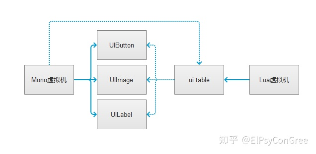
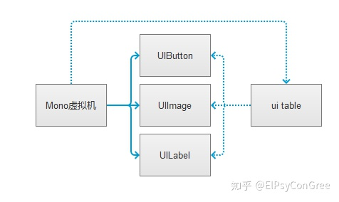
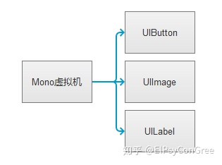
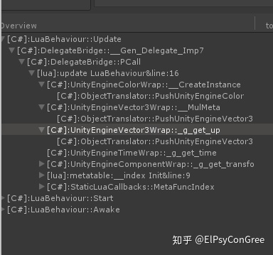
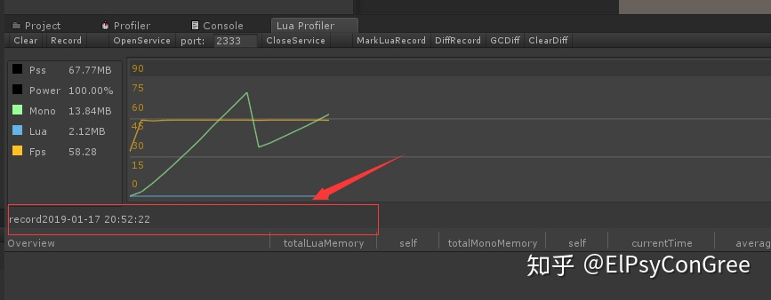
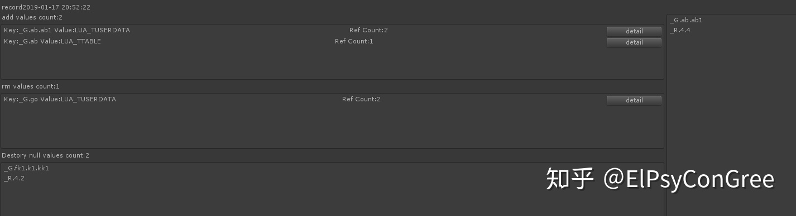

# Lua性能优化

在Unity中使用Lua存在的问题，主要有三个：

1. 进行有优化的人对lua、C#、C++整个调用流程结构并不是很清晰。
2. Lua、Mono双GC系统、以及Mono对象、Lua对象、Unity对象三者的释放流程细节难以把控容易造成资源没有及时释放。
3. 没有什么好的办法查看Lua 这边具体函数耗时以及GC消耗，导致程序员知道自己的函数内存或者消耗不是太理想，又不知道怎么去优化。

## **进行优化的人对lua、C#、C++整个调用流程结构并不是很清晰**

C#跟Lua脚本调用来调用去的，大大限制了优化程序员以及系统功能程序员对整体的代码框架的把控，我们只知道调用API，并不知道两个脚本交互的时候细节上的损耗到底多大。

例如下面的例子：

```c#
Transform child = transform.find("children1");
transform.position = new Vector(0,1,0);
transform.gameObject.name = "1234";
```

在C#中那边几乎没有性能问题，但是在Lua这边因为字符串传递的消耗，以及Lua这边会把Vector3当成table或者userdata处理，很容易就因为开发者的疏忽从而导致一些意想不到的瓶颈问题。

C#的ToString函数：

```c#
public static string lua_tostring(IntPtr L, int index){
    IntPtr strlen;
    IntPtr str = lua_tostring(L, index, out strlen);
    if(str != InPtr.Zero){
        //这里new了一个字符串
        string ret = Marshal.PtrToStringAnsi(str, strlen.ToInt32());
        if(ret == null){
            int len = strlen.ToInt32();
            //这个new一个byte数组
            byte[] buffer = new byte[len];
            
            Marshal.Copy(str, buffer, 0, len);
            //这里new一个字符串
            return Encoding.UTF8.GetString(buffer);
        }
        return ret;
    }
    else{
        return null;
    }
}
```

所以，一定要避免字符串频繁传递,尤其是UI打开的时候获取一些空间，千万别用字符串来。应该在C#那边组织好(比如在prefab中维护一个public List<UnityEngine.Object>,然后把对应的对象拽进去)，然后通过LuaTable注册给UI操作table。

**Xlua的push_struc**方法

```c#
LUA_API void *xlua_pushstruct(lua_State *L, unsigned int size, int mera_ref){
	//在Lua这边new了一个usedata
    CSharpStruct *css = (CSharpStruct *)lua_newuserdata(L, size + sizeof(int) + sizeof(unsigned int));
    css->len = size;
    lua_rawgeti(L, LUA_REGISTRYINDEX, meta_ref);
    lua_setmetable(L, -2);
    return css;
}
```

一定要避免在Lua这边使用Vector3计算唯一，C#那边是个栈对象，Lua这边是个堆对象，会导致Lua的频繁GC，替换做法可以通过3个number进行传递，然后在c那边封装好数值计算函数。


transform.gameObject在C#那边仅仅只是个地址偏移效率估计就是一次加法和取地址运算，但是在Lua这边却有着非常严重的虚拟机交互过程。所以要尽量的减少__index运算，多用缓存把一些C#对象保存起来，比如UIManager.GetInstance()这种在C#那边的效率影响不大，Lua这边就最好搞个全局变量保存一下。

## Lua、Mono双GC系统、以及Mono对象、Lua对象、Unity对象三者的释放流程，细节难以把控，容易造成资源没有及时释放

Lua将对象传递到C#这边之后，C#这个是个ref，内存占用很小，但是Lua 那边可能就是一个UI界面的table或者法则的函数调用，Lua那边的内存会非常大，并且Lua 的UI类还引用了不少C#那边的UI空间。也就是说，如果销毁一个UI界面，在C#这边不立刻把对象的table以及注册到C#的回调函数注销掉的话，整个系统内存将陷入一个Lua 与C#相互持有的死锁状态。

正常UI代开如下：



首先调用C#的Destroy方法以及确保Lua虚拟机在这边没啥对UI Table的引用

```c#
static void DisposeUI(string uiName){
	//Destroy Object 将ui的LuaTable的置空掉
}
```



这一步中lua虚拟机的该对象如果没有全部置空，比如这个UI table 是个全局变量或者其他UI任然持有，那么整个Lua以及C\#对象都将无法释放。

之后释放掉C#对 这个 ui table的引用。有两种办法：一、直接调用Dispose方法，二、等待C#的GC，在LuaTable这个class析构方法中对引用进行释放，因为资源是立即销毁的，所以推荐立刻调用Dipose方法。

如果C#这边的引用也为空，内存状态



最后调用下C#这边的GC.Collec() 方法,OK这些对象才被最终释放干净。

总结一下流程：

听到我上面讲述的整个释放过程是不是被绕晕了？而实际中只有这么一种操作手段，没有什么其他更好的办法了，所以这部分的内存极其容易泄露。

## **没有什么好的办法查看lua这边具体的函数耗时以及GC消耗**，导致程序员知道自己的函数内存或者时间消耗不是太理想**，却又不知道怎么去优化******

Unity的Profiler就可以看到很多C#这边的GC消耗量，定位到问题函数非常快。Lua这边就非常麻烦，搞的程序员知道时间消耗在Lua这边，可是定位却非常麻烦，就算偶尔优化一下，隔个几天效率问题又出现了，优化方案很难确定下来。

那么这些问题应该如何解决呢?一款工具**[LuaProfiler-For-Unity](https://link.zhihu.com/?target=https%3A//github.com/ElPsyCongree/LuaProfiler-For-Unity)**

它可以将C#和Lua的整个函数调用过程展示在你面前：

以及函数当前的GC、消耗的时间、调用的次数，全部统计到你的面前。

Lua内存、Mono内存、Android上的Pss、Ref表的lua对象、全部可以展现到你的面前：


帮助你快速的定位哪些函数GC过量，哪些函数有可能存在内存泄露、哪些函数调用时间过长等等问题。

支持在运行过程中Record出来一段函数进行，具体分析。

支持真机调试

**两个时间段变量DIFF**

选择一个合适的时间段，比如UI开启前点击MarkLuaRecord,将出现以下记录



点击**DiffRecord**即可在之后的记录中与**Record**的时间段进行**Diff**操作， **add** 标签下为新增变量，**rm**下为被删除的变量， 点击记录后面的detail按钮可以显示具体是哪些地方引用了这个变量。**Destory null Value**为C#为空，而Lua的引用不为空的对象，需要重点关注。

判断对象C#为空而Lua不为空的指令：

```
obj:Equals(nil)
```



R表获取，Lua代码中可以使用函数获取到，ToLua C#引用的对象都会在_R[4]这张表上有个弱引用（就是其他地方全部为空，那么我这张表里的对象可以被GC掉），如果 null object很多在 _R.4.x上的话呢，可以使用**GCDiff**这个功能，Diif前先执行一遍GC，再看看对象是否正常释放....

```
debug.getregistry()
```

**优化关注点**

1. 产生Lua GC 的函数
2. 总内存量不停上涨的函数
3. 时长消耗比较久的函数
4. 执行销毁操作后，R表是否正常释放
5. C#为空，而Lua不为空的对象要在Lua这边置空

