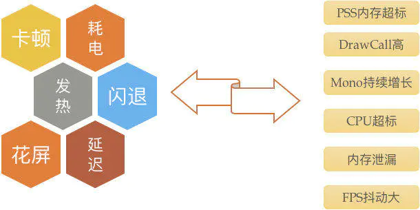
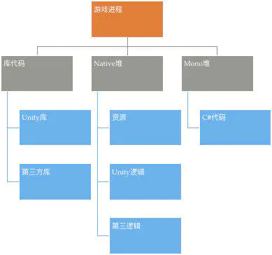
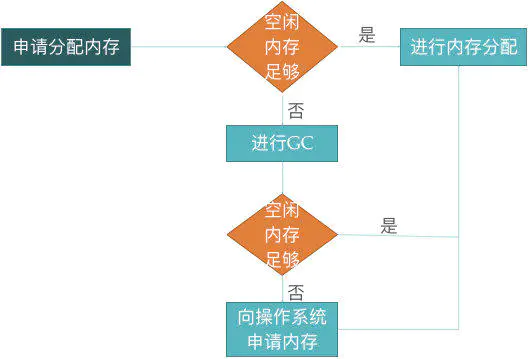
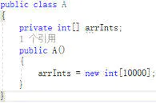
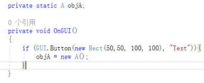
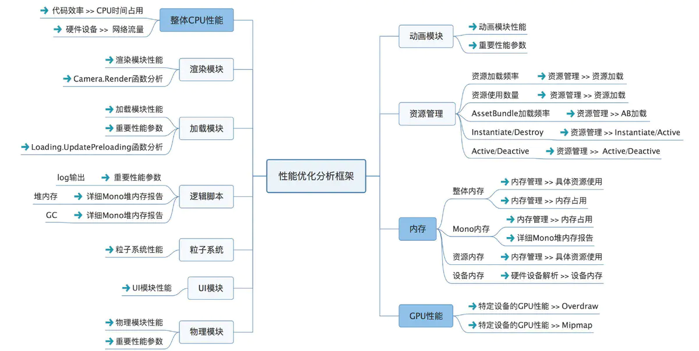
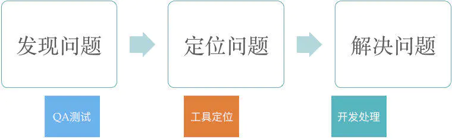

# Unity性能优化

[toc]

常见的Unity性能问题：

**VSS：Virtual Set Size**，虚拟耗用内存。它是一个进程能访问的所有内存空间地址的大小。这个大小包含了 一些没有驻留在RAM中的内存，就像mallocs已经被分配，但还没有写入。VSS很少用来测量程序的实际使 用内存。

**RSS：Resident Set Size**，实际使用物理内存。RSS是一个进程在RAM中实际持有的内存大小。RSS可能会 产生误导，因为它包含了所有该进程使用的共享库所占用的内存，一个被加载到内存中的共享库可能有很 多进程会使用它。RSS不是单个进程使用内存量的精确表示。

**PSS：Proportional Set Size**，实际使用的物理内存，它与RSS不同，它会按比例分配共享库所占用的内存。 例如，如果有三个进程共享一个占30页内存控件的共享库，每个进程在计算PSS的时候，只会计算10页。 PSS是一个非常有用的数值，如果系统中所有的进程的PSS相加，所得和即为系统占用内存的总和。当一个 进程被杀死后，它所占用的共享库内存将会被其他仍然使用该共享库的进程所分担。在这种方式下，PSS 也会带来误导，因为当一个进程被杀后，PSS并不代表系统回收的内存大小。

**USS：Unique Set Size**，进程独自占用的物理内存。这部分内存完全是该进程独享的。USS是一个非常有用 的数值，因为它表明了运行一个特定进程所需的真正内存成本。当一个进程被杀死，USS就是所有系统回 收的内存。USS是用来检查进程中是否有内存泄露的最好选择。

**DrawCall**是CPU调用底层图形接口的操作。比如有上千个物体，每一个的渲染都需要去调用一次底层接口，而每一次的调用CPU都需要做很多工作，那么CPU必然不堪重负。

**GC**是用来处理内存回收的，但是却增加了CPU的开销（GC一次开销可长可短，有时长达100ms）。因此对于GC的优化目标就是尽量少的触发GC。

> 首先我们要知道所谓的GC是Mono运行时的机制，而非Unity3D游戏引擎的机制，所以GC也主要是针对Mono的对象来说的，而它管理的也是Mono的托管堆。  明白了这一点，你也就明白了GC不是用来处理引擎的Assets（贴图，音效，模型等等）的内存释放的，因为U3D引擎也有自己的内存堆而不是和Mono一起使用所谓的托管堆。其次我们还要清楚什么东西会被分配到托管堆上？对，就是引用类型。
>
> 引用类型包括：**用户自定义的类，接口，委托，数组，字符串，Object**.
>
> 而值类型包括：**几种基本数据类型（如：int,float,bool等），结构体，枚举，空类型**。
>
> 所以GC的优化也就是代码的优化。

# Unity运行时的内存占用情况

# 内存标准

- 限定内存占用不超过200M(iPhone4接近容易Crash,低端机型)
- 项目中Reserved Total(总体分配)内存尽量控制在150M以内，如下  **Texture** 50M  **Mesh** 20M  **AnimationClip** 15M  **AudioClip** 15M  **Mono堆内存** 40M  **字体等** 10M
- 项目中尽量严格控制，即使在中高端机型可较大内存运行。

# Mono内存管理策略

- 字符串连接处理，建议StringBuilder

- 尽量不使用foreach，Unity5.4以上解决了GC问题

- 不要频繁实例化和销毁对象，建议对象池管理

- 场景切换时，主动调用System.GC.Collect(),及时清理内存

  

- Mono通过垃圾回收机制（Garbage Collect，简称GC）对内存进行管理。Mono内存分为两部分，已用内存（used）和堆内存（heap），已用内存指的是mono实际需要使用的内存，堆内存指的是mono向操作系统申请的内存，两者的差值就是mono的空闲内存。当mono需要分配内存时，会先查看空闲内存是否足够，如果足够的话，直接在空闲内存中分配，否则mono会进行一次GC以释放更多的空闲内存，如果GC之后仍然没有足够的空闲内存，则mono会向操作系统申请内存。

# Mono内存泄漏分析

- Mono通过引用关系，判断哪些内存不再使用
- 【Mono内存泄漏】对象已经不再使用，却未被GC回收
- Mono内存泄漏使空闲内存减少，GC频繁，mono堆不断扩大，最终导致游戏内存占用的增大
- 大部分mono内存泄漏的情况都是由于静态对象的引用引起
- 不再需要的对象将其引用设置为null，使其可以被GC及时回收

## 解决方法

objA.arrInts设置为null,断绝引用关系，待GC时，进行对象回收(objA本身是一个静态对象，是GC的 根节点，因此没有对象引用)

# 资源优化

- Texture:分辨率大小、格式、Mipmap、Read/Write

1. Android 透明使用两张ETC1压缩(更高级一张ETC1上下Alpha分离)，ETC2只支持OpenGL ES3.0设备，在不支持的设备上会自动转成RGBA32/ARGB32格式，对于RGBA Compressed ETC2 8bits纹理内存占用就增大4倍
2. iOS 透明使用一张RGBA PVRTC 4bits或RGBA16或两张RGB PVRTC Alpha分离，尽量不要使用RGBA32位
3. 单张图最大不超过1024*1024

- Mesh:SubMesh数量、顶点数量、压缩、Read/Write Mesh合并、不勾选Read/Write、大型场景使用LOD
- AnimationClip:动画曲线数量、Constant曲线数量、Dense曲线数量、Stream曲线数量、以及动画事件数量
- 动画压缩:无用的曲线删除，调整float精度
- AudioClp:格式、加载方式、时长以及频率 BGM背景音:ogg SFX声音特效:wav (有些项目BGM\SFX都用mp3)
- Material:关联的Shader和Texture
- Shader尽量使用mobile速配的

> ETC2 的格式理论上只在OpenGL ES 3.0 的设备上被支持，而在不被支持的设备上则会内部自动转成 RGBA32/ARGB32的格式，这对于 RGBA Compressed ETC2 8bits 的纹理就是放大了 4 倍。因此，如果希望在 OpenGL ES 2.0 的设备上对透明材质进行压缩，那么可以尝试使用分离 Alpha 通道的方式，用两个 ETC1 来进行压缩

# DrawCall优化

- 先了解下DrawCall相关概念，便于优化

  DrawCall是CPU调用底层图形接口的操作:`DrawCall_Num = 25K * CPU_Frame * CPU_Percentage / FPS.`

  * DrawCall_Num ： DrawCall数量（最大支持）
  * CPU_Frame : CPU 工作频率（GHz单位）
  * CPU_Percentage：CPU 分配在DrawCall这件事情上的时间率 （百分比）    FPS：希望的游戏帧率

- DrawCall Batching(DC批处理):

  * Dynamic Batching（动态批处理）
  * Static Batching（静态批处理）

- Bus总线带宽

  CPU完成一次DrawCall，除了需要调用一次DrawCall的命令之外，还需要把内存中顶点数据、纹理贴图、shader参数通过bus总线拷贝到内存分配给GPU的显存之中，注意这是拷贝，不是指针传递，速度不快。项目中不会同时出现的资源不要打包到一起，保证单张合并纹理不大于1024*1024一般就不会有问题了。

VSync（垂直同步）是CPU优化最直接的方式(发热、耗电原因之一)

打开Edit-Project Settings-Quality找到V Sync Count

* Don’t Sync 不同步

* Every V Blank 每一个垂直同步

* Every Second V Blank 每一秒垂直同步

> 通常我们选择Don’t Sync,同时Application.targetFrameRate设置目标FPS，让性能保持一个好的状态。注意选择其他项,Application.targetFrameRate设置不生效。

> 科普：VSync垂直同步又称场同步(Vertical Hold)，垂直同步信号决定了CRT从屏幕顶部画到底部，再返回原始位置的时间。从CRT显示器的显示原理来看，单个像素组成了水平扫描线，水平扫描线在垂直方向的堆积形成了完整的画面。显示器的刷新率受显卡DAC控制，显卡DAC完成一帧的扫描后就会产生一个垂直同步信号（决定于屏幕的刷新率）。我们平时所说的打开垂直同步指的是将该信号送入显卡3D图形处理部分，从而让显卡在生成3D图形时受垂直同步信号的制约（注意是制约）。如果我们选择等待垂直同步信号（也就是我们平时所说的垂直同步打开），那么在游戏中或许强劲的显卡迅速的绘制完一屏的图像，但是没有垂直同步信号的到达，显卡无法绘制下一屏，只有等垂直同步的信号到达，才可以绘制。这样FPS自然要受到操作系统刷新率运行值的制约。而如果我们选择不等待垂直同步信号（也就是我们平时所说的关闭垂直同步），那么游戏中作完一屏画面，显卡和显示器无需等待垂直同步信号就可以开始下一屏图像的绘制，自然可以完全发挥显卡的实力。但是不要忘记，正是因为垂直同步的存在，才能使得游戏进程和显示器刷新率同步，使得画面更加平滑和稳定。取消了垂直同步信号，固然可以换来更快的帧率，但是在图像的连续性上势必打折扣。

# GPU优化

> GPU接收顶点数据作为输入传递给顶点着色器。顶点着色器的处理单元是顶点,输入进来的每个顶点都会调用一次顶点着色器。（顶点着色器本身不可以创建或销毁任何顶点，并无法得到顶点与顶点之间的关系）。顶点着色器是完全可编程的，它主要完成的工作有：坐标变换和逐顶点光照。 坐标变换：就是对顶点的坐标进行某种变换—把顶点坐标从模型空间转换到齐次裁剪空间。顶点的多少直接决定了三角形面的多少，也直接决定了GPU的渲染流水线的工作量，所以减少顶点数是一个比较重要的优化点。那么减少顶点怎么操作呢，又有哪些途径？

* 顶点着色器 优化基本几何体(模型减面减顶点) 使用LOD（Level of detail）技术 使用遮挡剔除（Occlusion culling）技术

* 中间操作 -曲面细分着色器：是一个可选的着色器，主要用于细分图元 .

* 几何着色器：是一个可选的着色器，可用于执行逐图元的着色操作，或者被用于产生更多的图元。  

* 裁剪：这一阶段是可配置的。目的是把那些不在视野内的顶点裁剪掉，并剔除某些三角形图元的面片。部分在视野内的图元需要做裁剪处理，在裁剪边缘产生新的顶点和三角形进行处理。  

* 屏幕映射：这一阶段是可配置和编程的，负责把每个图元的坐标（三维坐标系）转换成屏幕坐标（二维坐标系）。

* 三角形设置：开始进入光栅化阶段，不再是数学上点了，而会把所有的点都映射到屏幕的具体像素坐标上，计算每条边上的像素坐标而得到三角形边界的表示方式即为三角形设置。  

* 三角形遍历：这一阶段会检查每个像素是否被一个三角风格所覆盖。如果覆盖的话，就会生成一个片元（一个片元并不是真正意义上的像素，而是包含了很多状态的集合，这些状态用于计算每个像素的最终颜色。这些状态包括了屏幕坐标、深度信息，及从几何阶段输出的顶点信息，如法线和纹理坐标等。），这样一个查找哪些像素被三角形覆盖的过程就是三角形遍历。

* 片元着色器 尽量减少overdraw 减少实时光照 不要使用动态阴影 尽量使用简单的shader

  > 片元着色器的输入就是上一阶段对顶点信息插值得到的结果，更具体点说，是根据从顶点着色器中输出的数据插值得到的。而这一阶段的输出是一个或者多个颜色值。这一阶段可以完成很多重要的渲染技术，如纹理采样，但是它的局限在于，它仅可以影响单个片元。片元着色器是比较花时间的，因为它是最终颜色的计算者，在某些情况下，例如复杂灯光环境下，片元着色器会出现GPU流水线主要的拖后腿的存在。为了让片元着色器的计算更加快，我们需要从很多方面进行提前的优化：片元着色器最容易拖后腿的情况就是，overdraw！和Android app的开发一样，就是同一个像素点绘制了多次，某些情况会造成计算力的浪费，增加耗电量。前面提到的遮挡剔除有减少overdraw非常有用。在PC上，资源无限，为了得到最准确的渲染结果，绘制顺序可能是从后往前绘制不透明物体，然后再绘制透明物体进行混合。但是在移动平台上，对于不透明物体，我们可以设置从前往后绘制，对于有透明通道的物体（很多UI纹理就是含有透明通道的），再设置从后往前绘制。unity中shader设置为“Geometry” 队列的对象总是从前往后绘制的，而其他固定队列（如“Transparent”“Overla”等）的物体，则都是从后往前绘制的。这意味这，我们可以尽量把物体的队列设置为“Geometry” 。对于GUI，尤其要注意和设计师商量，能用不透明的设计就用不透明的，对于粒子效果，也要注意不要引入透明值，多半情况下，移动平台的粒子效果透明值没有作用。

  

  > 移动平台的最大敌人。一个场景里如果包含了三个逐像素的点光源，而且使用了逐像素的shader，那么很有可能将Draw Calls提高了三倍，同时也会增加overdraws。这是因为，对于逐像素的光源来说，被这些光源照亮的物体要被再渲染一次。更糟糕的是，无论是动态批处理还是动态批处理（其实文档中只提到了对动态批处理的影响，但不知道为什么实验结果对静态批处理也没有用），对于这种逐像素的pass都无法进行批处理，也就是说，它们会中断批处理。所以当你需要光照效果时，可以使用Lightmaps，提前烘焙好，提前把场景中的光照信息存储在一张光照纹理中，然后在运行时刻只需要根据纹理采样得到光照信息即可。当你需要金属性强（镜面）的效果，可以使用Light Probes。当你需要一束光的时候，可以使用体积光去模拟这个效果。

  > 动态阴影很酷，但是对于片元着色器来说是灾难，阴影计算是三角投影计算，非常耗性能。如果想要阴影，可以使用
  >
  > 1. 简单的使用一个带阴影的贴图
  > 2. 烘焙场景，拿到lightmaps
  > 3. 创建投影生成器的方法
  > 4. 使用ShadowMap的方法

  

1. 建议尽量使用Unity自带mobile版本的(built-in)Shader，这些大大提高了顶点处理的性能。当然也会有一些限制。
2. 自己写的shader请注意复杂操作符计算，类似pow,exp,log,cos,sin,tan等都是很耗时的计算，最多只用一次在每个像素点的计算，还有有些除法运算尽量该能乘法运算等。
3. 避免透明度测试着色器，因为这个非常耗时，使用透明度混合的版本来代替。
4. 浮点类型运算:精度越低的浮点计算越快。
5. 不要在Shader中添加不必要的Pass.

# Unity优化工具

* MAT（Memory Analyzer Tool） 需要导入HPROF文件再分析 只能查看java层的内存情况，看不到native堆的详情
* Xcode Instrument工具 只能用于Mac,iOS 只能查看C++ 或 object C 的情况，看不到mono堆的详情
* Unity自带Profiler 需要单独编译develop版本 在PC上执行，没法捕获真机数据 内存数据跟实际真机的数据差异很大、多的时候有几十M差距 只能看到最近一段时间的数据，看不到总体的详情
* [官方开源Memory Profiler](https://links.jianshu.com/go?to=https%3A%2F%2Fbitbucket.org%2FUnity-Technologies%2Fmemoryprofiler%2Fsrc)
  1. Unity5.3及其以上
  2. 使用IL2CPP，比如iOS平台
  3. 构建时开启Development Build
* [UWA](https://links.jianshu.com/go?to=https%3A%2F%2Fwww.uwa4d.com%2F%23uwagot)（推荐）
* [腾讯WeTest](https://links.jianshu.com/go?to=http%3A%2F%2Fwetest.qq.com%2Fproduct%2Fcube)（推荐）

# 研发团队需要关注的引擎模块

# 开始优化工作

前面已经介绍了性能相关概念以及需关注模块，接下来该开始优化工作，具体步骤如下：

