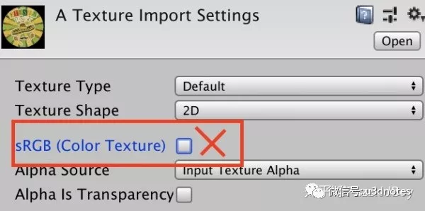
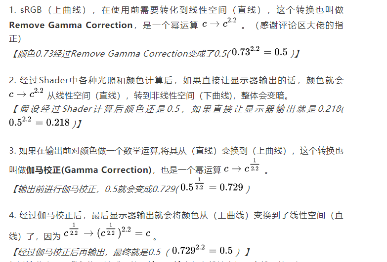

# Gamma vs Linear和sRGB空间

### **什么是**Linear、Gamma、sRGB和伽马校正**？**

在物理世界中，如果光的强度增加一倍，那么亮度也会增加一倍，这是线性关系。

而历史上最早的显示器(阴极射线管)显示图像的时候，输出亮度和电压并不是成线性关系的，而是亮度等于电压的2.2次幂的非线性关系：

2.2也叫做该显示器的**Gamma**值，现代显示器的Gamma值也都大约是2.2。

这种关系意味着当电压线性变化时，相对于真实世界来说，亮度的变化在暗处变换较慢，暗占据的数据范围更广，颜色整体会偏暗。

如图，直线代表物理世界的**线性空间（Linear Space）**，下曲线是显示器输出的**Gamma2.2空间（Gamma Space）**。

横坐标表示像素实际的数值，纵坐标表示显示的数值

巧合的是，人眼的感觉和Gamma2.2是很接近的，人眼对于黑暗的感知更敏感。换句话说人眼看世界的过程相当于一个经过了一个Gamma2.2的调整！

如图，在真实世界中（下方），如果光的强度从0.0逐步增加到1.0（类比显示器中电压从0.0增加到1.0），亮度是按照下方的色块那样线性增强的。但人眼和显示器对应的亮度变化却是上方色块的非线性关系，暗占据的色块更多。

好了，正常情况下，人眼看物理世界只是经过了一次Gamma2.2的调整。而如果显示器输出一个颜色后再被你看到，就相当于走了两次Gamma2.2的调整，这下子颜色就变暗了。如果我们在显示器输出之前，做一个操作把显示器的Gamma2.2影响平衡掉，那就和人眼直接观察物理世界一样了！这个平衡的操作就叫做**伽马校正。**

在数学上，伽马校正是一个约0.45的幂运算：

**最后，什么是sRGB呢？**1996年，微软和惠普一起开发了一种标准**sRGB**色彩空间。这种标准得到许多业界厂商的支持。**sRGB对应的是Gamma0.45所在的空间**。

**为什么sRGB在Gamma0.45空间？**

假设你用数码相机拍一张照片，你看了看照相机屏幕上显示的结果和物理世界是一样的。可是照相机要怎么保存这张图片，使得它在所有显示器上都一样呢？ 可别忘了所有显示器都带Gamma2.2。反推一下，那照片只能保存在Gamma0.45空间，经过显示器的Gamma2.2调整后，才和你现在看到的一样。换句话说，sRGB格式相当于对物理空间的颜色做了一次伽马校正。

**注：**在互联网资料里面，有一些提到sRGB是Gamma0.45，又有一些说是Gamma2.2，很奇怪。我暂且理解后者的意思是“sRGB是在显示器为Gamma2.2的环境下的格式。”如有不对请指正。

如果还是不懂也没关系，你可以看完文章后在互联网上查到更详细的资料，在继续之前你先记住以下几个知识点：

- 显示器的输出在Gamma2.2空间。
- 伽马校正会将颜色转换到Gamma0.45空间。
- 伽马校正和显示器输出平衡之后，结果就是Gamma1.0的线性空间。
- sRGB对应Gamma0.45空间。

### **统一到线性空间**

现在假设你对上文的概念有一定认识了，我们来讲重点吧。

在Gamma 或 Linear空间的渲染结果是不同的，从表现上说，在Gamma Space中渲染会偏暗，在Linear Space中渲染会更接近物理世界，更真实：

左（Gamma Space），右（Linear Space）

**为什么Linear Space更真实？**

你可以这么想，物理世界中的颜色和光照规律都是在线性空间描述的对吧？（光强度增加了一倍，亮度也增加一倍）。 而计算机图形学是物理世界视觉的数学模型，Shader中颜色插值、光照的计算自然也是在线性空间描述的。如果你用一个非线性空间的输入，又在线性空间中计算，那结果就会有一点“不自然”。

换句话说，**如果所有的输入，计算，输出，都能统一在线性空间中，那么结果是最真实的**，玩家会说这个游戏画质很强很真实。事实上因为计算这一步已经是在线性空间描述的了，所以只要保证输入输出是在线性空间就行了。

为什么游戏画面不真实？因为你混乱了，你的输入或输出在Gamma Space，又没搞清楚每个纹理应该在什么Space，甚至也不知道有没用伽马校正，渲染结果怎么会真实呢？

好假设我们的目标是获得最真实的渲染，因此需要统一渲染过程在线性空间，怎么做呢？

**注**：统一在Linear空间是最真实的，但不代表不统一就是错的。一般来说，如果是画质要求高的作品（如3A）等，那么都是统一的。没这方面要求的则未必是统一的，还有一些项目追求非真实的渲染，它们也未必需要统一。毕竟**图形学第一定律：如果它看上去是对的，那么它就是对的**。

我们会用下面这张图来逐步解释统一到Linear Space的过程：

假设输入是一张sRGB纹理。 *【并举例其中的一个像素rgb都为0.73】*

1. sRGB（上曲线），在使用前需要转化到线性空间（直线），这个转换也叫做**Remove Gamma Correction**，是一个幂运算 。（感谢评论区大佬的指正）
   *【颜色0.73经过Remove Gamma Correction变成了0.5(*  *)】*

2. 经过Shader中各种光照和颜色计算后，如果直接让显示器输出的话，颜色就会 从线性空间（直线），转到非线性空间（下曲线)，整体会变暗。
   *【假设经过Shader计算后颜色还是0.5，如果直接让显示器输出就是0.218(*  *)】*

3. 如果在输出前对颜色做一个数学运算,将其从（直线）变换到（上曲线），这个转换也叫做**伽马校正(Gamma Correction)**，也是一个幂运算 。
   *【输出前进行伽马校正，0.5就会变成0.729(**)*

4. 经过伽马校正后，最后显示器输出就会将颜色从（上曲线）变换到了线性空间（直线）了，因为  。
   *【经过伽马校正后再输出，最终就是0.5（*  *)】*

经过这些步骤，我们终于达成了统一输入和输出都在线性空间（直线）的目标。

总结，假设输入是sRGB，要统一到线性空间获得最真实的渲染，需要经过如下过程：

**sRGB->(Remove Gamam Correction)->Linear->Shader->(Gamma Correction)->非线性空间->(显示器)->Linear**

**如果输入纹理不是sRGB，而已经在线性空间了呢？**

那么第一步Remove Gamma Correction就可以去掉了。 美术输出资源时，纹理一般都是在sRGB空间的，但Normal Map、光照贴图、其他功能性纹理则一般在线性空间。所以开发大型项目，弄清楚区别并统一工作流是首要任务！

## **Unity中的Color Space**

我们回到Unity，在ProjectSetting中，你可以选择Gamma 或 Linear作为Color Space：

**这两者有什么区别呢？**

如果选择了Gamma，那Unity不会对输入和输出做任何处理，换句话说，Remove Gamma Correction 、Gamma Correction都不会发生，除非你自己手动实现。

如果选了Linear，那么就是上文提到的统一线性空间的流程了。对于sRGB纹理，Unity在进行纹理采样之前会自动进行Remove Gamma Correction。而在输出前，Unity会自动进行Gamma Correction再让显示器输出。

你还需要小心格式的问题，在Linear下Unity会将纹理默认为sRGB格式，对于Normal Map、Light Map、UI等纹理，它们都不是sRGB，Unity可以让你直接修改成相应的类型：

还有一些纹理不是上面的任何类型，但又已经在线性空间了（比如说Mask纹理、噪声图），那你需要取消这个选项让它跳过Remove Gamma Correction过程：

虽然Linear是最真实的，但是Gamma毕竟少了中间处理，渲染开销会更低，效率会更高。上文也说过**不真实不代表是错的**。

**注**：在Android上，Linear只在OpenGL ES 3.0和Android 4.3以上支持，iOS则只有Metal才支持。