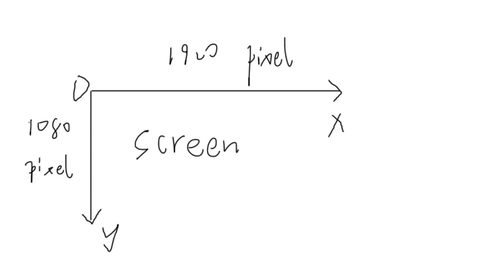
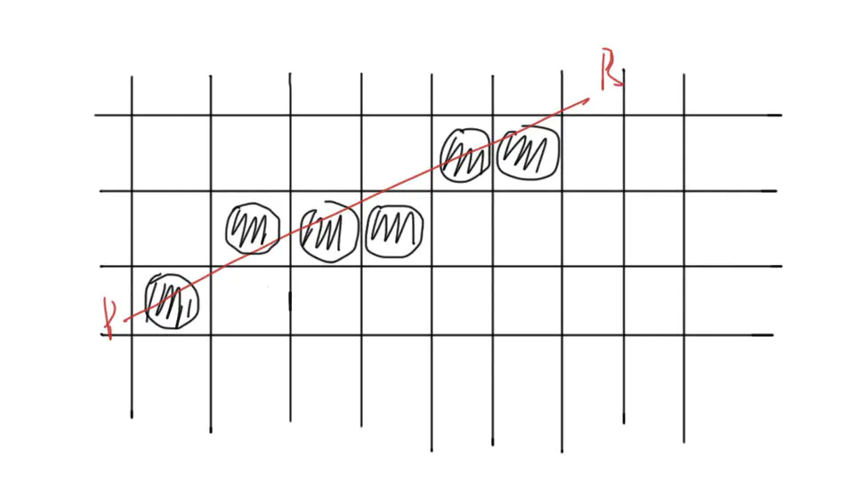

## 光栅化

计算机的屏幕是二维的平面坐标，以左上角为原点，x轴向右增加，y轴向下增加。

在3D图形学中，物体是3维的，拥有X, Y, Z三个坐标，并且拥有R, G, B三种颜色，alpha透明度，U, V贴图坐标，N法线。

三维物体在二维屏幕上的显示，大致分为以下几步：

1. 坐标变换（transform）
    将场景中的三维坐标转换为二维坐标，坐标系空间变换](https://www.jianshu.com/p/09095090c07f)。
2. 颜色计算（shade）
    计算每个顶点的颜色，通过UV贴图的颜色，结合光照，透明度等，计算出模型每个顶点的具体颜色（R, G, B）。
3. 光栅化（rasterization）
    假定屏幕分辨率为1920×1080，在二维屏幕渲染（光栅化）时，内存中frame buffer只保存着1920×1080个屏幕点的颜色，然后一个一个的画到屏幕上。（它的实现方式是以一个1920×1080长的一维数组储存每个顶点的RGB颜色，然后遍历数组画出来）
    什么X, Y, Z，什么alpha之类的frame buffer都没有的，在frame buffer里只有3个值：R, G, B。
    X, Y, Z, alpha等等属性要在另外的地方存储。
    **光栅化，就是计算出1920×1080这么长的RGB数组中，每一个RGB的值。**

在第二步中，我们计算出了3D模型每个顶点的颜色，这个是基于3维坐标的，顶点的三维坐标可以是**小数**。

但在屏幕渲染时，屏幕是只有X,Y二维的，并且其像素点坐标都是**整数**。1920×1080的屏幕只有1920×1080=2073600个像素点。所以光栅化的连点描边是一个近似过程。

> 目前主流的面片分割是三角形分割，所以大家在3DS MAX或者MAYA里看3D模型的网格，基本都是三角形网格，但也有以四边形为最小分割的算法，这里不涉及，我们认为3D模型的面片单元都是三角形。

那么一个三角形的颜色怎么规定呢？
（1）三个顶点颜色取平均值
（2）取某一个顶点的颜色
（3）三个顶点颜色的渐变
这三种方法都可以，根据实际情况自行斟酌。

**光栅化主要有以下几步：**

1. 读取模型的顶点，3个3个的读，因为要画三角形。
2. 将3个顶点两两连成线，形成三角形。
3. 计算屏幕像素点在三角形内还是三角形外。在三角形内部的，就上色（颜色是之前算出来的），在三角形外部的，就不上色。
    （**注意**：如果一个三角形挡在另一个三角形前面，我们应该只画前面的三角形。所以这里还需要比较一下正准备上色的这个像素点是不是已经上过色了。如果这个像素点已经上过色了，并且它是被Z=1的顶点上的色，而我们正准备上色的这个顶点的Z=2（说明这个顶点被挡在了后面），那么这个顶点就不应该上色，因为它是被挡住的点。）
4. 不断的循环，直到画完3D模型的所有三角形，这样一个模型就出来了！

那么，假设我们已经得到了3个顶点的坐标，并且已知这个三角形是红色。
 v1 (-1.5,  1.5, 1.5)
 v2 (1.5,  1.5, 1.5)
 v3 (0.2,  0.2, 0.2)
 **如何判断屏幕的哪些像素点在该三角形内部？**
 主流的算法有两种：
 1.LEE（Linear Expression Evaluation）
 2.Scan Line
 本期只讲LEE，因为Scan Line我没有亲自搞过。
 **LEE大致原理如下：**

1. 首先因为屏幕只有二维，所以判断点和边的位置关系的时候可以先不管Z，Z只是用来判断前后遮挡的。
2. 按照顺时针（或者逆时针）的顺序，连接v1v2, v2v3, v3v1，这样就得到了三条边。
3. 假定边的头是（X+dX, Y+dY），尾是（X, Y）
    计算这3条边的方程：E(**x,y**) = dY(**x**-X)-dX(**y**-Y)
    展开之后是dY***x** + (-dX)***y** + (dX*Y-dY*X) = 0
    即A**x** + B**y** + C =0
    其中A = dY, B = -dX, C = dX*Y-dY*X
    我们把v1v2, v2v3, v3v1三条边的A, B, C都求出来，就得到了3条边的方程E1, E2, E3。
4. 将屏幕像素点的x,y带入方程，A1**x** + B1**y** + C1 = E1，如果点在边上，则E1=0，如果点不在边上，则E1！=0。
5. **最神奇的地方来了。**
    如果点（x,y）带入3个方程的结果E1, E2, E3同时大于0或者同时小于0，即**同号**，则该点在三角形内，如果**异号**，则在三角形外。
6. 每次获得3个点之后，取出其中的min_x, max_x, min_y, max_y构成的四边形，将屏幕像素点（x,y）中，在该范围内的点取出，带入LEE公式比较结果。
    如果该点在三角形内，并且没有被遮挡（需要对Z进行判断），则上色，否则不上色。不断迭代，直到所有的三角形都被处理完成，3D模型也画到了屏幕上。

**需要注意的地方：**

1. 如何判断遮挡，即得到三角形内的点的Z值？
    答：我们知道了v1, v2, v3三个点，可以求三角形平面方程，求出之后，只需要将某个点的（x,y）代入，即可求出z。
    平面方程一般式为：Ax + By + Cz + D = 0
    取E1, E2两个边向量，进行叉乘，得到**法向量N(A,B,C)**。
    没错，你没看错，N的X, Y, Z即是A, B, C。（数学真神奇）
    然后取v1(x, y, z)带入方程，求出D，平面解析式就得到了。
    然后将想求z的点的x,y带入，就可以求出z了。
2. 屏幕的Z轴是朝里的，所以z越大说明离我们越远，z越小就里我们越近，近处的会遮挡远处的。
3. LEE的特殊情况
    由于多个三角形的边和边是互相挨着的，所以如果直接按上面的方法画，会有很多边重复画了2遍，为了提高渲染效率，我们需要**保证每条边只画一遍**。
    怎么保证呢？
    **答：只画三角形的左边和上边**

**如何定义左边和上边?**
 由于重画这个问题只出现在边上，对于三角形内部的像素点，都是只画一次的，所以不用考虑内部点，只考虑三条边上的点。

如图所示：
 1）假定三角形v1v2v3是这样的，我们当前要上色的像素点为P1（红色），落到了v1v3这条边上，那么就取不在这条边上的顶点v2，计算过v2的水平线与v1v3的交点R1，如果R1在v2的右侧，即R1.x > v2.x，那么说明P1是落在了**右侧**的边，所以**不画**

2）假定我们当前要上色的像素点为P2（绿色），落到了v2v3这条边上，那么就取不在这条边上的顶点v1，计算过v1的水平线与v2v3的交点R2，如果R2在v1的右侧，即R2.x > v1.x，那么说明P2是落在了**右侧**的边，所以**不画**

3）假定我们当前要上色的像素点为P3（蓝色），落到了v1v2这条边上，那么就取不在这条边上的顶点v3，计算过v3的水平线与v1v2的交点R3，如果R3在v3的右侧，即R3.x > v3.x，那么说明P3是落在了右侧的边，但图中是R3.x < v3.x，所以P3落在了**左侧**边，**要画**

4）**如果存在垂直边或者水平边，怎么判断左右？**
 垂直边和上面是一种情况，不用单独拿出来考虑。
 水平边的画，只画上方，即只画**左边和上边**
 还是看上图，假定边v2v3是水平的，那么我们取v1，发现v1的y比较小，即v1在v2v3上方，那么边v2v3就是**下边**，所以**不画**，反之则画。