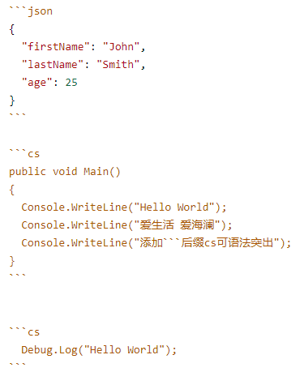

# MarkDown

[toc]

# 标题

要创建标题，请在标题文本前添加一至六个 # 符号。 您使用的 # 数量将决定标题的大小。

```markdown
# 标题一级
## 标题二级
### 标题三级
#### 标题四级
##### 标题五级
###### 标题六级

标题一级
===
标题二级
---
```

# 标题一级

## 标题二级

### 标题三级

#### 标题四级

##### 标题五级

###### 标题六级

# 标题一级

## 标题二级

------

```markdown
**加粗字体** 与 非加粗字体

***加粗加斜体字体***

*斜体字* 与 非斜体字

~~删除线~~

**加粗加_嵌套斜体字体_**
```

**加粗字体** 与 非加粗字体

***加粗加斜体字体\***

*斜体字* 与 非斜体字

~~删除线~~

**加粗加\*嵌套斜体字体\***

------

# 引用文字

```markdown
> 这里添加引用文字
```

> 这里添加引用文字

```markdown
> 带有多个段落的块引用
>
> 带有多个段落的块引用
```

> 带有多个段落的块引用
>
> 带有多个段落的块引用

```markdown
> 嵌套引用1.
>
>>  嵌套引用2.
```

> 嵌套引用1.
>
> > 嵌套引用2.

```markdown
> #### 标题四级
>
> * 段落一
> * 段落二.
>
>  *斜体* 与 **加粗**.
```

> #### 标题四级
>
> - 段落一
>
> - 段落二.
>
>   *斜体* 与 **加粗**.

------

# 引用代码



```json
{
  "firstName": "John",
  "lastName": "Smith",
  "age": 25
}
public void Main()
{
  Console.WriteLine("Hello World");
  Console.WriteLine("爱生活 爱海澜");
  Console.WriteLine("添加```后缀cs可语法突出");
}
  Debug.Log("Hello World");
```


`Debug.Log("单行代码");` 【WP Githuber MD 】

#### 代码类型关键字列表

| 语言名                |               关键字                | 备注 |
| --------------------- | :---------------------------------: | ---- |
| 1c                    |       1C:Enterprise (v7, v8)        | –    |
| abnf                  |     Augmented Backus-Naur Form      | –    |
| accesslog             |             Access log              | –    |
| actionscript          |            ActionScript             | –    |
| ada                   |                 Ada                 | –    |
| angelscript           |             AngelScript             | –    |
| apache                |               Apache                | –    |
| applescript           |             AppleScript             | –    |
| arcade                |            ArcGIS Arcade            | –    |
| arduino               |               Arduino               | –    |
| armasm                |            ARM Assembly             | –    |
| asciidoc              |              AsciiDoc               | –    |
| aspectj               |               AspectJ               | –    |
| autohotkey            |             AutoHotkey              | –    |
| autoit                |               AutoIt                | –    |
| avrasm                |            AVR Assembler            | –    |
| awk                   |                 Awk                 | –    |
| axapta                | Microsoft Axapta (now Dynamics 365) | –    |
| bash                  |                Bash                 | –    |
| basic                 |                Basic                | –    |
| bnf                   |          Backus–Naur Form           | –    |
| brainfuck             |              Brainfuck              | –    |
| cal                   |                C/AL                 | –    |
| capnproto             |             Cap’n Proto             | –    |
| ceylon                |               Ceylon                | –    |
| clean                 |                Clean                | –    |
| clojure-repl          |            Clojure REPL             | –    |
| clojure               |               Clojure               | –    |
| cmake                 |                CMake                | –    |
| coffeescript          |            CoffeeScript             | –    |
| coq                   |                 Coq                 | –    |
| cos                   |         Cache Object Script         | –    |
| cpp                   |                 C++                 | –    |
| crmsh                 |                crmsh                | –    |
| crystal               |              Crystal –              |      |
| cs                    |                 C#                  | –    |
| csp                   |                 CSP                 | –    |
| css                   |                 CSS                 | –    |
| d                     |                  D                  | –    |
| dart                  |                Dart                 | –    |
| delphi                |               Delphi                | –    |
| diff                  |                Diff                 | –    |
| django                |               Django                | –    |
| dns                   |            DNS Zone file            | –    |
| dockerfile Dockerfile |                  –                  |      |
| dos                   |              DOS .bat               | –    |
| dsconfig              |              dsconfig               | –    |
| dts                   |             Device Tree             | –    |
| dust                  |                Dust                 | –    |
| ebnf                  |      Extended Backus-Naur Form      | –    |
| elixir                |               Elixir                | –    |
| elm                   |                 Elm                 | –    |
| erb                   |         ERB (Embedded Ruby)         | –    |
| erlang-repl           |             Erlang REPL             | –    |
| erlang                |               Erlang                | –    |
| excel                 |                Excel                | –    |
| fix                   |                 FIX                 | –    |
| flix                  |                Flix                 | –    |
| fortran               |               Fortran               | –    |
| fsharp                |                 F#                  | –    |
| gams                  |                GAMS                 | –    |
| gauss                 |                GAUSS                | –    |
| gcode                 |          G-code (ISO 6983)          | –    |
| gherkin               |               Gherkin               | –    |
| glsl                  |                GLSL                 | –    |
| gml                   |                 GML                 | –    |
| go                    |               Golang                | –    |
| golo                  |                Golo                 | –    |
| gradle                |               Gradle                | –    |
| groovy                |               Groovy                | –    |
| haml                  |                Haml                 | –    |
| handlebars            |             Handlebars              | –    |
| haskell               |               Haskell               | –    |
| haxe                  |                Haxe                 | –    |
| hsp                   |                 HSP                 | –    |
| htmlbars              |              HTMLBars               | –    |
| http                  |       HTTP (Header Plaintext)       | –    |
| hy                    |                 Hy                  | –    |
| inform7               |              Inform 7               | –    |
| ini                   |           TOML, also INI            | –    |
| irpf90                |               IRPF90                | –    |
| isbl                  |                ISBL                 | –    |
| java                  |                Java                 | –    |
| javascript            |             JavaScript              | –    |
| jboss-cli             |              jboss-cli              | –    |
| json                  |      JSON / JSON with Comments      | –    |
| julia-repl            |             Julia REPL              | –    |
| julia                 |                Julia                | –    |
| kotlin                |               Kotlin                | –    |
| lasso                 |                Lasso                | –    |
| ldif                  |                LDIF                 | –    |
| leaf                  |                Leaf                 | –    |
| less                  |                Less                 | –    |
| lisp                  |                Lisp                 | –    |
| livecodeserver        |              LiveCode               | –    |
| livescript            |             LiveScript              | –    |
| llvm                  |               LLVM IR               | –    |
| lsl                   |   LSL (Linden Scripting Language)   | –    |
| lua                   |                 Lua                 | –    |
| makefile              |              Makefile               | –    |
| markdown              |              Markdown               | –    |
| mathematica           |             Mathematica             | –    |
| matlab                |               Matlab                | –    |
| maxima                |               Maxima                | –    |
| mel                   |                 MEL                 | –    |
| mercury               |               Mercury               | –    |
| mipsasm               |            MIPS Assembly            | –    |
| mizar                 |                Mizar                | –    |
| mojolicious           |             Mojolicious             | –    |
| monkey                |               Monkey                | –    |
| moonscript            |             MoonScript              | –    |
| n1ql                  |                N1QL                 | –    |
| nginx                 |                Nginx                | –    |
| nimrod                |        Nim (formerly Nimrod)        | –    |
| nix                   |                 Nix                 | –    |
| nsis                  |                NSIS                 | –    |
| objectivec            |             Objective-C             | –    |
| ocaml                 |                OCaml                | –    |
| openscad              |              OpenSCAD               | –    |
| oxygene               |               Oxygene               | –    |
| parser3               |               Parser3               | –    |
| perl                  |                Perl                 | –    |
| pf                    |               pf.conf               | –    |
| pgsql                 | PostgreSQL SQL dialect and PL/pgSQL | –    |
| php                   |                 PHP                 | –    |
| plaintext             |              Plaintext              | –    |
| pony                  |                Pony                 | –    |
| powershell            |             PowerShell              | –    |
| processing            |             Processing              | –    |
| profile               |           Python profile            | –    |
| prolog                |               Prolog                | –    |
| properties            |             Properties              | –    |
| protobuf              |          Protocol Buffers           | –    |
| puppet                |               Puppet                | –    |
| purebasic             |              PureBASIC              | –    |
| python                |               Pythin                | –    |
| q                     |                  Q                  | –    |
| qml                   |                 QML                 | –    |
| r                     |                  R                  | –    |
| reasonml              |              ReasonML               | –    |
| rib                   |            RenderMan RIB            | –    |
| roboconf              |              Roboconf               | –    |
| routeros              |      Microtik RouterOS script       | –    |
| rsl                   |            RenderMan RSL            | –    |
| ruby                  |                Ruby                 | –    |
| ruleslanguage         |        Oracle Rules Language        | –    |
| rust                  |                Rust                 | –    |
| sas                   |                 SAS                 | –    |
| scala                 |                Scala                | –    |
| scheme                |               Scheme                | –    |
| scilab                |               Scilab                | –    |
| scss                  |                SCSS                 | –    |
| shell                 |            Shell Session            | –    |
| smali                 |                Smali                | –    |
| smalltalk             |              Smalltalk              | –    |
| sml                   |          SML (Standard ML)          | –    |
| sqf                   |                 SQF                 | –    |
| sql                   |   SQL (Structured Query Language)   | –    |
| stan                  |                Stan                 | –    |
| stata                 |                Stata                | –    |
| step21                |            STEP Part 21             | –    |
| stylus                |               Stylus                | –    |
| subunit               |               SubUnit               | –    |
| swift                 |                Swift                | –    |
| taggerscript          |            Tagger Script            | –    |
| tap                   |       Test Anything Protocol        | –    |
| tcl                   |                 Tcl                 | –    |
| tex                   |                 TeX                 | –    |
| thrift                |               Thrift                | –    |
| tp                    |                 TP                  | –    |
| twig                  |                Twig                 | –    |
| typescript            |             TypeScript              | –    |
| vala                  |                Vala                 | –    |
| vbnet                 |               VB.NET                | –    |
| vbscript-html         |          VBScript in HTML           | –    |
| vbscript              |          VBScript in HTML           | –    |
| verilog               |               Verilog               | –    |
| vhdl                  |                VHDL                 | –    |
| vim                   |             Vim Script              | –    |
| x86asm                |         Intel x86 Assembly          | –    |
| xl                    |                 XL                  | –    |
| xml                   |              HTML, XML              | –    |
| xquery                |               XQuery                | –    |
| yaml                  |                YAML                 | –    |
| zephir                |               Zephir                | –    |

------

# 清单列表格式(有序)

> 前面的数字自动排列 依次递增，递增基础以第一个数字为基准

```markdown
1. 条目一
98. 条目二
97. 条目三
96. 条目四
    1. 缩进一 前面4个空格
    2. 缩进二 前面4个空格
    9. 缩进三 或双Tab
100. 条目五
```

1. 条目一
2. 条目二
3. 条目三
4. 条目四
   1. 缩进一 前面4个空格
   2. 缩进二 前面4个空格
   3. 缩进三 或双Tab
5. 条目五

# 清单列表格式(无序)

```markdown
* 条目一
- 条目二
+ 条目三
- 条目四
    * 缩进一 前面4个空格
    * 缩进二 前面4个空格
    * 缩进三 或双Tab
+ 条目五
```

- 条目一
- 条目二
- 条目三
- 条目四
  - 缩进一 前面4个空格
  - 缩进二 前面4个空格
  - 缩进三 或双Tab
- 条目五

# 插入图片

> 把QQ截图直接CTR+V或者拖拽到编辑页面就自动添加了，非常方便。

```markdown

```


------

# 水平线

> 三种格式通用

```markdown
***
---
___
```

------

------

------

# 选项列表

```markdown
- [x] Finish my changes
- [ ] Push my commits to GitHub
- [ ] Open a pull request
```

- Finish my changes
- Push my commits to GitHub
- Open a pull request

------

# 链接上鼠标悬停有备注

```markdown
[我的主页-无备注](https://aihailan.com/)
[我的主页-有备注](https://aihailan.com/ "我的主页备注信息")
```

[我的主页-无备注](https://aihailan.com/)
[我的主页-有备注](https://aihailan.com/)

> 第一部分的第一组括号围绕应该显示为链接的文本。第二组括号显示一个标签，用于指向对应的链接，标签不区分大小写，可以包含字母，数字，空格或标点符号

```markdown
[我的主页-无备注][1]
[我的主页-无备注] [1]
[我的主页-有备注][a]
[我的主页-有备注][A]
```

[我的主页-无备注](https://aihailan.com/)
[我的主页-无备注](https://aihailan.com/)
[我的主页-有备注](https://aihailan.com/)
[我的主页-有备注](https://aihailan.com/)

> 可以将此链接的第二部分放在Markdown文档中的任何位置。

```markdown
[1]: https://aihailan.com/
[A]: https://aihailan.com/ "备注信息"
[A]: https://aihailan.com/ '备注信息'
[A]: https://aihailan.com/ (备注信息)
[A]: <https://aihailan.com/> "备注信息"
[a]: <https://aihailan.com/> '备注信息'
[a]: <https://aihailan.com/> (备注信息)
```

------

# 显示特殊字符

##### 可以使用反斜杠来转义以下字符

##### *如果不使用反斜杠此行为斜字体*

| 字符 |           名称 |
| ---- | -------------: |
| \    |         反斜线 |
| `    |         刻度线 |
| *    |           星号 |
| _    |         下划线 |
| {}   |         大括号 |
| []   |           括号 |
| ()   |           括号 |
| #    |       英镑符号 |
| +    |           加号 |
| –    | 减号（连字符） |
| .    |             点 |
| !    |         感叹号 |

------

# 表格

> 其中的：是表示以什么方式对齐，默认不写以左侧对齐
>
> ```
> | 标题|内容|备注|
> | ------ | :------:|------:|
> |标题1 |内容1|备注1|
> | 标题2 | 内容2|备注2|
> ```
>
> | 标题  | 内容  |  备注 |
> | ----- | :---: | ----: |
> | 标题1 | 内容1 | 备注1 |
> | 标题2 | 内容2 | 备注2 |

------

# 脚注

> 脚注的详细信息无论添加到哪里，都会显示到全篇文章的最末尾。

```markdown
这是一个简短的脚注，[^1] 和一个较长的脚注。[^bignote]

[^1]: 这是一个简短的脚注。

[^bignote]: 这是一个较长的脚注。

    缩进段落以将其包含在脚注中。

    `{ my code }`

    添加任意数量的段落。
```

这是一个简短的脚注，[1](https://aihailan.com/markdown语法使用教程/#fn:1) 和一个较长的脚注。[2](https://aihailan.com/markdown语法使用教程/#fn:bignote)

##### 这是文章原始的地址 [https://aihailan.com/markdown%e8%af%ad%e6%b3%95%e4%bd%bf%e7%94%a8%e6%95%99%e7%a8%8b/](https://aihailan.com/markdown语法使用教程/)

##### 这是脚注1标记的地址 [https://aihailan.com/markdown%e8%af%ad%e6%b3%95%e4%bd%bf%e7%94%a8%e6%95%99%e7%a8%8b/#fn:1（点击脚注URL栏会有变化](https://aihailan.com/markdown语法使用教程/#fn:1（点击脚注URL栏会有变化)）

##### 这是脚注bignote详细信息的地址 [https://aihailan.com/markdown%e8%af%ad%e6%b3%95%e4%bd%bf%e7%94%a8%e6%95%99%e7%a8%8b/#fn:bignote（点击脚注URL栏会有变化](https://aihailan.com/markdown语法使用教程/#fn:bignote（点击脚注URL栏会有变化)）

------

# 上标、下标

```markdown
## 上标 **<sup>[主页地址](https://www.jianshu.com/u/84e03bc5c4a6)</sup>**
## 下标 **<sub>[主页地址](https://www.jianshu.com/u/84e03bc5c4a6)</sup>**
```

**上标** [主页地址](https://www.jianshu.com/u/84e03bc5c4a6)
**下标** [主页地址](https://www.jianshu.com/u/84e03bc5c4a6)

------

# 公式

不怎么常用就不写了 可自行Google 关键字 markdown LaTeX