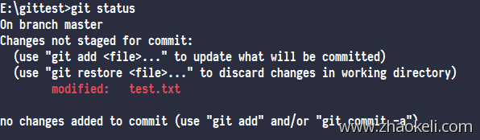
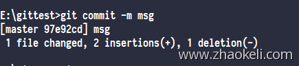
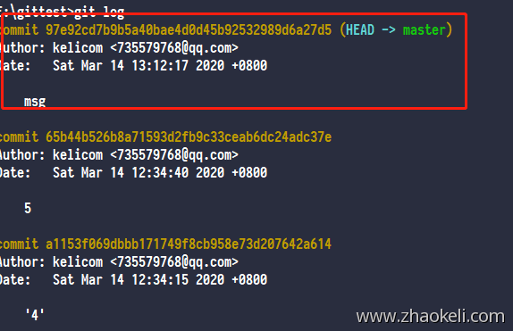
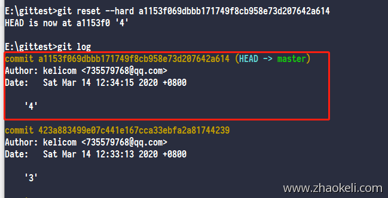
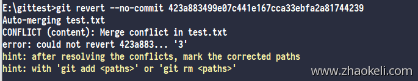
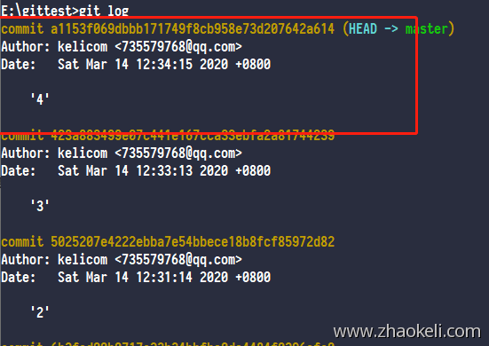

# GitHub放弃修改

[toc]

## 前言 

使用git中不免会遇到回滚代码，要放弃刚刚的修改等操作，首先需要弄明白git中工作区、暂存区、版本库的关系，如果已经很明白的话可以跳过这里

1. 工作区就是我们工作的目录中所有代码代表的区域
2. 暂存区为我们工作目录中的 .git 目录中有一个索引文件，这个文件代表暂存区，也就是暂时保存到这里
3. 版本库为我们最终的代码提交的地方

我们提交代码时会经过这三个地方，工作区修改，然后提交到暂存区，最后提交到代码库，对应的操作分别是 

git status 查看当前工作区有状态，下面是有文件修改时的状态，显示红色



git add . 把工作区的变动/修改提交到暂存区,根据.gitignore文件规则提交文件，新建的文件,untracked file也会被提交

git add -u 仅提交tracked file,它是 git add -update的简写


git commit -m '提交备注' 最后提交到版本库



git push origin 如果有远程仓库的话，再经过这一步提交到远程仓库

## 放弃工作区修改

本地修改啦一部分代码，没有提交到暂存区(git add)则可以直接使用下面命令恢复代码状态，注意恢复后你的修改将再来找不回来

```
git checkout .
```

## 放弃暂存区修改

还原已经提交到暂存区的代码，此操作后不会丢失暂存区的修改，只是还原git add这个操作，把修改的代码状态从暂存区取出来

```
git reset HEAD test.txt
```

如果确实不想要这部分修改，就使用上面的命令 git checkout .还原代码修改

## 放弃版本库的修改


### reset 

请注意，这种方法会丢失你还原点之后的提交信息，并且push到远程的时候需要强制提交

先看下提交日志



回到上一次 commit 的状态，如果是window下面执行后面的 "HEAD^" 加上引号，不然会提示你 more?

```
git reset —hard HEAD^
```

也可以指定提交id

```
git reset —hard a1153f069dbbb171749f8cb958e73d207642a614
```



### revert

此方法为还原提交链中的某一次提交,并把还原操作生成最新的一次提交，比如你提交啦1 2 3 4 5 6 提交啦6次，现在要还原第3次的变动，此方法可以单独把第三次的提交还原并且生成第7次也就是最新的一次提交来记录这个操作

如下还原第3个提交，如果有想还原多个提交的话可以使用一个区间如：423a883499..aaaaaaaa 这个区间是个前开后闭区间，也就是说不包含前面但包含后面的版本。

里面的参数 --no-commit 可以简写为 -n 意思是放到暂存区就可以啦先不要提交

```
git revert --no-commit 423a883499e07c441e167cca33ebfa2a81744239
```



因为我都是在一个文件中操作的，所以提交有冲突，需要解决下冲突然后再提交，如果没有冲突的话就直接放暂存区等你手动提交啦

我们查看下执行还原后的仓库提交日志



提交日志还是原样，没有变动，但是工作区已经发生改变啦，工作区内把第三次提交的代码反向操作啦一次，解决冲突然后提交就ok

```
git add .
git commit -m
```


## reset和revert区别

### reset(版本撤回)

#### 格式

```
git reset [-q] [<commit>] [--] <paths>...``git reset (--patch | -p) [<commit>] [--] [<paths>...]``git reset (--soft | --mixed | --hard | --merge | --keep) [-q] [<commit>]
```

#### 用法

`git reset --mixed` 回退commit,保留源码,默认方式.

`git reset --soft` 回退至某个版本,只回退commit信息

`git reset --hard` 彻底回退至某个版本

> ```
> 回退所有内容到上一个版本 git reset HEAD^
> 回退a.py这个文件的版本到上一个版本 git reset HEAD^ a.py
> 向前回退到第3个版本 git reset –soft HEAD~3
> 将本地的状态回退到和远程的一样 git reset –hard origin/master
> 回退到某个版本 git reset 057d
> 回退到上一次提交的状态，按照某一次的commit完全反向的进行一次commit git revert HEAD
> ```

### revert(撤消操作)

撤销某次操作，此次操作之前的commit都会被保留. git reset 是撤销某次提交，但是此次之后的修改都会被退回到暂存区.

#### 格式

```
git revert [--edit | --no-edit] [-n] [-m parent-number] [-s] <commit>...``git revert --continue` `git revert --quit` `git revert --abort
```

#### 示例

```
git revert HEAD~3：丢弃最近的三个commit，把状态恢复到最近的第四个commit，并且提交一个新的commit来记录这次改变。
git revert -n master~5..master~2：丢弃从最近的第五个commit（包含）到第二个（不包含）,但是不自动生成commit，这个revert仅仅修改working tree和index。
```

### reset与revert的区别

1. git revert是用一次新的commit来回滚之前的commit，git reset是直接删除指定的commit。
2. 在回滚这一操作上看，效果差不多。但是在日后继续merge以前的老版本时有区别。因为git revert是用一次逆向的commit“中和”之前的提交，因此日后合并老的branch时，导致这部分改变不会再次出现，但是git reset是之间把某些commit在某个branch上删除，因而和老的branch再次merge时，这些被回滚的commit应该还会被引入。
3. git reset 是把HEAD向后移动了一下，而git revert是HEAD继续前进，只是新的commit的内容和要revert的内容正好相反，能够抵消要被revert的内容。

