# Lua写UGUI

我们先简单回顾以下，如果用C#来写UI逻辑，大体上有几种办法获得component：

1. 在代码中，通过路径读取。例如：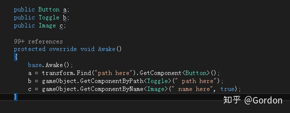

   这种方法，最原始，麻烦之处就不用细说，都能理解。

2. 这种方法是将脚本挂在prefab上，直接拖对应的component到field上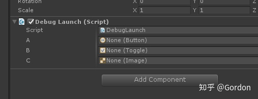

   这种方式简单明了，但是我们如果用lua做，不可能给每个界面，额外加一个c#的类。

3. 有些项目会选择给prefab上的资源以一定的命名规则，然后写逻辑自动生成。

   这种办法好处是，写一个通用的解析代码，后面就省事了。坏处是，在prefab元素的命名上，限制有些多，如果需要更多一些的逻辑，string的描述能力是不足的。

4. 还有一种，类似3，给元素打上标记，然后离线自动生成读取的代码片段，类似很多的excel配表转数据class的处理方式。 这种方式和上面一种的问题类似。

以上是c#来写UI，常见的几种处理方式。肯定还有很多不同的方式，也许更优，我就不了解了，希望大家分享。

回到lua，我们用lua来做UI component引用的自动获得，以上4种办法，都有变种可以处理。最后，我们选择第二种方式来处理，在prefab上挂一个通用的c#脚本（此脚本仅做配置表述，变动很小，极少数不做热更新的之一。关于热更新c#脚本，参见之前文章。），然后将c#脚本配置的数据，运行时自动生成lua table的key，如果我们给一个table class化，其实也就像c#的属性了。

具体步骤如下：

1. 制作prefab，在prefab上挂一个FieldCfger的脚本

   ```c#
   using System;
   using UnityEngine;
   using System.Collections.Generic;
   using AdvancedInspector;
   
   public class FieldCfger : MonoBehaviour
   {
       public enum FildType
       {
           GameObject = 0,
           RectTransform = 1,
           Button = 2,
           Text = 3,
           Image = 9,
           Slider = 4,
           Toggle = 5,
           DropDown =6,
           Input = 7,
           ScrollRect = 8,
           
           ScrollBar = 10,
           RawImage = 11,
           ToggleGroup = 12,
           CanvasGroup = 13,
           SpriteRenderer = 14,
           LayoutGroup = 15
       }
   
       public enum LuaFildType
       {
           None,
           Normal,
           LuaMonoBase,
           CustomTable,
           CustomTableWithMono,
       }
   
       [Serializable]
       public class UILuaField
       {
           public FildType type;
   
           [Inspect("showLuaType")]
           public LuaFildType luaType;
   
           [Inspect("showLuaTableName")]
           public string tableName;
   
           private bool showLuaType()
           {
               return type == FildType.GameObject;
           }
   
           private bool showLuaTableName()
           {
               return luaType == LuaFildType.CustomTable || luaType == LuaFildType.CustomTableWithMono;
           }
   
           public GameObject obj;
   
           public string customName;
       }
   
       public List<UILuaField> fields = new List<UILuaField>();
   
       
   }
   ```

   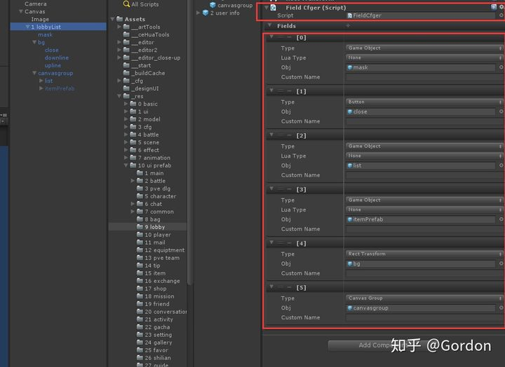

   Type：选择obj的类型，不同的类型，会有不同的处理

   LuaType：我们会做一些自动的lua绑定，后续介绍。

   Custom Name：如果不想用prefab上元素自身的名字，可以另外取名字，少数情况会用到。

2.  接下来，当我们打开一个UI界面的时候，会根据这个配置，初始化好table的数据，部分代码如下:

   ```c#
   public static void InitCfgField(GameObject obj, LuaTable table)
       {
           FieldCfger fieldCfger = obj.GetComponent<FieldCfger>();
           table["_go"] = obj;
           RectTransform t = obj.GetComponent<RectTransform>();
           if (t == null)
           {
               table["_tf"] = obj.transform;
           }
           else
           {
               table["_tf"] = t;
           }
           if (fieldCfger != null)
           {
               fieldCfger.enabled = false;
               for (int i = 0; i < fieldCfger.fields.Count; i++)
               {
                   FieldCfger.UILuaField field = fieldCfger.fields[i];
                   if (field.obj  == null)
                   {
                       Loger.LogError(string.Format("{0} 下 序列 {1} gameobject没有绑定", obj.name, i));
                       continue;
                   }
                   string fieldName = field.customName;
                   if (string.IsNullOrEmpty(fieldName))
                   {
                       fieldName = field.obj.name;
                   }
                   table[string.Format("{0}_go", fieldName)] = field.obj;
                   table[string.Format("{0}_tf",fieldName)] = field.obj.transform;
                   switch (field.type)
                   {
                       case FieldCfger.FildType.GameObject:
                           if (field.luaType == FieldCfger.LuaFildType.None)
                           {
                               table[fieldName] = field.obj;
                           }
                           else if (field.luaType == FieldCfger.LuaFildType.Normal)
                           {
                               table[fieldName] = BindLua(field.obj, LuaMgr.me.CreateLuaTable());
                           }
                           else if (field.luaType == FieldCfger.LuaFildType.LuaMonoBase)
                           {
                               table[fieldName] = BindLuaMono(field.obj, LuaMgr.me.CreateLuaTable("LuaMonoBase"));
                           }
                           else if (field.luaType == FieldCfger.LuaFildType.CustomTable)
                           {
                               table[fieldName] = BindLua(field.obj, LuaMgr.me.CreateLuaTable(field.tableName));
                           }
                           else if (field.luaType == FieldCfger.LuaFildType.CustomTableWithMono)
                           {
                               table[fieldName] = BindLuaMono(field.obj, LuaMgr.me.CreateLuaTable(field.tableName));
                           }
                           break;
                       case FieldCfger.FildType.Button:
                           table[fieldName] = field.obj.GetComponent<Button>();
                           break;
                       case FieldCfger.FildType.Image:
                           table[fieldName] = field.obj.GetComponent<Image>();
                           break;
                       case FieldCfger.FildType.RectTransform:
                           table[fieldName] = field.obj.GetComponent<RectTransform>();
                           break;
                       case FieldCfger.FildType.ScrollRect:
                           table[fieldName] = field.obj.GetComponent<ScrollRect>();
                           break;
                       case FieldCfger.FildType.Input:
                           table[fieldName] = field.obj.GetComponent<InputField>();
                           break;
                       case FieldCfger.FildType.Slider:
                           table[fieldName] = field.obj.GetComponent<Slider>();
                           break;
                       case FieldCfger.FildType.Text:
                           table[fieldName] = field.obj.GetComponent<Text>();
                           break;
                       case FieldCfger.FildType.Toggle:
                           table[fieldName] = field.obj.GetComponent<Toggle>();
                           break;
                       case FieldCfger.FildType.DropDown:
                           table[fieldName] = field.obj.GetComponent<Dropdown>();
                           break;
                       case FieldCfger.FildType.ScrollBar:
                           table[fieldName] = field.obj.GetComponent<Scrollbar>();
                           break;
                       case FieldCfger.FildType.RawImage:
                           table[fieldName] = field.obj.GetComponent<RawImage>();
                           break;
                       case FieldCfger.FildType.ToggleGroup:
                           table[fieldName] = field.obj.GetComponent<ToggleGroup>();
                           break;
                       case FieldCfger.FildType.CanvasGroup:
                           table[fieldName] = field.obj.GetComponent<CanvasGroup>();
                           break;
                       case FieldCfger.FildType.SpriteRenderer:
                           table[fieldName] = field.obj.GetComponent<SpriteRenderer>();
                           break;
                   }
               }
           }
   ```

以上是示例代码，这样，我们在lua中，对一个属性的访问，就非常简单了：


直接通过self.xxxx 来直接获取对应的component，并且可以self._go来获取gameobject，self._tf来获得transform，self.xxxx_go获得对应component的gameobject。


这里，完成了大部分元素的获取，做UI的时候，在fieldCfger脚本上拖拽上需要的元素，选择好type，在lua部分，就可以直接获取对应type的component了，省去了大部分烦杂的getComponent的脚本，工作效率和c#原生开发一样，不自动生成脚本，不需要对取名做特殊处理，还可以根据项目需求，修改这个脚本，增加更多对元素的描述和配置。

上面两步，已经可以解决大部分问题，但是，还有一些方面，我们做了一些加强，答案就在：


当我们给元素选择类型是Gameobject的时候，会额有一个luaFieldType的选项，这里会额外做一些处理，主要是为了解决下面这个问题。

我们做UI的时候，经常需要分层处理逻辑或显示。例如，一个战斗UI界面，可能有攻击方头像区域，技能按钮区域，被攻击方或Boss的血条，连击数显示等等多个模块。我们肯定不希望所有逻辑写在一个类里面（lua实现的类），而是希望有个层级结构。所以，我们希望能得到table[key] = table，属性也是一个table。例如：

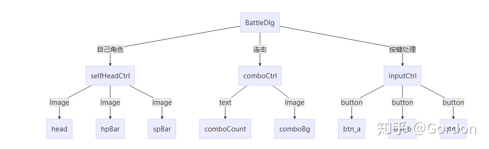

那么，battleDlg是一个table，selfHeadCtrl，comboCtrl，inputCtrl也是一个table，每个子table，就有自己的属性。例如，我要访问操作按钮a，就用self.inputCtrl.btn_a就可以了，这是简单的将属性分层。也就是LuaFieldType中的Normal类型。对应prefab就如这样配置：

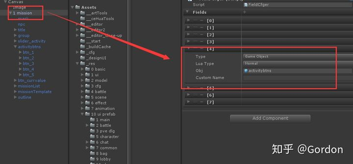

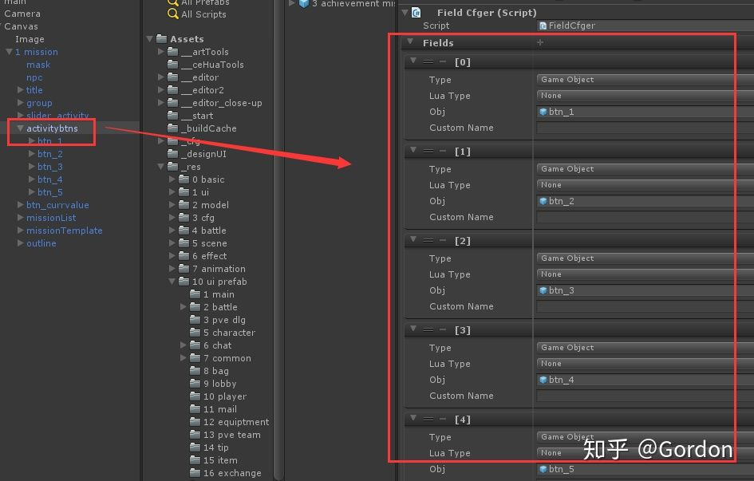下一层挂自己的元素

当然，还可以生成我们定义的，包含逻辑的一个table（lua class），这种一般用在我们需要对这个子模块，写模块内的逻辑。

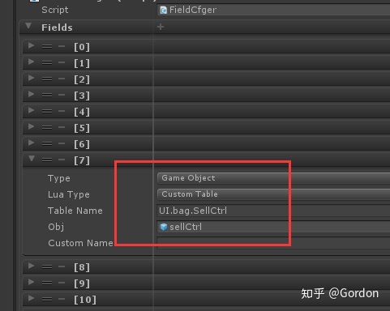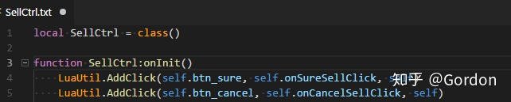

通过这种方式，很方便地就自动处理好对lua中各个component属性的赋值。

另外几种LuaFieldType，都是对这种使用方式的扩展。


还有一种需求，比如我们有个角色列表的UI，一次展示三个角色，我不希望在prefab上一次创建好三个角色信息子UI，而是在prefab里面，做一个模板，运行时去Instantiate三个子UI，这是常见的处理方式。

为了方便处理，我们可以在这个模板上挂FieldCfger，然后在运行时，Instantiate出这个模板，并自动绑定好对应的lua table， 如下：

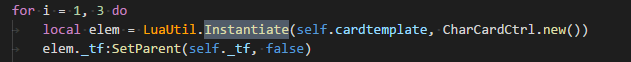

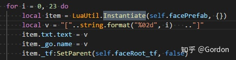

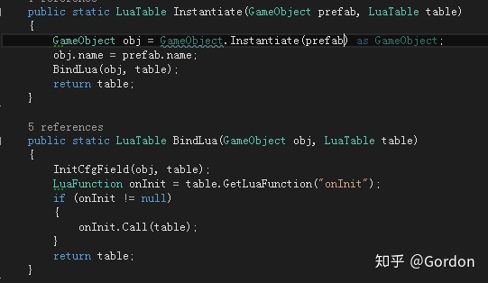

对lua这块的介绍，基本就到这里了，这个方法，能减少大量的低技术含量的工作量，并且在运行时使用也很方便。按照这个思路，也方便进行扩展，在非UI的逻辑下，也可以运用。目前用下来，非常方便，大大提高了开发的速度，让我们写lua，轻松了不少。


最后，lua的使用，必定没有c#写起来舒爽，但是当lua必不可少的情况下（个人觉得ILRuntime还不够成熟，我们稳妥为主，还是用lua），能让我们用起来更轻松点，也是值得项目努力的。

此方案还有不少可以优化之处，就不一一列举。这次就分享这个小的点吧，希望让一些还没用lua的项目，减少一些对lua的恐惧，其实，并没有那么难。