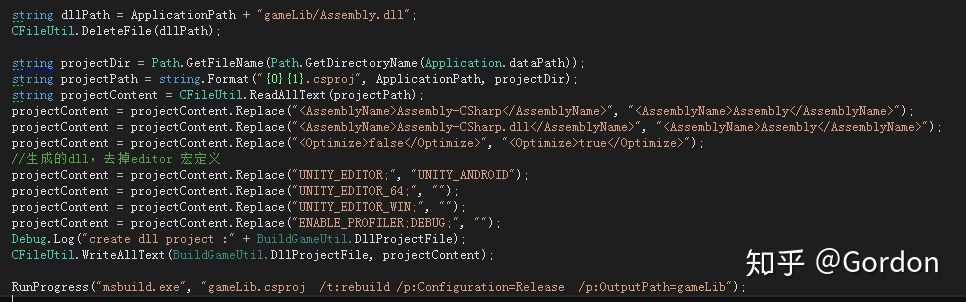

# Lua和DLL的热更新

[toc]

> lua是目前最常见，普及度最高，也最成熟的热更技术，因为ios是绕不过去的一个平台。dll是只能在Android平台热更新的方式，并且对我们开发的流程，会有一些限制。那么，既然已经用lua做代码的热更新了，为啥还要做dll热更新呢？

* 因为c#的开发效率和运行效率的优势，以及游戏某些部分（战斗）对性能的敏感，我们还是需要用c#做开发。能够在Android平台热更新c#部分代码，对Android平台的运营，具有很大的帮助，站在整个项目的角度考虑，我们要尽可能减少因为整包更新导致玩家流失的可能。
* 在开发过程中，我们总需要到真机上测试一些效果和逻辑，这时候，dll的热更新，让我们在真机测试，改bug这些操作上，节省宝贵的时间。对比打一个apk，5分钟，编译一个dll并更新，只需要十几秒。我见过有些项目，改了一个代码，打包10分钟，错了，再改，再打包，一个小时，只能改三四次，而做了dll热更新，能做几十次，这是质的不同。
* 当策划或者QA做真机测试的时候，反馈bug，修改，更新再测试的流程，也能节省时间。做得再好的自动化打包apk，也没有dll更新来得方便。
* 在国内的开发环境下，测试总是不足的，当运营过程出现了bug，能迅速地更新，而不是打包一个新的apk提交应用商店，等待审核。ios我们通过lua解决了50%痛苦的话，通过dll和lua的配合，我们在Android平台能结局95%的痛苦，当然值得。

这些理由，足够我们考虑在Android上，必须要做dll热更新。

对于我们早期做页游的开发人员来说，更新，是必须的，而最常见的方式，是做一个启动的壳，这个壳别的不做，只做资源和dll的更新，更新完成后，正式启动游戏进入。现在绝大都数游戏，应该都这样做了。

那么，针对dll热更新，有哪些限制，我们需要注意些什么？能更新到什么程度呢？

（这里说明一点，我们不是改unity的so文件方式来做更新）

## DLL热更新的限制

1. 放在Plugins下的c#文件无法热更新。这里也是我们放游戏的整个启动文件的地方。
2. 挂载在Prefab上的代码，无法做热更新。所以，如果需要挂载到Prefab上的代码，需要放到Plugins下，且这部分不能热更新。我们只有少数美术用的小工具脚本，放到Plugins下，放弃热更新。
3.  ScriptObject不能热更新，或者说对热更新的支持不够好，所以，除了部分插件会使用，我们自己的逻辑，是不使用ScriptObject的。所以，并不是我们游戏逻辑的插件，我们也会放到Plugins下，不需要做热更新。

除了上述几点，其他代码都可以做热更新。对于dll来说，就是编译到Assembly-CSharp-firstpass.dll的部分，不能热更新。编译到Assembly-CSharp.dll的代码，可以热更新。

## 怎么做热更新

1. 将所有的第三方代码，插件代码，工具代码（压缩，加密，xml，json解析，protobuf等）都放到Plugins下，这部分代码很少改动，不考虑热更新。极少部分需要挂载到prefab上的代码，放到Plugins下。最后，把游戏的启动代码放到Plugins下。启动代码会在启动游戏后，比较当前包的dll版本和服务器上获得的dll版本，如果有最新版，就下载最新版本，接着，用Assamble的方式，从新的dll进入游戏。

   

2. 其他的代码，我们认为是和当前项目紧密相关的，使用msbuild，将他们编译成一个dll，压缩，hash出版本，传到http服务器。当前我们dll 大概2M多，压缩后600K，更新量很小。（这部分代码不能挂到prefab上，理由如前所述）

   

其实整个dll热更新的逻辑并不复杂，只是需要注意规范放置代码，避免一些限制（不在prefab上挂脚本）就可以了。

最关键的，还是要理清思路，规划好游戏的启动部分，和游戏的入口。

## 怎么做更好

1. 在启动部分，我们只更新dll逻辑，更新资源（Assetbundle，cfg，lua）的逻辑，放在可以热更新的dll部分，让我们能热更新的东西更多。我们现在的项目，除掉插件，99%的C#代码都能热更新。
2.  进一步，为了减小包体，在打包apk的过程中，我们可以删除打包自动生成的Assembly-CSharp.dll，减少2M的dll，增加压缩的dll 600k，我们还能减少1M多的包体，苍蝇再小也是肉啊。对于很多破解的人，他突然找不到Assembly-CSharp.dll了，这也算是提高一点破解难度吧。
3.  再进一步，有些项目，做了项目dll加密，那么热更新dll不就又会被破解了吗？这里，我们可以对压缩的热更新dll进行加密，加密解密过程做得好，又可以提升一点破解难度。
4. 因为我们不在Resources目录下放资源，都是assetbundle模式，加上dll和lua的热更新，我们项目在Android平台，几乎是可以整体热更新的。
5. 最后，我们探索了全shader的热更新，包括unity 的build in shader。（这是另一部分了，如果大家有兴趣，到时候另开一篇说说）

文章最后，还是谈点务虚的：

* 快速迭代，快速反应，热更新是项目的核心竞争力之一，必须在项目开始就认真做好，如果到了中后期，也需要赶紧补救。不能热更新，就缺少了市场竞争的基础。
* 逻辑和view的分离，也就是代码和prefab的分离，在我看来，是必然的结果。Unity 拖拽comonent的开发方式，在大型一些的项目中，是否合适，值得大家思考。
* 在项目之初，一些模块一定要打好基础，从demo到上线运营，一整个生命周期都要考虑清楚。资源管理和资源代码的热更新，是一个项目的基石。
* 一点点的改进，就能给自己，给团队带来一些效率的提升，积累起来，就是团队的优势。