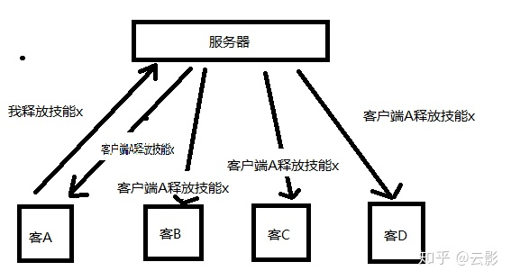

# 帧同步和状态同步

[toc]

最大的区别就是战斗核心逻辑写在哪，状态同步的战斗逻辑在服务端，帧同步的战斗逻辑在客户端。战斗逻辑是包括技能逻辑、普攻、属性、伤害、移动、AI、检测、碰撞等等的一系列内容，这常常也被视为游戏开发过程中最难的部分。由于核心逻辑必须知道一个场景中的所有实体情况，所以MMO游戏（例如魔兽世界）就必须把战斗逻辑写在服务端，所以MMO游戏必须是状态同步的，因为MMO游戏的客户端承载有限，并不能把整张地图的实体全部展现出来（例如100米以外的NPC和玩家就不显示了），所以客户端没有足够的信息计算全图的人的所有行为。

具体到客户端和服务端通信上，在状态同步下，客户端更像是一个服务端数据的表现层，举个例子，一个英雄的几乎所有属性（例如血量、攻击、防御、攻速、魔法值等等）都是服务端传给客户端的，而且在属性发生改变的时候，服务端需要实时告诉客户端哪些属性改变了，客户端并不能改变这些属性，而是服务端传来多少属性就显示多少属性。

而在帧同步下，通信就比较简单了，服务端只转发操作，不做任何逻辑处理。

现在同一局里有4个玩家，也就是4个客户端，这时客户端A释放了一个技能x，此时将操作传递给服务端，服务端不做任何判断，直接把A的操作全部分发给ABCD，则ABCD同时让客户端A控制的英雄释放技能x。

## 流量

状态同步比帧同步流量消耗大，例如一个复杂游戏的英雄属性可能有100多条，每次改变都要同步一次属性，这个消耗是巨大的，而帧同步不需要同步属性；例如释放一个技能，服务端需要通知客户端很多条消息（必须是分步的，不然功能做不了），而帧同步就只需要转发一次操作就行了。

## 回放和观战

帧同步的回放&观战比状态同步好做得多，因为只需要保存每局所有人的操作就好了，而状态同步的回放&观战，需要有一个回放&观战服务器，当一局战斗打响，战斗服务器在给客户端发送消息的同时，还需要把这些消息发给放&观战服务器，回放&观战服务器做储存，如果有其他客户端请求回放或者观战，则回放&观战服务器把储存起来的消息按时间发给客户端。

## 断线重连

状态同步的断线重连很好做，无非就是把整个场景和人物全部重新生成一遍，各种数值根据服务端提供加到人物身上而已。帧同步的断线重连就比较麻烦了，例如客户端在战场开始的第10秒短线了，第15秒连回来了，就需要服务端把第10秒到第15秒之间5秒内的所有消息一次性发给客户端，然后客户端加速整个游戏的核心逻辑运行速度（例如加速成10倍），直到追上现有进度。

## 帧同步

相同的输入+相同的时机=相同的显示

帧同步的基础，是不同的客户端，基于相同的操作指令顺序，各自执行逻辑，能得到相同的效果。就如大家所知道的，在unity下，不同的调用顺序，时序，浮点数计算的偏差，容器的排序不确定性，coroutine内写逻辑带来的不确定性，物理浮点数，随机数值带来的不确定性等等。

还有最基础的，要通过一个统一的逻辑tick入口，来更新整个战斗逻辑，而不是每个逻辑自己去Update。保证每次tick都从上到下，每次执行的顺序一致。

浮点数计算无法保证一致性，我们需要转换为定点数。

## 帧同步网络协议的实现

多client，一个server的模式，server负责统一tick，并转发client的指令，通知其他client。

是网络协议的选择。TCP和UDP的选择，我就不多说了，帧同步肯定要基于UDP才能保证更低的延迟。在UDP的选择上，我看网上有些文章，容易导入一个误区，即，我们是要用可靠传输的UDP，还是冗余信息的UDP。

**基于可靠传输的UDP**，是指在UDP上加一层封装，自己去实现丢包处理，消息序列，重传等类似TCP的消息处理方式，保证上层逻辑在处理数据包的时候，不需要考虑包的顺序，丢包等。类似的实现有Enet，KCP等。

**冗余信息的UDP**，是指需要上层逻辑自己处理丢包，乱序，重传等问题，底层直接用原始的UDP，或者用类似Enet的Unsequenced模式。常见的处理方式，就是两端的消息里面，带有确认帧信息，比如客户端（C）通知服务器（S）第100帧的数据，S收到后通知C，已收到C的第100帧，如果C一直没收到S的通知（丢包，乱序等原因），就会继续发送第100帧的数据给S，直到收到S的确认信息。