# 帧同步联机战斗

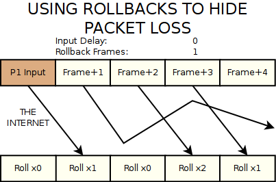

## **帧同步的几个难点**

帧同步的基础原理，以及和状态同步的区别，已经有很多文章介绍，我就不再赘述，大家可以自行google。以下只说几个难点。

- **保证客户端独自计算的正确，即一致性**

帧同步的基础，是不同的客户端，基于相同的操作指令顺序，各自执行逻辑，能得到相同的效果。就如大家所知道的，在unity下，不同的调用顺序，时序，浮点数计算的偏差，容器的排序不确定性，coroutine内写逻辑带来的不确定性，物理浮点数，随机数值带来的不确定性等等。

有些比较好解决，比如随机数值，只需要做随机种子即可。

有些注意代码规范，比如在帧同步的战斗中，逻辑部分不使用Coroutine，不依赖类似Dictionary等不确定顺序的容器的循环等。

还有最基础的，要通过一个统一的逻辑tick入口，来更新整个战斗逻辑，而不是每个逻辑自己去Update。保证每次tick都从上到下，每次执行的顺序一致。

物理方面，因为我们战斗逻辑不需要物理，碰撞都是自己做的碰撞逻辑，所以，跳过不说，这块可以参考别的文章。

最后，说一下，浮点数计算无法保证一致性，我们需要转换为定点数。关于定点数的实现，比较简单的方式是，在原来浮点数的基础上乘1000或10000，对应地方除以1000或10000，这种做法最为简单，再辅以三角函数查表，能解决一些问题，减少计算不一致的概率，但是，这种做法是治标不治本的方式，存在一些隐患（举个例子，例如一个int和一个float做乘法，如果原数值就要*1000，那最后算出来的数值，可能会非常大，有越界的风险。）。

最佳的解决办法，是使用实现更加精确和严谨，并经过验证的定点数数学库，在c#上，有一个定点数的实现，[Photon网络](https://link.zhihu.com/?target=https%3A//www.photonengine.com/en-US/Photon)的早期版本，[Truesync有一个很不错的定点数实现](https://link.zhihu.com/?target=https%3A//github.com/Caizc/learn-photon-truesync/tree/master/Assets/TrueSync/Engine/Math)。

其中FP，就可以完全代替float，我们只需要将我们自己的逻辑部分，float等改造为FP，就可以轻松解决。并且，能够很好的和我们protobuf的序列化方式集成（注意代码中的Attribute，如下图），保证我们的配置文件，也是定点数的。

TSVector对应Vector3，只要基于FP，可以自己扩展自己的数据结构。（当然，如果用到了复杂的插件，并且不开源，那么对于定点数的改造，就会困难很多）

我个人认为，这一套的实现，是优于简单的乘10000，除10000的方式。带来的坏处，可能就是计算性能略差一点点，但是我们大量测试下来，对计算性能的影响很小，应该是能胜任绝大部分项目的需求。

对于计算的不确定性，我们也有一些小的隐患，就是，我们用到了Physics.Raycast来检测地面和围墙，让人物可以上下坡，走楼梯等高低不平的路，也可以有形状不规则的墙。这里会获得一个浮点数的位置，可能会导致不确定性，这里，我们用了数值截断等方式，尽量规避，经过反复测试，没有出现过不一致。但是这种方式，毕竟在逻辑上，存在隐患，更好的方式，是实现一套基于定点数的raycast机制，我们人力有限，就没时间精力去做了。这块，有篇文章讲得更细致一些，大家可以参看 [帧同步：浮点精度测试](https://zhuanlan.zhihu.com/p/30422277)。

- **帧同步网络协议的实现**

在处理好了基础的计算一致性问题后，我们就要考虑网络如何通信。这里，我不谈p2p方式了，我们以下谈的，都是多client，一个server的模式，server负责统一tick，并转发client的指令，通知其他client，可以参看文章[网游流畅基础：帧同步游戏开发](https://link.zhihu.com/?target=http%3A//www.10tiao.com/html/255/201609/2650586281/4.html)。

首先，是网络协议的选择。TCP和UDP的选择，我就不多说了，帧同步肯定要基于UDP才能保证更低的延迟。在UDP的选择上，我看网上有些文章，容易导入一个误区，即，我们是要用可靠传输的UDP，还是冗余信息的UDP。

**基于可靠传输的UDP**，是指在UDP上加一层封装，自己去实现丢包处理，消息序列，重传等类似TCP的消息处理方式，保证上层逻辑在处理数据包的时候，不需要考虑包的顺序，丢包等。类似的实现有Enet，KCP等。

**冗余信息的UDP**，是指需要上层逻辑自己处理丢包，乱序，重传等问题，底层直接用原始的UDP，或者用类似Enet的Unsequenced模式。常见的处理方式，就是两端的消息里面，带有确认帧信息，比如客户端（C）通知服务器（S）第100帧的数据，S收到后通知C，已收到C的第100帧，如果C一直没收到S的通知（丢包，乱序等原因），就会继续发送第100帧的数据给S，直到收到S的确认信息。

有些文章介绍的时候，没有明确这两者的区别，但是这两种方式，区别是巨大的。可靠传输的UDP，在帧同步中，个人认为是不合适的，因为他为了保证包的顺序和处理丢包重传等，在网络不佳的情况下，delay很大，将导致收发包处理都会变成类似tcp的效果，只是比TCP会好一些。必须要用冗余信息的UDP的方式，才能获得好的效果。并且实现并不复杂，只要和服务器商议好确认帧和如何重传即可，自己实现，有很大的优化空间。例如，我们的协议定义类似如下：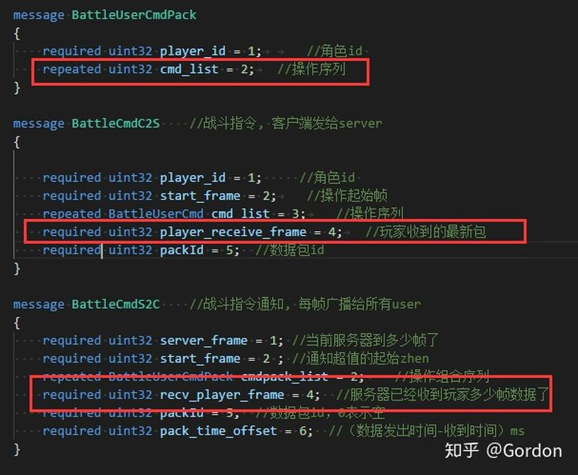

这里简单说一下，对于这种收发频繁的消息，如果使用protobuf，会造成每个逻辑帧的GC，这是非常不好的，解决方案，要么对[protobuf做无GC改造](https://link.zhihu.com/?target=https%3A//www.cnblogs.com/SChivas/p/7898166.html)，要么就自己实现一个简单的byte[]读写。无GC改造工程太大，感觉无必要，我们只是在战斗的几个频繁发送的消息，需要自己处理一下byte[]读写即可。

此处补充一下，看到KCP作者[韦易笑](https://www.zhihu.com/people/skywind3000/activities)在评论区的留言，提到[kcp+fec的模式](https://link.zhihu.com/?target=https%3A//github.com/skywind3000/kcp/wiki/Network-Layer)，可以比冗余方式，有更好的效果，我之前并没有仔细研究过这个模式，不过可以推荐大家看一下，如果有用过朋友分享下结论就更好了。

因为我们项目早期，服务器定下了使用enet，我评估了一下，反正使用冗余包的方式，所以没有纠结enet或kcp，后续其实想改成kcp，服务器不想再动，也就放下了。

enet麻烦的地方是，[enet的ipv6版本](https://link.zhihu.com/?target=https%3A//github.com/lsalzman/enet/pull/73)，是一个不成熟的pull request，enet作者没有merge（并且存在好几个ipv6的pull request），我不确定稳定性，还好看了下commit，加上测试下来，没有太大问题。KCP我没有评估过ipv6的问题，不过github上有C#版本，改一下ipv6支持应该很简单。

- **逻辑和显示的分离**

这块很多讲帧同步的文章都提过了。我在前面讲[技能编辑器](https://zhuanlan.zhihu.com/p/38001896)的时候，也提过，配置的数据和显示要分离，在战斗中，战斗的逻辑，也要和显示做到分离。

例如，最基本，我们动作切换的逻辑，是基于自己抽象的逻辑帧，而不是基于animator中一个clip的播放。比如一个攻击动作，当第10帧的时候，开始出现攻击框，并开始检测和敌人受击框的碰撞，这个时候的第10帧，必须是独立的逻辑，不能依赖于animator播放的时间，或者AnimatorStateInfo的normalizedTime等。甚至，当我们不加载角色的模型，一样可以跑战斗的逻辑。如果抽离得好，还可以放到服务器跑，做为战斗的验证程序，王者荣耀就是这样做的。

- **联机如何做到流畅战斗**

前面所有的准备，最终的目的，都是为了战斗的流畅。特别是我们这种Act游戏，或者格斗类游戏，对按键以后操作反馈的即时性，要求非常高，一点点延迟，都会影响玩家的手感，导致玩家的连招操作打断，非常影响体验。我们对延迟的敏感性，甚至比MOBA类游戏还要高，我们要做到好的操作手感，还要联机战斗（PVP，组队PVE），都需要把帧同步做到极致，不能因为延迟卡住或者操作反馈出现变化。

因为这个原因，我们不能用lockstep的方式，lockstep更适合网络环境良好的内网，或者对操作延迟不敏感的类型（例如我听过还有项目用来做卡牌类的帧同步）。

我们也不能用缓存服务器确认操作的方式，也就是一些游戏做的指令buffer。具体描述，[王者荣耀的分析文章](https://link.zhihu.com/?target=http%3A//youxiputao.com/articles/11842)，讲得很具体了。这也是他们说的模式，这个模式能解决一些小的网络波动，对一些操作反馈不需要太高的游戏，例如有些游戏攻击前会有一个比较长的前摇动作，这类游戏，用这种方式，应该就能解决大部分问题。但是这种方式还是存在隐患，即使通过策略能很好地动态调整buffer，也还是难以解决高延迟下的卡顿和不流畅。王者荣耀优化得很好，他们说能让buffer长度为0，文章只提到通过平滑插值和逻辑表现分离来优化，更细节的没有提到，我不确定他们是否只是基于这个方式来优化的。目前也没有看到更具体的分析。

指令buffer的方式，也不能满足我们的需求，或者说，我没有找到基于此方式，能优化到王者荣耀的效果的办法。我也测试过其他moba和act，arpg类游戏的联机，在高延迟，网络波动情况下，没有比王者表现更好的了。

最后，在仔细研究了我们的需求后，找到一篇指导性的文章，非常适合我们。

就是[Understanding Fighting Game Networking](https://link.zhihu.com/?target=http%3A//mauve.mizuumi.net/2012/07/05/understanding-fighting-game-networking/)，这篇文章非常详细地介绍了各种方式，最终回滚逻辑（rollback）是终极的解决方案，国内也有文章提到过，即[Skywind Inside " 再谈网游同步技术](https://link.zhihu.com/?target=http%3A//www.skywind.me/blog/archives/1343%23more-1343)里面提到的Time Warp方式，我理解回滚逻辑，和Time Warp是一个概念。

- **游戏逻辑的回滚**

回滚逻辑，就是我们解决问题的方案。可以这样理解，客户端的时间，领先服务器，客户端不需要服务器确认帧返回才执行指令，而是玩家输入，立刻执行（其他玩家的输入，按照其最近一个输入做预测，或者其他更优化的预测方案），然后将指令发送给服务器，服务器收到后给客户端确认，客户端收到确认后，如果服务确认的操作，和之前执行的一样（自己和其他玩家预测的操作），将不做任何改变，如果不一样（预测错误），就会将游戏整体逻辑回滚到最后一次服务器确认的正确帧，然后再追上当前客户端的帧。

此处逻辑较为复杂，我尝试举个例子说明下。

此处逻辑较为复杂，我尝试举个例子说明下。

当前客户端（A，B）执行到100帧，服务器执行到97帧。在100帧的时候，A执行了移动，B执行了攻击，A和B都通知服务器：我已经执行到100帧，我的操作是移动（A），攻击（B）。服务器在自己的98帧或99帧收到了A，B的消息，存在对应帧的操作数据中，等服务器执行到100帧的时候（或提前），将这个数据广播给AB。

然后A和B立刻开始执行100帧，A执行移动，预测B不执行操作。而B执行攻击，预测A执行攻击（可能A的99帧也是攻击），A和B各自预测对方的操作。

在A和B执行完100帧后，他们会各自保存100帧的状态快照，以及100帧各自的操作（包括预测的操作），以备万一预测错误，做逻辑回滚。

执行几帧后，A，B来到了103帧，服务器到了100帧，他开始广播数据给AB，在一定延迟后，AB收到了服务器确认的100帧的数据，这时候，AB可能已经执行到104了。A和B各自去核对服务器的数据和自己预测的数据是否相同。例如A核对后，100帧的操作，和自己预测的一样，A不做任何处理，继续往前。而B核对后，发现在100帧，B对A的预测，和服务器确认的A的操作，是不一样的（B预测的是攻击，而实际A的操作是移动），B就回滚到上一个确认一样的帧，即99帧，然后根据确认的100帧操作去执行100帧，然后快速执行101\~103的帧逻辑，之后继续执行104帧，其中（101~104）还是预测的逻辑帧。

因为客户端对当前操作的立刻执行，这个操作手感，是完全和pve（不联网状态）是一样的，不存在任何delay。所以，能做到绝佳的操作手感。当预测不一样的时候，做逻辑回滚，快速追回当前操作。

这样，对于网络好的玩家，和网络不好的玩家，都不会互相影响，不会像lockstep一样，网络好的玩家，会被网络不好的玩家lock住。也不会被网络延迟lock住，客户端可以一直往前预测。

对于网络好的玩家（A），可以动态调整（根据动态的latency），让客户端领先服务器少一些，尽量减少预测量，就会尽量减少回滚，例如网络好的，可能客户端只领先2~3帧。

对于网络不好的玩家（B），动态调整，领先服务器多一些，根据latency调整，例如领先5帧。

那么，A可能预测错的情况，只有2~3帧，而网络不好的B，可能预测错误的帧有5帧。通过优化的预测技术，和消息通知的优化，可以进一步减少A和B的预测错误率。对于A而言，战斗是顺畅的，手感很好，少数情况的回滚，优化好了，并不会带来卡顿和延迟感。

重点优化的是B，即网络不好的玩家，他的操作体验。因为客户端不等待服务器确认，就执行操作，所以B的操作手感，和A是一致的，区别只在于，B因为延迟，预测了比较多的帧，可能导致预测错，回滚会多一些。比如按照B的预测，应该在100帧击中A，但是因为预测错误A的操作，回滚重新执行后，B可能在100帧不会击中A。这对于B来说，通过插值和一些平滑方式，B的感受是不会有太大区别的，因为B看自己，操作自己都是及时反馈的，他感觉自己是平滑的。

这种方式，保证了网络不好的B的操作手感，和A一致。回滚导致的一些轻微的抖动，都是B看A的抖动，通过优化（插值，平滑等），进一步减少这些后，B的感受是很好的。我们测试在200~300毫秒随机延迟的情况下，B的操作手感良好。

这里，客户端提前服务器的方式，并且在延迟增大的情况下，客户端将加速，和[守望先锋的处理方式](https://link.zhihu.com/?target=https%3A//mp.weixin.qq.com/s/cOGn8-rHWLIxdDz-R3pXDg)是一样的。当然，他们肯定比我做得好很多。

希望我已经大致讲清楚了这个逻辑，大家参看几篇链接的文章，能体会更深。

这里，我要强调的一点是，我们这里的预测执行，是真实逻辑的预测，和很多介绍帧同步文章提到的预测是不同的。有些文章介绍的预测执行，只是view层面的预测，例如前摇动作和位移，但是逻辑是不会提前执行的，还是要等服务器的返回。这两种预测执行（View的预测执行，和真实逻辑的预测执行）是完全不是一个概念的，这里需要仔细地区分。

这里有很多的可以优化的点，我就不一一介绍了，以后可能零散地再谈。

- **游戏逻辑的快照（snapshot）**

我们的逻辑之所以能回滚，都是基于对每一帧状态可以处理快照，存储下每一帧的状态，并可以回滚到任何一帧的状态。在[Understanding Fighting Game Networking](https://link.zhihu.com/?target=http%3A//mauve.mizuumi.net/2012/07/05/understanding-fighting-game-networking/) 文章和[守望先锋网络](https://link.zhihu.com/?target=https%3A//mp.weixin.qq.com/s/cOGn8-rHWLIxdDz-R3pXDg) 文章中，都一笔带过了快照的说明。他们说的快照，可能略有不同，但是思路，都是能保存下每一帧的状态。如果去处理快照（Understanding那篇文章做的是模拟器游戏，可以方便地以内存快照的方式来做），是一个难点，这也是我[前面文章](https://zhuanlan.zhihu.com/p/38280972)提到ECS在这个方式下的应用，云风的解释：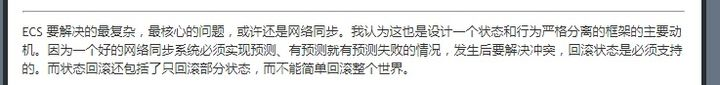

ECS是一个好的处理方式，并且我找到[一篇文章](https://link.zhihu.com/?target=https%3A//www.kisence.com/2017/11/12/guan-yu-zheng-tong-bu-de-xie-xin-de/)，也这样做了（我看过他开源的demo，做得还不够好，应该还是demo阶段，不太像是一个成型的项目）。这篇文章的思路是很清晰的，并且也点到了一些实实在在的痛点，解决思路也基本是正确的，可以参看。

这块，我做得比较早了，当时守望先锋的文章还没出，我的战斗也没有基于ECS，所以，在处理快照上，只有自己理顺逻辑来做了。

我的思路是，通过一个回滚接口，需要数据回滚的部分，实现接口，各自处理自己的保存快照和回滚。就像我们序列化一个复杂的配置，每个配置各自序列化自己的部分，最终合并成一个序列化好的文件。

首先，定义接口，和快照数据的reader和writer

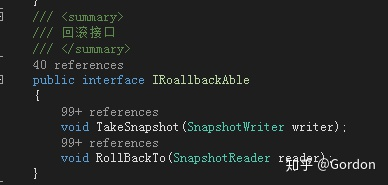

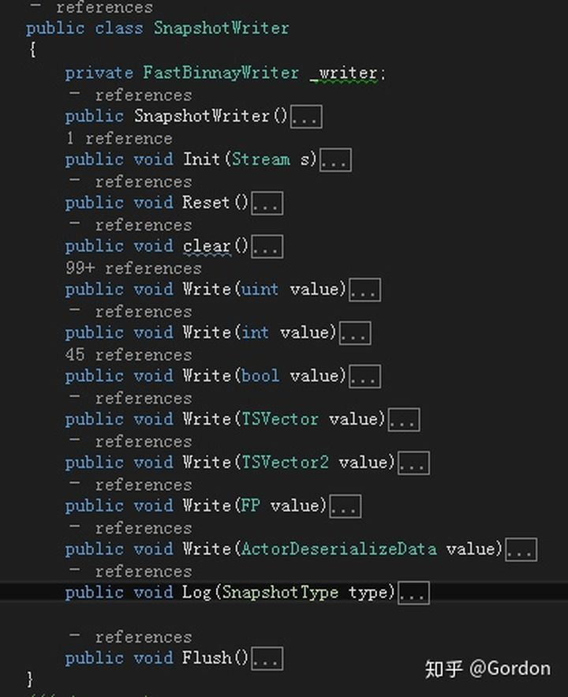

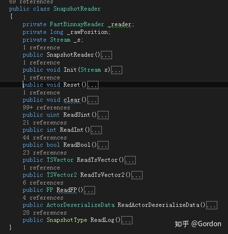

然后，就是每个模块，自己去处理自己的takeSnapshot和rollback，例如：

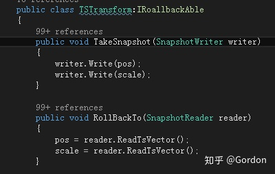

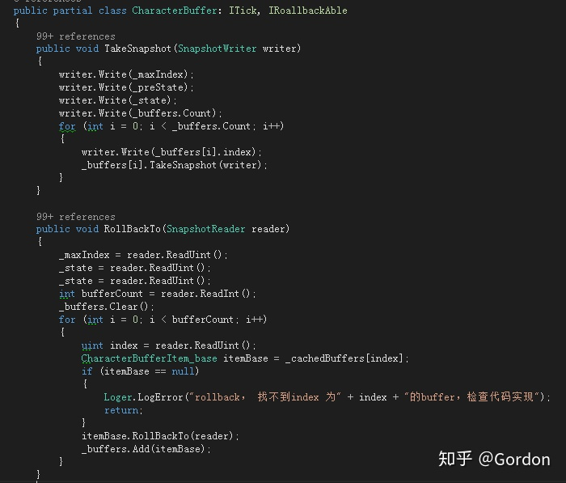

思路理顺以后，就可以很方便地处理了，注意write和read的顺序，注意处理好list，就解决了大部分问题。当然，在实现逻辑的过程中，时刻要注意，一个模块如何回滚（例如获取随机数也需要回滚）。

有一个更简单的方式，就是给属性打Attribute，然后写通用的方法。例如，我早**期的实现方案**：

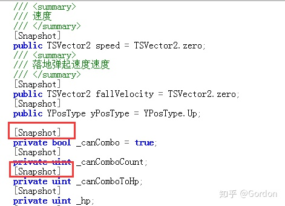

根据标签，通用的读写方法，通过反射来读写，就不需要每个模块自己去实现自己的方法了：

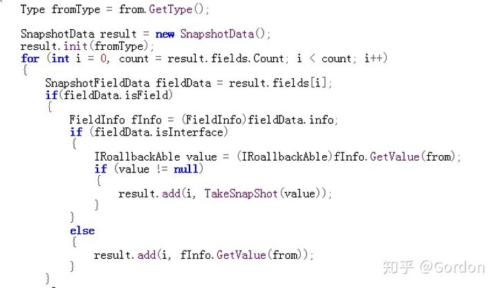

这种方法，能很好地解决大部分问题，甚至前面提到的[Truesync](https://link.zhihu.com/?target=https%3A//github.com/suzuke/TrueSync/tree/master/Assets/TrueSync/Engine/Math)，也是用的这种方式来做。

但是这种方法有个难以回避的问题，就是GC，因为基于反射，当我们调用field的GetValue和SetValue的时候，GC难以避免。并且，因为全自动，不方便处理一些特殊逻辑，调试优化也不方便，最后改成了现有的方式，虽然看起来笨重一些，但是可控性更强，我后续做的很多优化，都方便很多。

关于快照，也有很多可以优化的点，无论是GC内存上的，还是运行效率上的，都需要优化好，否则，可能带来性能问题。这块优化，有空另辟文章再细谈吧。

当我们有了快照，就可以支持回滚，甚至跳转。例如我们要看战斗录像，如果没有快照，我们要跳到1000帧，就需要从第一帧，根据保存的操作指令，一直快速执行到1000帧，而有了快照，可以直接跳到1000帧，不需要执行中间的过程，如果需要在不同的帧之间切换，只需要跳转即可，这将带来巨大的帮助。

- **自动测试**

由于帧同步需要测试一致性的问题，对我们来说，回滚也是需要大量测试的问题。自动测试是必须要做的一步，这块没有什么特别的点，主要就是保存好操作，快照，log，然后对不同客户端的数据做比对，找到不同的地方，查错改正。

我们现在做到，一步操作，自动循环战斗，将每一盘战斗数据上传内网log服务器。

当有很多盘战斗的数据后，通过工具自动解析比对数据，找到不同步的点。也是还可以优化得更好，只是现在感觉已经够用了。经过大量的内部自动测试，目前战斗的一致性，是很好的。

- **总结**

我们现在的帧同步方案，总结下来，就是预测，快照，回滚。当把这些有机地结合起来，优化好，就有了非常不错的帧同步联网效果，无论网络速度如何，只要不是延迟大到变态，都保证了非常好的操作手感。

快照回滚的方式，也不是所有游戏都适用，例如[Skywind Inside " 再谈网游同步技术](https://link.zhihu.com/?target=http%3A//www.skywind.me/blog/archives/1343%23more-1343)文章中对此模式（Time warp或Rollback）的缺点，也说明了。

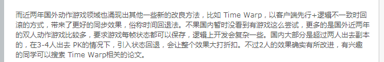

如图所述，这种模式不适合太多人的联网玩法，例如MOBA，可能就不太适用。我们最多三人联机，目前优化测试下来，效果也没有太大问题。但是联机人数越多，预测操作的错误可能性越大，导致的回滚也会越多。

一篇文章，难以讲得面面俱到，很多地方可能描述也不一定明确，并且，个人能力有限，团队人员有限（3个客户端）的情况下，必定有很多设计实现不够好的地方，大家见谅。后续有空，再补充一些细节和优化等，这里同样是希望抛砖引玉，希望看到更多好的方案。

最后，也要感谢我们项目的服务器哥们的技术支持和帮助。

一些有帮助的文章再列一下：

- [Understanding Fighting Game Networking](https://link.zhihu.com/?target=http%3A//mauve.mizuumi.net/2012/07/05/understanding-fighting-game-networking/)
- [Skywind Inside " 再谈网游同步技术](https://link.zhihu.com/?target=http%3A//www.skywind.me/blog/archives/1343%23more-1343)
- [《守望先锋》回放技术：阵亡镜头、全场最佳和亮眼表现](https://link.zhihu.com/?target=https%3A//mp.weixin.qq.com/s/cOGn8-rHWLIxdDz-R3pXDg)
- [《王者荣耀》技术总监复盘回炉历程](https://link.zhihu.com/?target=http%3A//youxiputao.com/articles/11842)
- [帧同步：浮点精度测试](https://zhuanlan.zhihu.com/p/30422277)
- [A guide to understanding netcode](https://link.zhihu.com/?target=https%3A//www.gamereplays.org/overwatch/portals.php%3Fshow%3Dpage%26name%3Doverwatch-a-guide-to-understanding-netcode)
- [网游流畅基础：帧同步游戏开发](https://link.zhihu.com/?target=http%3A//www.10tiao.com/html/255/201609/2650586281/4.html)

最后啰嗦一句，如最开始所述，帧同步有很多变种和实现方式，优化方向。有时候，可能不同文章提到帧同步这个术语的时候，里面的意思，可能都有区别，大家需要仔细理清和区分