# 被动技能设计逻辑

1. 触发时间。常见的有，当xxx的时候，执行yyy的逻辑。触发条件，是一块逻辑。

   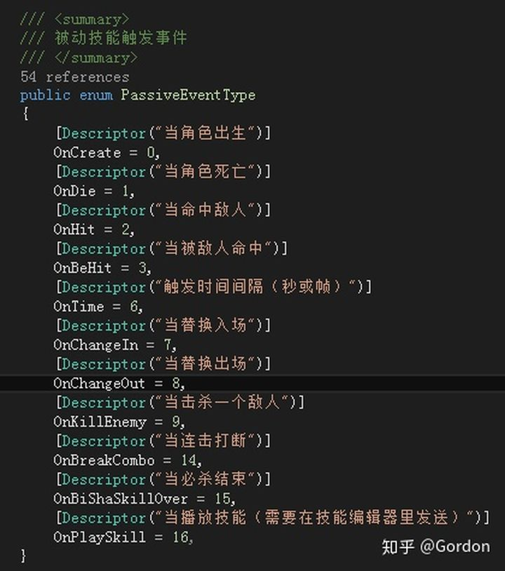

2. **触发前置条件。**例如，当xxx时，***有20%概率\***执行yyy逻辑。当触发，并达成一定条件的时候，才执行yyy。

   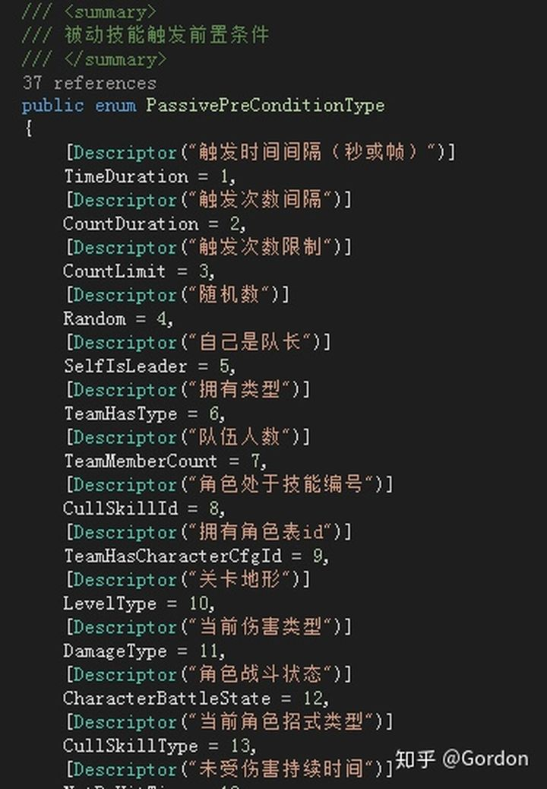

3. **执行的具体逻辑。**就是当xxx时，执行yyy，这里，我整体抽象yyy为buffer，分为持续性buffer和瞬时的buffer。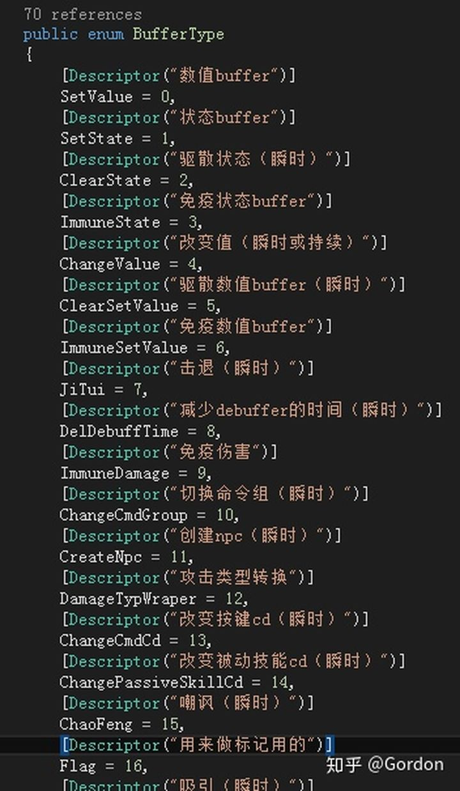

4. **对什么人添加buffer（执行操作），即目标选择。**例如，当xxx时，***对半径内敌人\***，执行yyy。

   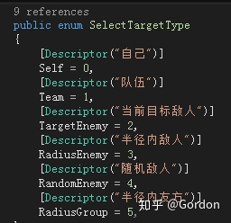

5. **对目标的过滤。**例如，当xxx时，对半径内***血量大于50%\***的敌人，执行yyy。

   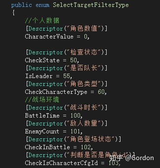

6. **buffer 的叠加类型。**例如，火焰buff，可叠加xxx层。

   

7. **数值类buff的数值类型。**例如给玩家增加攻击，防御，暴击率等等。

   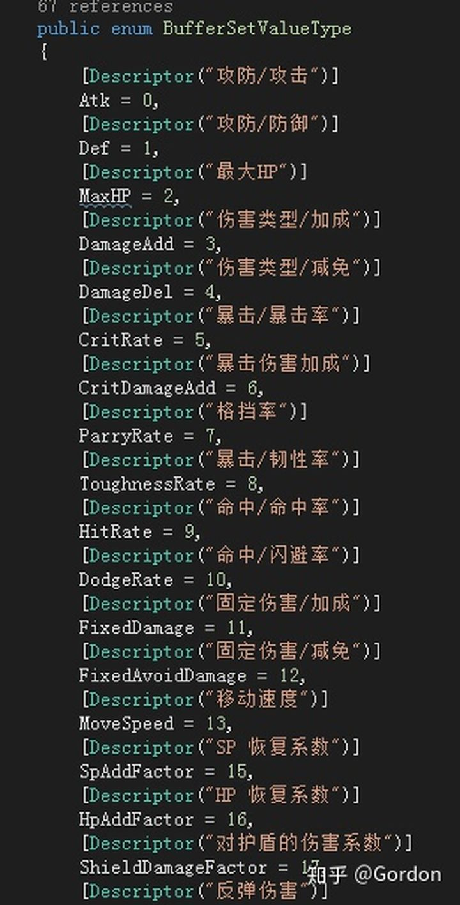

8. **数值来源。**例如，增加***当前攻击力10%的\***防御力。数值可能是需要根据条件计算出来的

   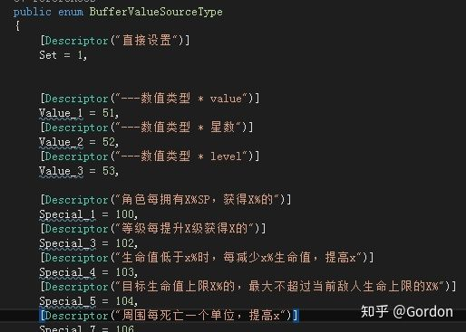

   数值来源这里，可以考虑小部分来自脚本公式。但是我们还是选择处理少量数特殊需求。

9. **buffer 的生效条件。**例如，添加一个buff，持续10秒，过程中，***当血量低于10%\***，提升暴击率50%。这种一般是，一个持续性buff，需要某些条件下，才生效。

   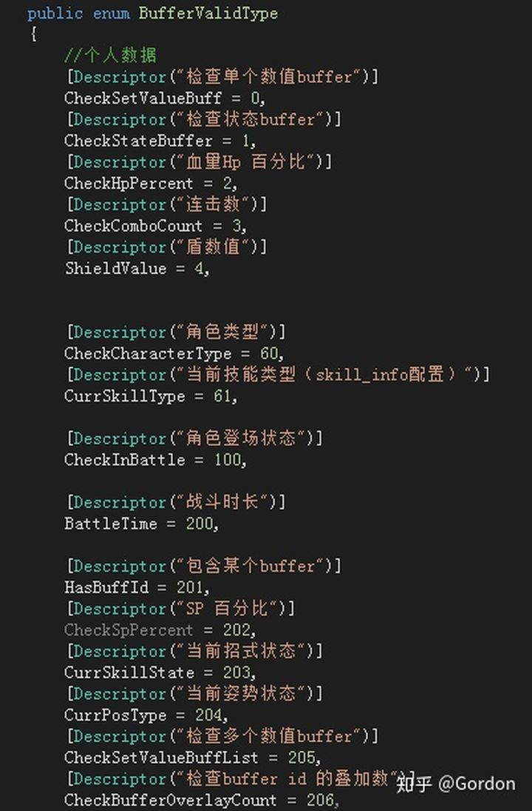

**通过上述的分析，我们基本上可以在结构上还原出需求。根据细分的模块，根据需求添加模块的点，然后策划通过编辑器去组合各个模块，就可以得到需求的效果。后续的扩展，就是主要对以上几个模块的分别扩展。**

## **大体的数据结构（数据class关系），分为被动技能，和buffer两大部分**

1. **被动技能部分**

   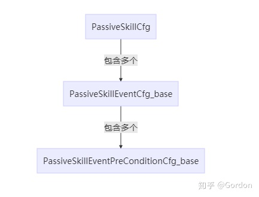

   PassiveSkillCfg：一个被动技能的根，包含多个事件的配置

   PassiveSkillEventCfg_base：一个事件的配置，包含多个前置条件，以及条件达成后触发什么（通常是添加buffer和添加其他被动事件）

   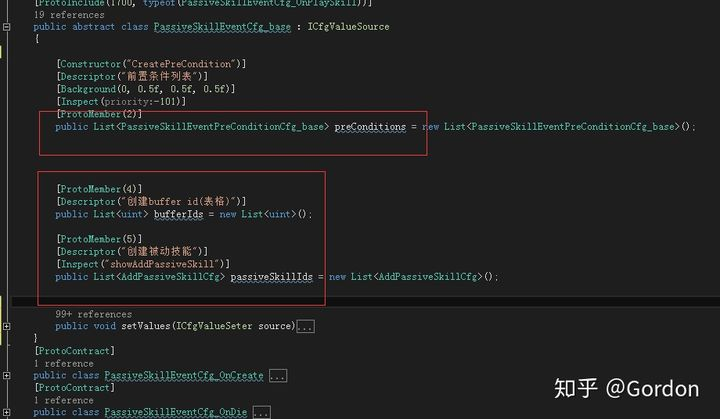

   PassiveSkillEventPreConditionCfg_base：各种不同的前置条件

   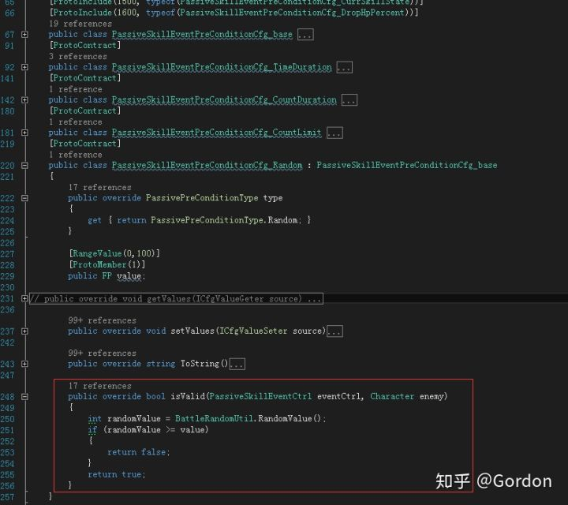

2.  **buffer部分**

   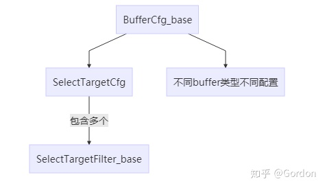

   BufferCfg_base：buffer类型

   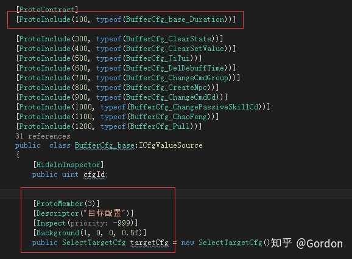

   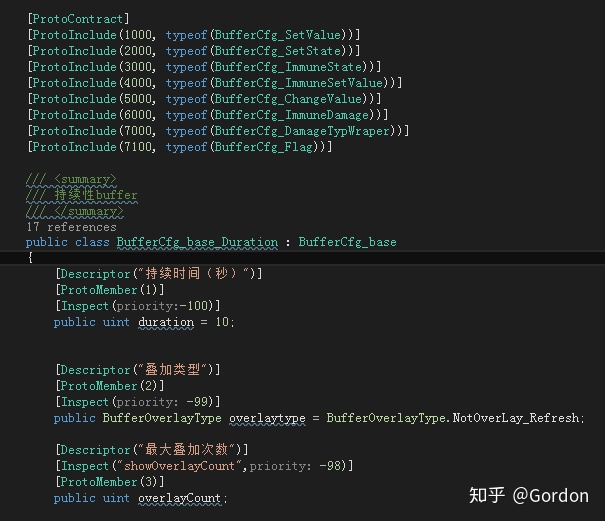

   SelectTargetCfg：选择目标

   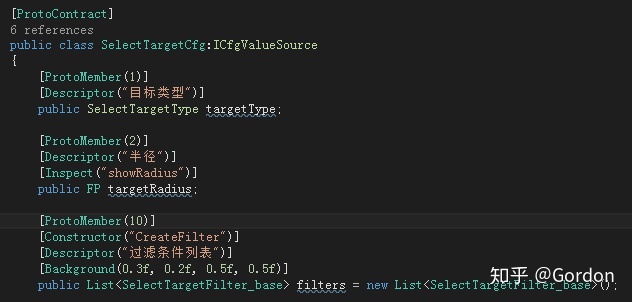

   SelectTargetFilter_base：选择目标过滤

   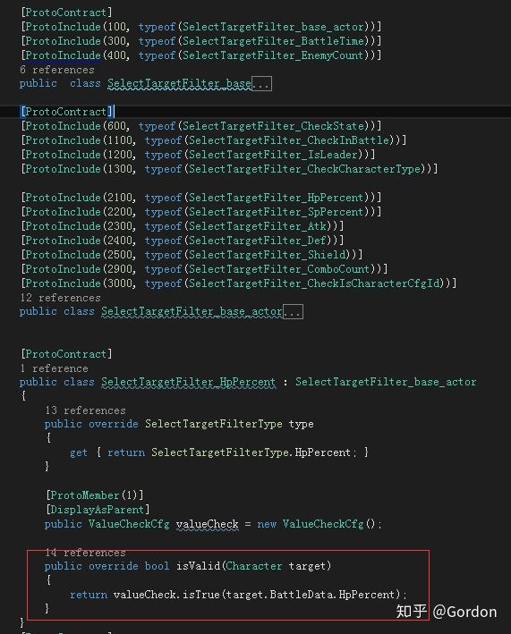

   我们以设置数值buffer举例

   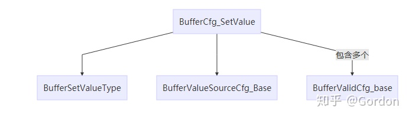

   BufferSetValueType：buffer改变的数值类型

   BufferValueSourceCfg_Base：数据来源

BufferValidCfg_base：buffer的生效条件

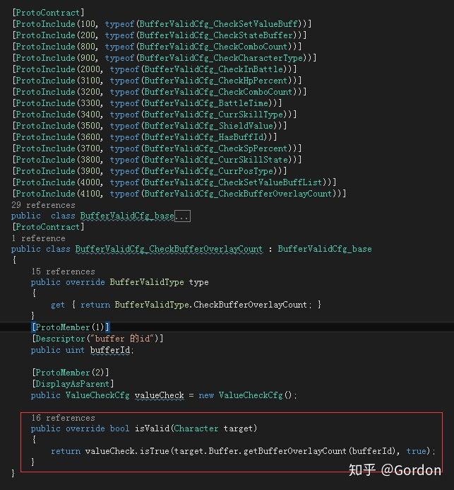

每种buffer的逻辑可能不同，根据配置不同的数据，处理不同的逻辑即可，非常方便扩展。

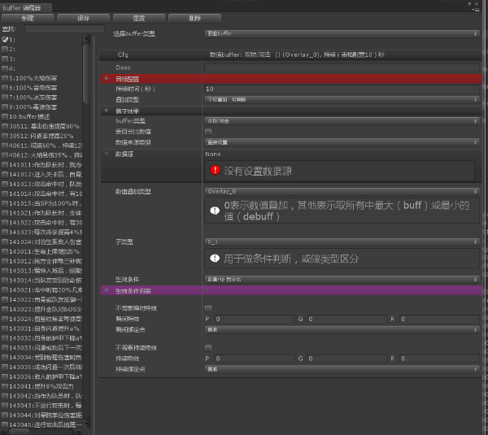

**以上基本就是整体的思路，主要就是根据逻辑，在语义上，研究划分，将需求划分成每一个块，每一个块可以单独扩展，之后将逻辑整合起来，策划通过编辑器去组合不同的模块逻辑。**

这里之所以说我们要在语义上划分，是因为，如果我们按别的方式去抽象逻辑，策划配置的时候，可能需要一个思维转换的过程。而在语义上划分的话，策划基本是根据他们自己定义的描述（就像他们给出的需求描述），一步一步在编辑器里去配置，在思维上，是顺畅的。

我们的代码设计和编辑器，还是有很多做得不够好的地方，并且根据策划的需求，经过了几次重构和整理，才有了现在的结构。

## **在Excel表里，配置数据，编辑器里，配置逻辑**

在最初的设计，我考虑漏了一点，就是如何在excel里面配置数值，编辑器配置逻辑，将两者分离。当策划提出被动技能和buffer需要升级，例如cd，数值，条件的数值等等，各个数值部分都可能会变，这时候如何配置，1~10级的数值，但是逻辑一样，总不能复制10个出来吧。

后面我们的补救措施（为了兼容之前的配置），是在excel里面，配置每一个buffer id对应的逻辑id（即编辑器里面的逻辑），然后配置1~20个数值参数（20够用了）。

编辑器里面，配置数值的地方，配置1~20的参数索引，初始化的时候，读取配置的数值。

配置1~20的参数索引

这个处理方式不是太优雅，如果重新设计，可能专门设计一个数值类，可以选择直接设置，还是读取配置。当前有点积重难返，暂时这样处理了，也能解决问题。

## 总结

借助之前做技能编辑器的经验，我们直接使用了protobuf来序列化配置，并借助Advanced Inspector这个插件来处理配置的UI界面。因为不需要显示角色模型等，我们用EditorWindow的方式来做被动技能和buffer的编辑器。