# 资源管理机制

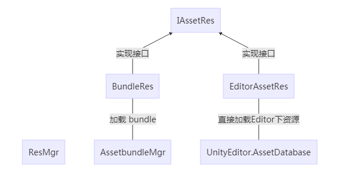

> 在早期Unity的很多初级教程中，为了方便，会告诉大家，将资源放在Resources目录下，通过Resources.Load()来加载数据。因为很多教程都是演示效果，或者是小型demo，小型休闲游戏，这样做，问题不大。

[toc]

但是当我们开始做一个上点规模的项目，并准备热更运营的时候，就需要考虑资源的使用场景。常见使用场景两种：

1. 静态：直接拖拽一个资源到GameObject的Component上，例如往UI的image上拖一个sprite
2. 动态：根据资源名字，动态加载一个资源，例如做一个可以根据角色类型换sprite的image

对于动态加载，又有2种方式：

1. 在Editor下Load出资源
2. 在手机上从assetbundle中load出资源（假设我们肯定是需要资源更新的）

那么，对于资源，我们需要考虑的关键问题是：

1. 如何帮助美术、策划分类整理资源？
2. 用什么方法标记一个资源，并可以方便策划配置资源？
3. 如何保证资源在Editor和打包到手机上，用统一的API加载？
4. 如果需要资源热更新，需要注意什么？

这几个问题，决定了游戏最基础的资源管理模块，我将一一分析这几个问题。

## 如何帮助美术、策划分类整理资源？

资源的管理，最重要的是分类，例如分角色模型，UI图片，UI prefab，特效，声音等

大家都会将一类资源，放在一起，方便查找，复用，整理。

我的思路是，将需要动态加载的资源，分成三级。

第一级是pack，大分类，例如，我现在项目分类如下：

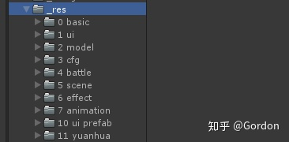

​                                                             `常见大类型，UI 图片，model 角色模型，cfg 编辑器数据，scene 场景等`

第二级是group，按功能分类，用模型举例

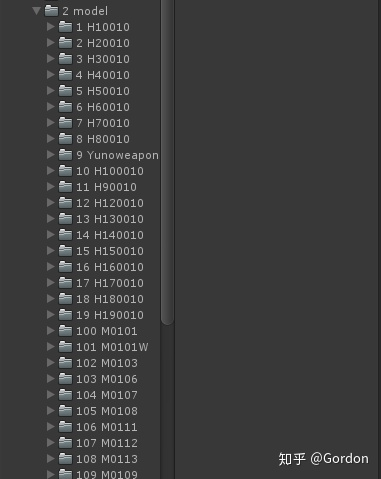

​                                                                       `在pack model下，按照角色分为group`

第三级是具体的资源，res，我们用pack model，group H10010举例


​                                                           `角色最终的prefab`

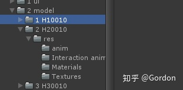

​                                                           `细分角色对应的动画，材质，贴图等`

通过将每一个可加载资源分成三级，美术可以方便地通过pack，group，res三级索引到自己的资源。这是资源放置的思路，这块和大部分项目，应该是大同小异，我只是将可加载资源要三级定位这个规则制定，第三级后，美术可以根据需求自己细分。

最后，我非常不喜欢这样的做法：让美术把资源放到目录Assets/Res下，而要求把生成的prefab，单独放到一个需要打包的Assets/BundlePrefab文件加下。这种方式方便了打包AssetBundle，但是撕裂了美术对资源整合放置的思路。美术的原始资源，和对应的prefab，就应该尽可能挨着。这是我一家之言，每个项目都有自己的方式，没有什么是绝对好的，只有合适的，和自己喜欢的。

## 用什么方法标记一个资源，并可以方便策划配置资源？

如何定位一个资源？是重要的一环，我见过的绝大多数解决方案，对资源的索引方式，都是资源路径。例如有一个角色的prefab，路径是：Assets/Resources/Model/a.prefab

当需要加载这个prefab出来，Instantiate的时候，通常这样做

```csharp
        GameObject prefab = Resources.Load("Assets/Resources/Model/a.prefab");
```

或者是在配置文件中配置路径。处理好一点的，只配置 “a.prefab”。

这样的处理方式存在三个弊端：

1. 资源名字通常是英文和拼音，容易拼写错误
2. 一旦遇到资源名字修改，之前的配置将失效
3. 如果只配置资源名字，不配置路径，在unity中不方便定位资源位置（不知道资源放在哪个路径下，例如我很难通过a.prefab这样的名字，定位资源在哪里）

所以，我使用了一个资源Id数据结构来索引唯一资源，核心类ResId部分如下

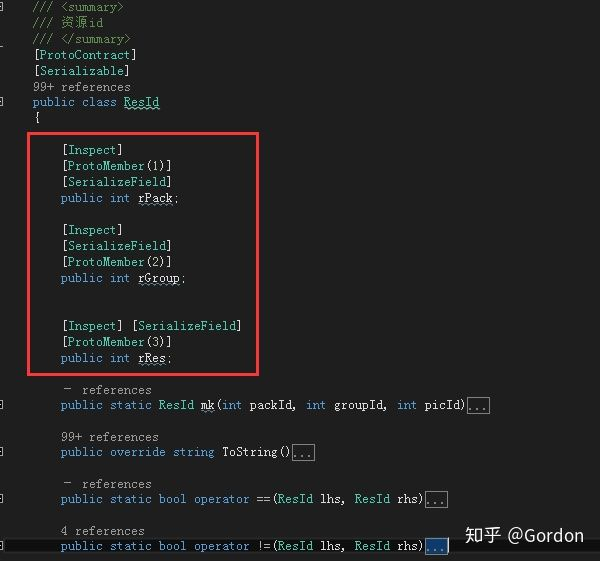

当加载资源的时候，我们可以这样使用：


策划配置的时候，可以这样配置：

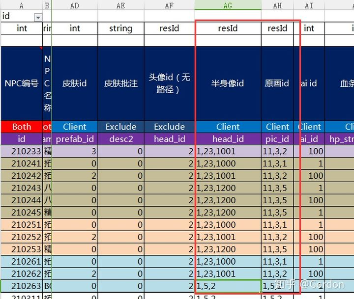

可以看出，我们用rPack，rGroup, rRes三个数字组成唯一的ResId，这三个数字，对应的就是我们之前资源三级路径，两级路径和最后一级的资源文件用数字开头，数字必须唯一，后面是资源的名字。这样，美术和策划即使改了资源的名字，只要最前的id不改，就不会影响程序逻辑和策划的配置。

策划在配置里直接配资源id（2,1,1）就可以索引到资源，并且可以通过三个数字，很方便地找到对应的美术资源。

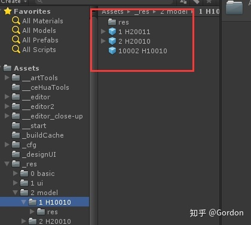

在经历了初期的适应阶段，策划和美术也能很好地对资源进行分类，规划。

策划，美术，程序沟通时要找某个资源，只需要出示ResId的三个数字，对方就能明确资源在哪里，大大减少沟通的成本。

这套方法的主要逻辑，用三数字标识唯一资源，是我当年做页游的时候，从当时的项目中学到。我将其融合到当前整个工具链和资源管理中，非常方便高效。

## 如何保证资源在Editor和打包到手机上，用统一的API加载

当我们在调用API加载资源的时候，希望是一个统一的，不区分平台的调用方式，上层调动，不需要管是在Editor下调用，还是从assetbundle中读取，我只关心，我给你一个ResId，你给我资源。所以，我希望是这样简洁的调用：

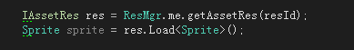

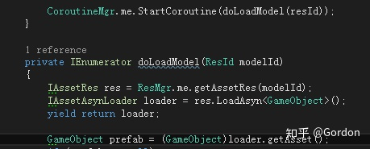

对应类结构大致如下：


* ResMgr：只是简单地根据是否Editor，返回一个IAssetRes给调用者
* IAssetRes： 资源id对应的资源接口，将会有bundle和editor下读取的两种实现
* BundleRes：在手机端，通过AssetbundleMgr来读取资源
* EditorAssetRes：在Editor端，直接从工程目录中用UnityEditor.AssetDatabase读取资源

为什么不直接load出资源，而要返回一个IAssetRes呢？

因为我们希望将一个资源的操作，都抽象到这个接口，ResMgr只是简单地返回给你这个接口，至于这个接口怎么实现，是从哪里读来的，上层调用者就不需要关心了。

例如，你可以cache一次战斗中load的所有IAssetRes，在战斗结束后，对这些IAssetRes clear，清除战斗中使用的资源。

所有的操作，都是基于IAssetRes的，当底层换了资源加载方式，上层调用不需要关心。

很多项目都做了类似的处理，最大的区别还是，我们使用ResId来做资源id。当然，我认为我们的封装和实现都要简洁明了些。

比如国内的KSFramework在资源管理，加载的实现是相当复杂，十几个Loader，相当绕，一个调用跳来跳去，非常糟糕（当然，他可能为了做大而全的框架，做了过度的设计。不过，这个框架也有可圈可点之处，所以我不建议用一个别人的框架，即使要用，也要根据自己项目的需求，做适当的裁剪和修改）。

## 如果需要资源热更新，需要注意什么？

我看过好几个项目因为早期时间压力和其他原因，对资源的规划不足，导致快上线了，需要对资源做热更新了，发现各种问题：

1. 当初所有的资源都放到Resources目录下，打包的时候，发现所有的资源，不管用没用，都一起打包了，包体非常大，包含了很多无用资源，很难做剔除。
2. 需要更新了，不知道哪些资源需要挑出来打包成assetbundle更新，即无法简单分辨两个版本的资源变化。
3. Resources下的资源，无法打包成Assetbundle（我之前测试的Unity版本是这样，不知后续版本是否有改变），需要将资源移动到Resources外，打完Assetbundle再移回Resources，着实蛋疼。
4. 没有规划好统一的资源load接口，对于assetbundle打包的粒度难以划分，并且对于什么资源在哪个bundle下，需要专门处理对应关系。

以上几点，如果在项目后期发现，将对项目造成不小的麻烦。

因为最早做页游，热更新资源，是基础逻辑。所以，在做第一个Unity项目时，我仔细分析了资源管理，打包，更新的流程，并做了充足的测试。最终形成现在这样的处理方式：

1. 所有资源都不放在Resources下，让所有资源都能热更，可以看到，我的Resources下，几乎没有资源

   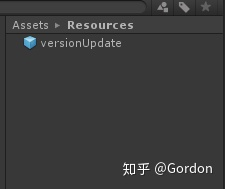

   这样，能保证，不会把不需要的资源，打包到apk中。也完全用不大Resources.Load()。

2. 在手机端，将所有用到的资源，都打包成assetbundle，并生成所有assetbundle的hash，当再次打包，只需要比较每个bundle 的hash是否变化，就知道哪些资源更新了，非常方便做差异热更新。这应该是最近比较普遍的方案了。

3. 通过ResId 来决定哪些资源需要打包。我会遍历_res目录，通过分析目录和资源是否数字开头，只将能形成三数字ResId的资源进行assetbundle打包，在_res目录下，不符合ResId 规律的资源，我们就可以认为是没有使用到的资源，即使美术放了几个G的测试资源，只要没有用到，我们就不会打包。后续，如果要剔除一些不需要的资源，只需要去掉数字开头，就不会被打包。

   在打包assetbundle的过程中，取得所有ResId的资源列表后，再获取他们依赖的资源，进行bundle粒度细分。例如，一个角色的prefab 资源id是（1,3,14），他包含prefab，prefab引用的模型，动画和贴图，我们就将其细分为三个bundle，一个是1/3/*14.bundle，一个是1/*3/*14*/model.bundle，一个是*1/*3/*14*_texture.bundle。当我们在用ResId （1,3,14）加载的时候，就能方便地定位到对应的bundle。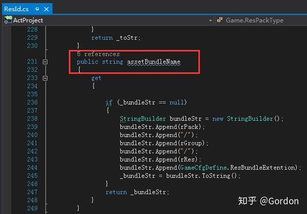

   在热更的时候，可以单独地更新texture bundle或model bundle，甚至可以细化地把每一个动画打包一个bundle。粒度分到多细，就是项目根据需求来规划，取一个合适的平衡。

最后，还是说几点务虚的思考：

* 在项目之初，要考虑好项目的资源管理方式，考虑好对打包，热更新的支持
* 帮助美术理顺资源整理的思路，减少和美术的沟通成本。减少因为美术添加测试资源，对出包造成的影响
* 我们是否需要大而全的框架？我认为，不需要。放弃对大而全框架的幻想，根据项目需求，裁剪加工自己的小框架，更为合适。拿来就能用的，大多是繁杂冗余的。
* 通过程序的努力，想办法减少策划美术的犯错成本（比如用string 做资源索引，策划配置拼错单词），也是程序体现能力的重要环节。
* 客户端程序是一个项目的粘合剂，需要和策划美术，服务器都打交道，并且是最终效果的整合者。所以，好的客户端，会想办法去做好这个粘合剂，让策划，美术合作得更加顺滑。

