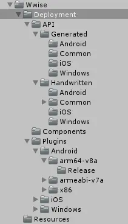

# Wwise项目中的问题

## IOS库很大

IOS库很大：是因为Unity不支持 Thumb指令，所以即使Release版本也包含了所有的调试符号。 这个只能在XCode里面去剥离，最终的大小是 1-2M。

官方文档在这个地方专门做过解释：[Build your Unity Game for a Target Platform](https://link.zhihu.com/?target=https%3A//www.audiokinetic.com/library/edge/%3Fsource%3DUnity%26id%3Dpg__howtobuilddeployios.html)

也可以参考这个问题的回答：[Why is the Wwise iOS Unity Integration so big?](https://link.zhihu.com/?target=https%3A//www.audiokinetic.com/qa/622/why-is-the-wwise-ios-unity-integration-so-big)

Unity 目前还不支持 thumb 指令；因此，在 Xcode 工程中禁用了 thumb 指令。

Wwise Integration 库，`libAkSoundEngine.a，通常包含所有的调试符号。因此该库是非常大的。请确保去除调试符号，方法是在（iOS）Player` Settings 的 **Other Settings** 部分中，指定 **Stripping Level** 选项。通常，集成会给游戏增加 1到 2 MB内存消耗。

## Unity2018只支持Wwise2019版本

## Wwise集成的修改

1. 在` Edit > Project Settings… > Audio` 中启用 `Disable Audio` 选项。内置的音频系统将因此被禁用。
2. 若启用了 `"Create WwiseGlobal GameObject"` `Wwise Setting`，则在当前场景中创建一个名为 `Wwise Global `的游戏对象。`WwiseGlobal `对象是一个包含 `Wwise` 声音引擎 `Initializing` 和 `Terminating` 脚本的游戏对象。在 Editor 工作流中，会将其添加到每一场景，以便在 Editor 中正常预览。在游戏中，只会在第一个场景中创建一个实例。该实例将在整个游戏当中保持有效。在初始化器脚本中，有一些可自定义的选项。另外，还为 `WwiseGlobal` 对象提供有 `AkEditorEventPlayer`、`AkAudioListener` 和 `AkGameObj` 脚本，方便在 Edit 模式下预览 AkEvent对象。同时，还添加了 `Rigidbody `组件，便于预览 `AkEnvironment`、`AkRoom` 和 `AkGameObj`之间的交互。

## ERROR: Error: ENOENT: no such file or directory, scandir 'C:\Documents and Settings\All Users\Start Menu\Programs'

```bash
npm rebuild node-sass
```

## Bank version 需要对应上

要不然bank是加载不出来的。

## 删除多余文件


